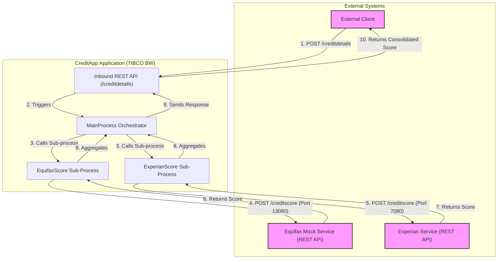

## Executive Summary
This analysis provides a logical dependency diagram and integration overview for the `CreditApp` TIBCO BusinessWorks (BW) application. The system is designed as a RESTful service that orchestrates calls to external credit scoring services. The core functionality involves receiving a credit detail request, concurrently calling two separate services (inferred to be Equifax and Experian), aggregating their scores, and returning a consolidated response. The architecture is straightforward, with a single inbound API endpoint and two distinct outbound REST API integrations.

## Logical Dependencies & Integration Diagram

### System Overview
The `CreditApp` application acts as an orchestration layer. It exposes a single REST API endpoint, `/creditdetails`, which accepts customer information (SSN, Name, DOB). Upon receiving a request, it concurrently calls two downstream REST APIs to fetch credit scores from what appear to be Equifax and Experian services. The application then combines these scores into a single response for the client. The integrations are synchronous REST/HTTP calls.

### Dependency Diagram

### Integration Details Table

| Component | Integration Type | Target System | Protocol/Method | Purpose | Evidence |
| :--- | :--- | :--- | :--- | :--- | :--- |
| `MainProcess.bwp` | Inbound API | External Client | REST/HTTP (POST) | Receives customer details to initiate a credit score check. | `CreditApp.module\META-INF\module.bwm` |
| `EquifaxScore.bwp` | Outbound API | Equifax Mock Service | REST/HTTP (POST) | Fetches a credit score from an Equifax-like service. | `CreditApp.module\Resources\creditapp\module\HttpClientResource2.httpClientResource` |
| `ExperianScore.bwp` | Outbound API | Experian Service | REST/HTTP (POST) | Fetches a credit score from an Experian-like service. | `CreditApp.module\Resources\creditapp\module\HttpClientResource1.httpClientResource` |

### Undetermined Elements

- **External System Details**: The "Equifax" and "Experian" services are inferred from process names (`EquifaxScore.bwp`, `ExperianScore.bwp`). The HTTP client configurations (`HttpClientResource1.httpClientResource`, `HttpClientResource2.httpClientResource`) point to `localhost` or `host.docker.internal`, suggesting these are likely mock services or other local applications rather than actual external credit bureaus in the tested environment.
- **Integration Contracts**: The Swagger definition for the Experian service (`getcreditstorebackend_0_1_mock_app.json`) specifies a host of `integration.cloud.tibcoapps.com`, which conflicts with the `localhost` configuration in the HTTP client resource. This indicates a configuration discrepancy between design and local execution.
- **Unimplemented Features**: The final response schema (`getcreditstorebackend_0_1_mock_app.xsd`) includes a `TransUnionResponse` element, but there is no corresponding process or integration call to a TransUnion service found in the codebase. This suggests an incomplete or planned feature.
- **Operational Context**: The codebase does not provide information on operational infrastructure such as load balancers, API gateways (beyond the TIBCO binding), or DNS configurations that would be present in a production environment.

## Evidence Summary
- **Scope Analyzed**: The analysis covered all TIBCO BusinessWorks processes (`.bwp`), configuration files (`.substvar`, `.xml`), resource definitions (`.httpClientResource`, `.httpConnResource`), and service descriptors (`.json`, `.xsd`).
- **Key Data Points**:
    - 1 primary TIBCO module (`CreditApp.module`).
    - 3 business processes (`MainProcess`, `EquifaxScore`, `ExperianScore`).
    - 1 inbound REST API endpoint (`/creditdetails`).
    - 2 outbound REST API integrations.
- **References**: Findings are based on the interactions defined in `MainProcess.bwp` and the connection details in `HttpClientResource1.httpClientResource` and `HttpClientResource2.httpClientResource`.

## Assumptions Made
- It is assumed that the process names `EquifaxScore` and `ExperianScore` accurately reflect the business purpose of the outbound integrations, even though they point to local services.
- It is assumed that the parallel flow in `MainProcess.bwp` is intended to call the two credit services concurrently for efficiency.
- The "External Client" is assumed to be any system capable of making a POST request to the exposed `/creditdetails` endpoint.

## Open Questions
- What are the real endpoint URLs for the Equifax and Experian services in a production environment?
- Is the `TransUnionResponse` in the schema a planned future integration, or is it legacy code that should be removed?
- How are credentials and API keys for the external services managed? The current configuration does not show any authentication mechanisms for outbound calls.

## Confidence Level
**Overall Confidence**: High

**Rationale**: The codebase is small and self-contained, making the dependency chain easy to trace. The TIBCO process files (`.bwp`) and resource configurations provide explicit evidence of the service orchestration, internal process calls, and external HTTP integrations. The primary uncertainty lies in the exact nature of the external endpoints, which are clearly mocked for local development.

**Evidence**:
- **File references**: `CreditApp.module\Processes\creditapp\module\MainProcess.bwp` clearly shows the orchestration logic, calling the `EquifaxScore` and `ExperianScore` sub-processes.
- **Configuration files**: `CreditApp.module\Resources\creditapp\module\HttpClientResource1.httpClientResource` and `HttpClientResource2.httpClientResource` define the target hosts and ports for the outbound calls.
- **Code examples**: The `<invoke>` and `<tibex:activityExtension>` elements within the `.bwp` files specify the exact operations being called.

## Action Items
**Immediate** (Next 1-2 days):
- [ ] Confirm the production endpoint URLs and authentication methods for the Equifax and Experian services to update environment-specific configurations.

**Short-term** (Next Sprint):
- [ ] Clarify the status of the TransUnion integration. If it is not planned, remove the `TransUnionResponse` element from the API schema to avoid confusion.
- [ ] Implement a secure mechanism for managing credentials for the outbound API calls, such as using GCP Secret Manager or another vault solution, instead of relying on unauthenticated local endpoints.

**Long-term** (Next Quarter):
- [ ] Develop a health-check mechanism for the external dependencies (Equifax, Experian) to improve the application's resilience and provide better error feedback to clients.

## Risk Assessment
- **High Risk**: The discrepancy between the documented service host (`integration.cloud.tibcoapps.com`) and the configured `localhost` could lead to deployment failures if not properly managed across environments.
- **Medium Risk**: The lack of defined authentication for outbound calls is a significant security vulnerability that must be addressed before deploying to a production environment.
- **Low Risk**: The presence of the unused `TransUnionResponse` in the schema could cause minor confusion for new developers or API consumers but has no functional impact.