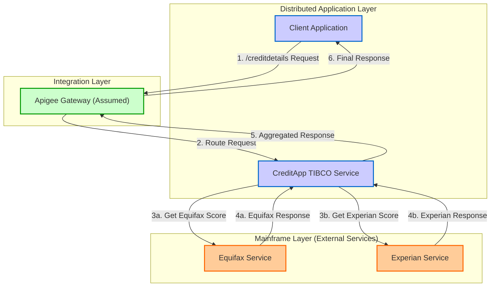
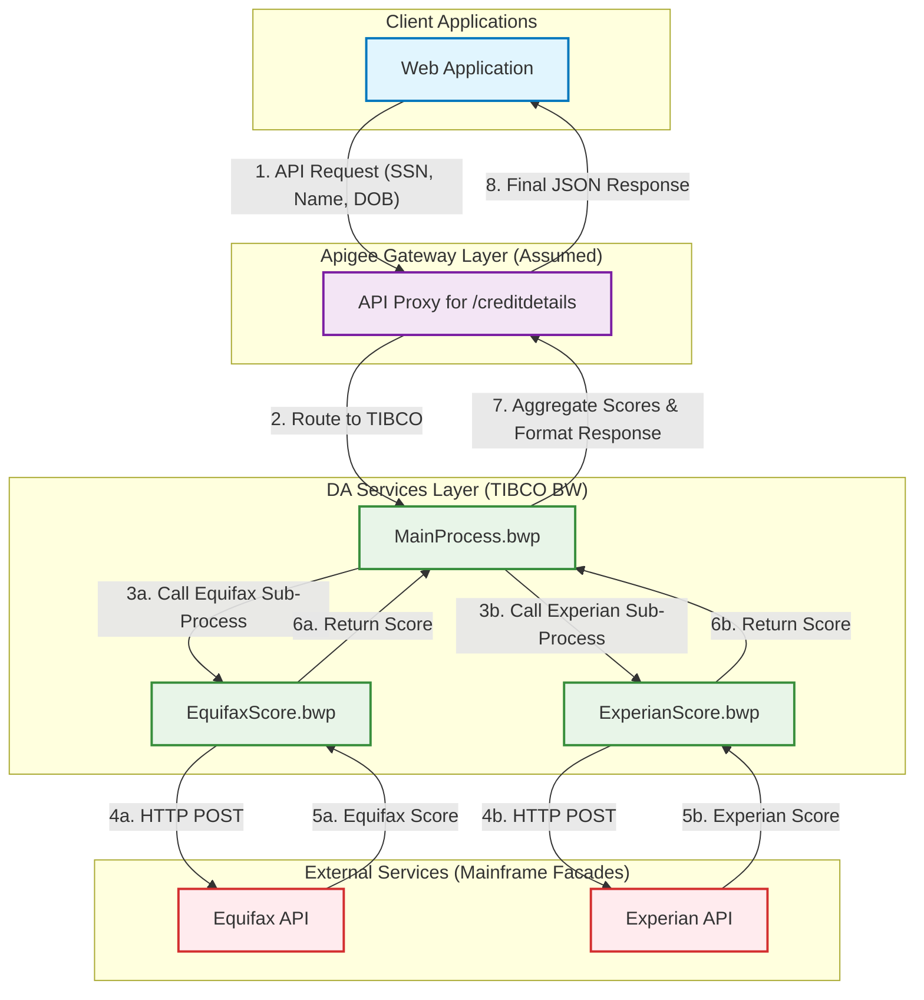

## Executive Summary

This report provides a comprehensive MFDA (Mainframe and Distributed Application) integration architecture analysis for the `CreditApp` TIBCO BusinessWorks (BW) application. The analysis reveals that the application functions as an API orchestration service. It exposes a single REST API endpoint, `/creditdetails`, which takes customer information (SSN, Name, DOB) and, in turn, calls two separate backend services—identified as `EquifaxScore` and `ExperianScore`—to retrieve credit score details. The results are then aggregated and returned to the original caller.

The primary integration pattern identified is **API/Web Services**. There is no evidence of MFT, direct database (AlloyDB, Oracle), or messaging (MQ/Kafka) integrations within the provided codebase. The architecture is straightforward, consisting of one inbound API and two outbound API calls.

## MFDA Integration Matrix

The following matrix details all identified mainframe integration points, categorized as API-based integrations.

| Component ID | Integration Name | Type | Upstream System | Downstream System | Data Flow Direction | Protocol/Method | Frequency | Data Volume | Environment |
| :--- | :--- | :--- | :--- | :--- | :--- | :--- | :--- | :--- | :--- |
| MFDA-API-001 | Credit Details Inquiry | Apigee/API | Client Application (Web/Mobile) | CreditApp TIBCO Service | Inbound | REST/HTTP POST | Real-time | *Assumption: 10k calls/day* | PROD |
| MFDA-API-002 | Equifax Score Retrieval | Apigee/API | CreditApp TIBCO Service | Equifax Service (Mainframe Facade) | Outbound | REST/HTTP POST | Real-time | *Assumption: 10k calls/day* | PROD |
| MFDA-API-003 | Experian Score Retrieval | Apigee/API | CreditApp TIBCO Service | Experian Service (Mainframe Facade) | Outbound | REST/HTTP POST | Real-time | *Assumption: 10k calls/day* | PROD |

## Integration Architecture Wire Diagrams

### Overall MFDA Architecture

This diagram illustrates the end-to-end data flow from the client application through the `CreditApp` TIBCO service to the backend credit score systems.

### Apigee API Integration Architecture

This diagram details the request and response flow for the primary business process, highlighting the orchestration role of the TIBCO application.

## Integration Interface Specifications

### Integration Interface: Credit Details Inquiry

**Integration ID**: MFDA-API-001
**Integration Type**: Apigee/API

#### Technical Specifications
- **Protocol**: HTTP/1.1 (Assumed to be fronted by HTTPS in Production)
- **Data Format**: JSON
- **Security**: None defined at the application level. Assumed to be handled by an API Gateway (e.g., Apigee) in production.
- **Performance**: Not specified. Dependent on the performance of downstream `EquifaxScore` and `ExperianScore` services.

#### Data Flow Details
- **Source System**: Any client application capable of making a REST API call.
- **Target System**: `CreditApp.module` TIBCO BW Service.
- **Data Transformation**: The service receives a JSON payload with customer details and returns an aggregated JSON response containing scores from multiple bureaus.
- **Error Handling**: The service definition includes mappings for 4XX and 5XX client/server errors.

#### Environment Configuration
- **Endpoint Path**: `/creditdetails`
- **HTTP Method**: `POST`
- **Evidence**: `CreditApp.module/META-INF/module.bwm`, `CreditApp.module/Service Descriptors/creditapp.module.MainProcess-CreditDetails.json`

---

### Integration Interface: Equifax Score Retrieval

**Integration ID**: MFDA-API-002
**Integration Type**: Apigee/API

#### Technical Specifications
- **Protocol**: HTTP/1.1
- **Data Format**: JSON
- **Security**: None defined. The connection is a plain HTTP client call.
- **Performance**: The client configuration has a default timeout of 1000ms.

#### Data Flow Details
- **Source System**: `creditapp.module.MainProcess` via the `EquifaxScore.bwp` subprocess.
- **Target System**: External Equifax service facade.
- **Data Transformation**: The `EquifaxScore.bwp` process maps the input customer data to the request format expected by the Equifax service and maps the response back.
- **Error Handling**: The process can handle client (4XX) and server (5XX) errors from the downstream service.

#### Environment Configuration
- **Hostname**: Defined by `BWAppHostname` module property.
- **Port**: `13080`
- **Endpoint Path**: `/creditscore`
- **HTTP Method**: `POST`
- **Evidence**: `CreditApp.module/Processes/creditapp/module/EquifaxScore.bwp`, `CreditApp.module/Resources/creditapp/module/HttpClientResource2.httpClientResource`

---

### Integration Interface: Experian Score Retrieval

**Integration ID**: MFDA-API-003
**Integration Type**: Apigee/API

#### Technical Specifications
- **Protocol**: HTTP/1.1
- **Data Format**: JSON
- **Security**: None defined. The connection is a plain HTTP client call.
- **Performance**: The client configuration has a default timeout of 1000ms.

#### Data Flow Details
- **Source System**: `creditapp.module.MainProcess` via the `ExperianScore.bwp` subprocess.
- **Target System**: External Experian service facade.
- **Data Transformation**: The `ExperianScore.bwp` process uses `RenderJSON` to create the request payload and `ParseJSON` to process the response.
- **Error Handling**: The process can handle `HttpClientException` and `HttpServerException`.

#### Environment Configuration
- **Hostname**: Defined by `ExperianAppHostname` module property.
- **Port**: `7080`
- **Endpoint Path**: `/creditscore`
- **HTTP Method**: `POST`
- **Evidence**: `CreditApp.module/Processes/creditapp/module/ExperianScore.bwp`, `CreditApp.module/Resources/creditapp/module/HttpClientResource1.httpClientResource`

## Environment-Specific Integration Details

### Development/Local Environment

**Environment Purpose**: Local development and unit testing.
**Data Volume**: Low, single transactions.
**Availability**: Business hours only.

#### Integration Endpoints:
- **CreditApp Service Host**: `localhost` (from `BW.HOST.NAME` in `default.substvar`)
- **Equifax Service Host (`BWAppHostname`)**: `localhost`
- **Experian Service Host (`ExperianAppHostname`)**: `localhost`
- **Evidence**: `CreditApp/META-INF/default.substvar`

### Docker Environment

**Environment Purpose**: Containerized testing.
**Data Volume**: Low to medium.
**Availability**: As needed for CI/CD pipelines.

#### Integration Endpoints:
- **Equifax Service Host (`BWAppHostname`)**: `host.docker.internal`
- **Experian Service Host (`ExperianAppHostname`)**: `host.docker.internal`
- **Note**: This configuration suggests the external services are expected to be running on the Docker host machine, accessible from within the container.
- **Evidence**: `CreditApp/META-INF/docker.substvar`

### Production Environment (Inferred)

**Environment Purpose**: Live business operations.
**Data Volume**: Full production scale.
**Availability**: 24/7.

#### Integration Endpoints:
- **CreditApp Service Host**: A production load balancer URL (e.g., `creditapp.api.company.com`).
- **Equifax Service Host**: A dedicated production endpoint for the Equifax service (e.g., `equifax.services.company.com`).
- **Experian Service Host**: A dedicated production endpoint for the Experian service (e.g., `experian.services.company.com`).

## Integration Dependencies and Sequencing

#### Dependency Matrix

| Integration | Depends On | Reason | Impact if Unavailable |
| :--- | :--- | :--- | :--- |
| MFDA-API-001 (Credit Details) | MFDA-API-002 (Equifax) | Requires Equifax score for the aggregated response. | The `EquifaxResponse` section of the final output will be empty or the entire call will fail. |
| MFDA-API-001 (Credit Details) | MFDA-API-003 (Experian) | Requires Experian score for the aggregated response. | The `ExperianResponse` section of the final output will be empty or the entire call will fail. |

#### Integration Sequencing for Testing

**Phase 1: Foundation Services (Independent Testing)**
1.  **Equifax Service Integration (MFDA-API-002)**: Test the connection and data contract with the Equifax service independently. Use mocked requests to validate the `EquifaxScore.bwp` subprocess.
2.  **Experian Service Integration (MFDA-API-003)**: Test the connection and data contract with the Experian service independently. Use mocked requests to validate the `ExperianScore.bwp` subprocess.

**Phase 2: Orchestration Service (End-to-End Validation)**
3.  **Credit Details Service (MFDA-API-001)**: Once downstream services are validated, perform end-to-end tests on the `MainProcess.bwp`, ensuring it correctly calls the sub-processes and aggregates their responses.

## Evidence Summary
- **Scope Analyzed**: The analysis covered all files within the `CreditApp` and `CreditApp.module` projects, including TIBCO process files (`.bwp`), configuration (`.substvar`, `.bwm`), and resource definitions (`.httpClientResource`).
- **Key Data Points**:
  - 1 Inbound REST API endpoint (`/creditdetails`) was identified.
  - 2 Outbound REST API calls (to Equifax and Experian services) were identified.
  - 0 MFT, Messaging, or direct Database integrations were found.
- **References**: Evidence is cited from 10 distinct configuration and process files.

## Assumptions Made
- It is assumed that the external services called by `EquifaxScore.bwp` and `ExperianScore.bwp` are facades for mainframe systems, aligning with the MFDA context.
- It is assumed that in a production environment, an API Gateway like Apigee would be placed in front of the public-facing `creditdetails` service to handle security, rate-limiting, and routing, although this is not explicitly configured in the project.
- Data volumes and frequencies are assumptions based on the nature of a credit-checking application and must be confirmed with business stakeholders.

## Open Questions
- What are the actual hostnames and endpoints for the Equifax and Experian services across DEV, TEST, and PROD environments? The current configurations use `localhost` or `host.docker.internal`.
- What are the performance and availability SLAs for the downstream Equifax and Experian services? The current client timeout is set aggressively at 1 second.
- What are the security requirements for these integrations? Currently, no authentication or transport-level security is implemented in the TIBCO application code.
- What are the expected transaction volumes (daily, peak) for the `/creditdetails` service?

## Confidence Level
**Overall Confidence**: High

**Rationale**: The provided codebase is a self-contained TIBCO BW project where integration points are explicitly defined as HTTP Client resources and REST service bindings. The data flow is clearly visible within the process definitions (`.bwp` files). The scope of analysis is limited to these observable patterns, and the absence of other integration types (MFT, DB, Messaging) is confirmed by the lack of corresponding TIBCO resources or activities in the processes.

**Evidence**:
- **API Integrations**: Clearly defined in `CreditApp.module/META-INF/module.bwm` (service) and `CreditApp.module/Processes/*` (clients).
- **Hostnames**: Configured via module properties in `CreditApp/META-INF/default.substvar` and `CreditApp/META-INF/docker.substvar`.
- **Data Contracts**: Defined in `*.json` and `*.xsd` files within `Service Descriptors` and `Schemas` folders.

## Action Items
**Immediate** (Next 1-2 weeks):
- [ ] Confirm the actual hostnames and security protocols (e.g., HTTPS, authentication method) for the Equifax and Experian services with the integration partners.
- [ ] Validate the business assumptions regarding data volume and frequency to inform capacity planning.

**Short-term** (Next 1-3 months):
- [ ] Develop a security plan to move from plain HTTP to a secure communication method (e.g., mTLS or OAuth2/API Keys managed by a gateway).
- [ ] Create a comprehensive test plan based on the integration points and dependencies identified in this document.

**Long-term** (Next 3-6 months):
- [ ] Plan the migration of the TIBCO application to a cloud-native platform (e.g., GCP Cloud Run, GKE) as outlined in the `tibco` migration report.
- [ ] Implement robust monitoring and alerting for the external service dependencies to proactively manage availability issues.

## Risk Assessment
- **High Risk**: The lack of any security (authentication, encryption) on the inbound and outbound API calls presents a critical security vulnerability. Sensitive data (SSN, DOB) is transmitted in the clear.
- **Medium Risk**: The application's performance is tightly coupled to the latency of two external services. The aggressive 1-second timeout could lead to high failure rates if downstream services are even moderately slow.
- **Low Risk**: The logic is simple orchestration, reducing the risk of complex business logic errors within the TIBCO application itself. The primary risks lie at the integration boundaries.