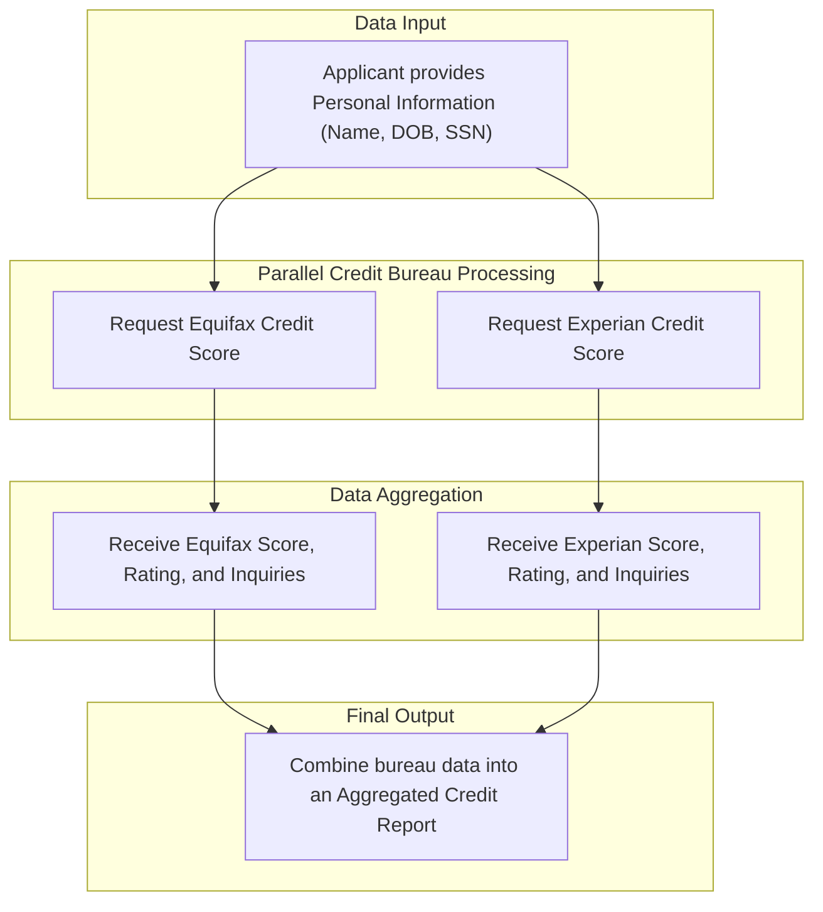

An analysis of the codebase reveals that the system's data model is designed to support a core business function: **credit risk assessment**. The application captures an individual's personal information, uses it to retrieve credit scores from multiple external credit bureaus, and then aggregates this information into a consolidated report. This data model is fundamental to making automated or manual lending decisions.

The primary information assets are the **Applicant's Personal Data**, the individual **Credit Score Reports** from bureaus like Equifax and Experian, and the final **Aggregated Credit Report**. The flow of information is designed to protect sensitive data while enabling a comprehensive risk evaluation, which is a standard and critical process in the financial services and lending industry.

## Analysis

### Business Entity Documentation

The system is built around tracking information related to credit applicants and their corresponding creditworthiness as determined by external bureaus.

| Business Entity | What It Tracks | Who Uses It | Business Purpose | Key Information |
| :--- | :--- | :--- | :--- | :--- |
| **Applicant Personal Information** | Core identifying details of a person applying for credit. | Underwriting Systems, Credit Analysts | To uniquely identify an applicant and retrieve their credit history. This is the foundational data for any credit decision. | Full Name, Date of Birth (DOB), Social Security Number (SSN). |
| **Credit Score Information** | A credit bureau's assessment of an applicant's creditworthiness. | Underwriting Systems, Loan Officers, Automated Decision Engines | To provide a standardized measure of credit risk, which is a primary factor in approving or denying credit applications and determining interest rates. | FICO Score, Number of Recent Inquiries, Qualitative Credit Rating (e.g., "Excellent", "Good"). |
| **Aggregated Credit Report** | A consolidated view of credit scores from multiple bureaus (e.g., Equifax, Experian). | Senior Credit Analysts, Automated Decision Engines, Risk Management | To create a comprehensive risk profile by comparing data from different sources. This supports more robust lending decisions and mitigates risks from data discrepancies between bureaus. | Equifax Score Details, Experian Score Details. |

### Business Relationships

The connections between these information entities are central to the application's business purpose.

| Relationship | Business Meaning | Business Impact |
| :--- | :--- | :--- |
| **Applicant** <-> **Credit Score** | An applicant's personal information is used to request and retrieve their credit score from one or more credit bureaus. | This connection is the core of the credit evaluation process. Without it, the business cannot assess an applicant's risk and cannot make informed lending decisions. |
| **Credit Score** -> **Aggregated Credit Report** | Individual credit scores from different bureaus (Equifax, Experian) are combined to form a single, comprehensive report for an applicant. | Enables a "tri-merge" style credit review, a standard best practice in lending. It provides a more accurate and reliable basis for credit decisions, reducing the risk of lending to unqualified applicants or offering incorrect terms. |

### Business Rules in Data

The data structures imply several business rules that ensure data quality and consistency.

| Business Rule | What It Ensures | Business Risk if Violated |
| :--- | :--- | :--- |
| Credit Score must be a whole number. | Ensures that the primary risk metric (FICO Score) is in a standardized, numerical format for calculations and comparisons. | Automated decisioning systems could fail or produce incorrect risk assessments, leading to bad loans or improper denials. |
| Number of Inquiries must be a whole number. | Guarantees that the count of recent credit checks is a valid integer, which is a key input for risk models. | Inaccurate inquiry counts could lead to a misjudgment of an applicant's recent credit-seeking behavior, impacting their risk profile. |
| Applicant's personal details (DOB, Name, SSN) are optional for data submission. | The system is designed to be flexible, potentially allowing for partial information submission at certain stages. | While flexible, this could lead to failed credit pulls if mandatory information for a bureau is missing. It places the burden of data completeness on the business process logic. |

### Business Information Flow

The application follows a clear, parallel process to gather and aggregate credit information. An applicant's details are submitted, and the system simultaneously requests credit scores from multiple bureaus before combining them into a final report.

## Evidence Summary

*   **Scope Analyzed**: The analysis focused on TIBCO BusinessWorks processes (`.bwp`), schema definitions (`.xsd`), and service descriptors (`.json`).
*   **Key Data Points**:
    *   **Applicant Information**: Defined in `GiveNewSchemaNameHere` type within `getcreditstorebackend_0_1_mock_app.xsd` and `ExperianRequestSchema.xsd`. It includes `DOB`, `FirstName`, `LastName`, and `SSN`.
    *   **Credit Score Information**: Defined as `SuccessSchema` in `getcreditstorebackend_0_1_mock_app.xsd` and `ExperianResponseSchemaElement` in `ExperianResponseSchemaResource.xsd`. It includes `FICOScore`, `NoOfInquiries`, and `Rating`.
    *   **Aggregated Report**: Defined as `CreditScoreSuccessSchema` in `getcreditstorebackend_0_1_mock_app.xsd`, which combines multiple `SuccessSchema` objects for different bureaus.
*   **References**: The business flow was directly derived from `CreditApp.module\Processes\MainProcess.bwp`, which orchestrates parallel calls to the `EquifaxScore.bwp` and `ExperianScore.bwp` subprocesses.

## Assumptions Made

*   It is assumed that the schema element named `GiveNewSchemaNameHere` represents the data for a single credit applicant.
*   It is assumed that the business purpose of this application is to support a credit underwriting or loan origination process.
*   The terms `FICOScore`, `NoOfInquiries`, and `Rating` are assumed to be standard credit reporting metrics used for risk assessment.
*   The processes `EquifaxScore` and `ExperianScore` are assumed to connect to the respective real-world credit bureaus, although they currently point to mock services.

## Open Questions

*   The `CreditScoreSuccessSchema` includes a `TransUnionResponse`. However, no process or integration point for TransUnion was found in the codebase. Is this a planned future integration or a remnant of a deprecated feature?
*   What are the specific data validation rules for key fields like `SSN` and `DOB`? The schemas define them as strings, but business logic for format validation is not apparent in the schemas themselves.
*   What are the data retention policies for this sensitive Personally Identifiable Information (PII)? How long is applicant data stored after a decision is made?

## Confidence Level

**Overall Confidence**: High

**Rationale**: The data models are explicitly defined in XML Schemas (`.xsd`) and JSON service descriptors. The relationships and data flows are clearly implemented in the TIBCO BusinessWorks processes (`.bwp`), leaving little room for ambiguity. The naming conventions (`FICOScore`, `EquifaxResponse`, `ExperianScore`) strongly indicate the business domain.

**Evidence**:
*   **File References**: `getcreditstorebackend_0_1_mock_app.xsd`, `creditapp.module.MainProcess-CreditDetails.json`, `MainProcess.bwp`.
*   **Configuration Files**: The process files clearly show the orchestration of data.
*   **Code Examples**: The structure of `CreditScoreSuccessSchema` in `getcreditstorebackend_0_1_mock_app.xsd` directly confirms the aggregation of multiple bureau responses.

## Action Items

**Immediate**:
*   [ ] Confirm with business stakeholders the purpose of the `TransUnionResponse` field in the data model, as it is not currently populated by any process. This will clarify whether it's a future requirement or should be removed.

**Short-term**:
*   [ ] Engage with the credit risk or underwriting department to formally document the specific validation rules for applicant data (e.g., valid SSN format, acceptable date range for DOB).
*   [ ] Schedule a meeting with the compliance officer to define and document the data retention policies for the applicant PII handled by this system.

## Risk Assessment

*   **High Risk**: The data model centrally manages highly sensitive Personally Identifiable Information (PII), including Social Security Numbers. A data breach would have severe regulatory (e.g., GLBA, GDPR) and reputational consequences.
*   **Medium Risk**: The business relies on the accuracy of data from external credit bureaus. The current data model does not include fields for tracking the source or timestamp of the bureau data, which could complicate audits or dispute resolution.
*   **Low Risk**: The data model itself is relatively simple, with a clear hierarchical structure rather than complex relational joins. This reduces the risk of internal data corruption due to software bugs.