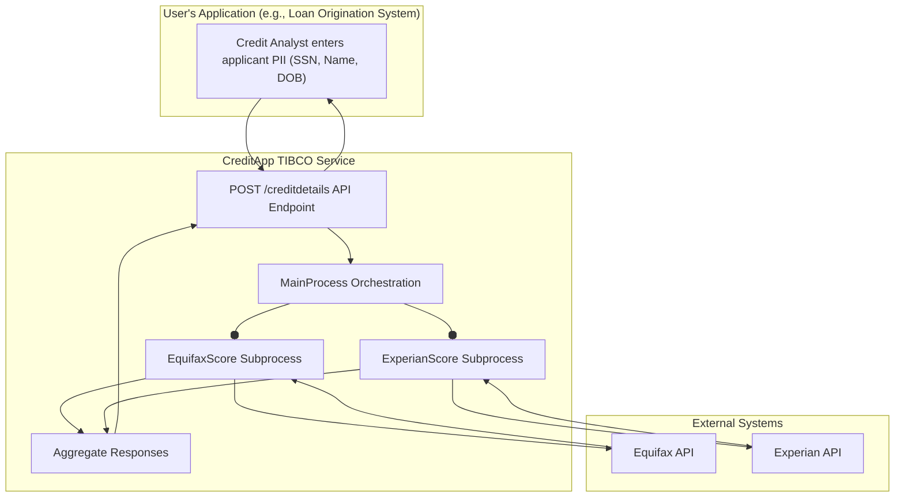

## Executive Summary

This analysis reveals that the application, `CreditApp`, is a specialized backend service designed for the financial services domain. Its core function is to act as a credit score aggregator. Based on code evidence, the system receives an individual's Personally Identifiable Information (PII) via a single REST API endpoint, orchestrates parallel calls to external credit bureaus (specifically Equifax and Experian), and returns a consolidated credit report. The primary user of this system is another application, likely a loan origination or underwriting platform, acting on behalf of a Credit Analyst or Loan Officer to facilitate rapid credit-based decision-making.

## Analysis

### User Persona: Credit Analyst / Loan Officer

This persona represents the business user whose workflow is enabled by the `CreditApp` service. They interact with the service indirectly through a primary business application (e.g., a Loan Origination System).

| Attribute | Description |
| :--- | :--- |
| **Role Name** | Credit Analyst / Loan Officer |
| **Primary Responsibilities** | - Evaluating the creditworthiness of applicants for financial products (e.g., loans, credit cards). - Making data-driven decisions on application approvals, denials, or terms. - Ensuring compliance with credit reporting regulations. |
| **Success Metrics/KPIs** | - **Time-to-Decision**: Time taken from application submission to credit decision. - **Loan Approval Rate**: Percentage of applications approved. - **Default Rate**: Percentage of approved loans that go into default. |
| **Pain Points (Solved by this System)** | - Manually accessing multiple, separate credit bureau systems to gather a complete credit profile. - Dealing with inconsistent data formats and reports from different bureaus. - Slow, manual processes leading to delayed decisions and poor customer experience. |
| **Decision Authority** | - Approving or denying credit applications within specified limits. - Recommending terms (e.g., interest rates, credit limits) based on the aggregated credit score. |
| **Business Impact if System Fails** | - Complete halt of new credit application processing. - Significant delays in loan approvals, leading to customer dissatisfaction and potential loss of business to competitors. - Inability to make informed risk assessments. |
| **Escalation Path** | Application Support, IT Operations, Head of Underwriting. |

### User Journey: Requesting a Consolidated Credit Report

This journey describes the end-to-end business process for obtaining a credit score using the `CreditApp` service.

**Journey Name**: Consolidated Credit Report Retrieval
**Participants**: Credit Analyst (via a front-end system), `CreditApp` Service, External Credit Bureaus (Equifax, Experian).

**Steps**:

1.  **Submit Applicant Data**
    *   **User Goal**: To initiate a credit check for a new applicant.
    *   **System Support**: The Credit Analyst enters the applicant's PII (SSN, Name, DOB) into their primary application. This application then makes a `POST` request to the `/creditdetails` API endpoint provided by `CreditApp`.
    *   **Evidence**: The `creditapp.module.MainProcess-CreditDetails.json` Swagger definition shows a `POST /creditdetails` endpoint that accepts `GiveNewSchemaNameHere` (`DOB`, `FirstName`, `LastName`, `SSN`).

2.  **System Fetches Scores in Parallel**
    *   **User Goal**: To get a comprehensive credit profile from multiple trusted sources quickly.
    *   **System Support**: Upon receiving the request, the `MainProcess` immediately triggers two parallel subprocesses to fetch scores from different bureaus.
    *   **Evidence**: The `MainProcess.bwp` contains a `<flow>` element that simultaneously invokes the `EquifaxScore.bwp` and `ExperianScore.bwp` subprocesses.

3.  **System Aggregates Scores**
    *   **User Goal**: To view a single, easy-to-understand report without needing to reconcile data from different sources.
    *   **System Support**: The `MainProcess` waits for both subprocesses to complete, then maps the individual responses into a single, structured JSON object.
    *   **Evidence**: The `postOut` reply activity in `MainProcess.bwp` combines the outputs from `EquifaxScore` and `ExperianScore` into the `CreditScoreSuccessSchema`, which contains distinct `EquifaxResponse` and `ExperianResponse` objects.

4.  **Review Consolidated Report & Make Decision**
    *   **User Goal**: To make a fast, informed credit decision.
    *   **System Support**: The aggregated API response, containing FICO scores, inquiry counts, and ratings from each bureau, is returned to the Credit Analyst's application for display. This enables the analyst to quickly assess risk and approve, deny, or set terms for the application.
    *   **Evidence**: The `CreditScoreSuccessSchema` in `getcreditstorebackend_0_1_mock_app.xsd` defines the consolidated structure with fields like `FICOScore`, `NoOfInquiries`, and `Rating` for each bureau.

**Value Chain**: This automated journey significantly accelerates the credit underwriting process. By providing a single point of integration and a consolidated report, it reduces manual effort, minimizes human error, and enables faster business decisions, directly impacting customer acquisition and satisfaction.

### Business Flow Diagram

## Evidence Summary

-   **Scope Analyzed**: The analysis covered all TIBCO BusinessWorks processes (`.bwp`), schema definitions (`.xsd`, `.json`), and module configurations (`.bwm`, `.substvar`) within the `CreditApp.module`.
-   **Key Data Points**:
    -   **1** primary API endpoint (`/creditdetails`) was identified.
    -   **3** core business processes were analyzed: `MainProcess`, `EquifaxScore`, `ExperianScore`.
    -   **2** external credit bureau integrations (Equifax, Experian) are actively implemented.
    -   **4** key PII data points are used for the credit check: `SSN`, `FirstName`, `LastName`, `DOB`.
-   **References**:
    -   `CreditApp.module/Processes/creditapp/module/MainProcess.bwp`: Defines the core orchestration logic.
    -   `CreditApp.module/Processes/creditapp/module/EquifaxScore.bwp`: Defines the call to the Equifax service.
    -   `CreditApp.module/Processes/creditapp/module/ExperianScore.bwp`: Defines the call to the Experian service.
    -   `CreditApp.module/Service Descriptors/creditapp.module.MainProcess-CreditDetails.json`: Defines the public-facing API contract.
    -   `CreditApp.module/Schemas/getcreditstorebackend_0_1_mock_app.xsd`: Defines the input and output data structures.

## Assumptions Made

-   It is assumed that the "user" of this service is a financial role like a Credit Analyst or Loan Officer, who interacts with it via a separate front-end application not present in this repository.
-   The application is intended for the US financial market, given the use of SSN and specific credit bureaus (Equifax, Experian).
-   The endpoints defined in `HttpClientResource1` and `HttpClientResource2` (`localhost:7080` and `localhost:13080`) are placeholders or mock services for the actual external credit bureau APIs.
-   The business goal is to automate and accelerate credit-based decision-making by providing a unified data source.

## Open Questions

-   The response schema (`CreditScoreSuccessSchema`) includes a placeholder for `TransUnionResponse`, but there is no corresponding logic in `MainProcess.bwp` to call a TransUnion service. Is this a planned future enhancement or a remnant of a deprecated requirement?
-   The process flows in `MainProcess.bwp` do not contain explicit error handling paths. What is the expected business behavior if one of the credit bureau APIs fails or times out? Should the service return a partial success or a complete failure?
-   What are the business-defined SLAs for response time? The journey's value is speed, but no technical timeouts are explicitly configured beyond the default Hystrix settings.

## Confidence Level

**Overall Confidence**: High

**Rationale**: The purpose of the application is exceptionally clear from the naming conventions of processes, schemas, and variables. The `MainProcess.bwp` file provides a definitive view of the business workflow: receive a request, call two external services in parallel, and aggregate the results. The data schemas (`GiveNewSchemaNameHere`, `CreditScoreSuccessSchema`) directly map to the business domain of credit reporting.

**Evidence**:
-   **File References**: `MainProcess.bwp` clearly shows the orchestration flow. `EquifaxScore.bwp` and `ExperianScore.bwp` show the distinct external calls.
-   **Configuration Files**: `creditapp.module.MainProcess-CreditDetails.json` defines the single, clear business function exposed by the service.
-   **Code Examples**: The XSLT mappings within the `.bwp` files explicitly show data being passed from the initial request to the subprocesses and then aggregated into the final response, confirming the data journey.

## Action Items

**Immediate** (Next planning session):
-   **[ ] Clarify TransUnion Integration**: Product Management should confirm if the `TransUnionResponse` placeholder in the schema is for an upcoming feature or should be removed to avoid confusion.

**Short-term** (Within 1-2 sprints):
-   **[ ] Define Error Handling Journeys**: Business Analysts and UX Designers should define the desired user experience when one or more credit bureaus are unavailable. This includes what message the Credit Analyst should see and whether a partial report is acceptable.

**Long-term** (Next quarter):
-   **[ ] Map Additional User Journeys**: Investigate if there are other user journeys, such as administrative roles for managing API access or monitoring service health, that are not captured in the current process flows.

## Risk Assessment

-   **High Risk**: **Incomplete Data Risk.** The lack of explicit error handling if one credit bureau API fails could lead to Credit Analysts making decisions based on an incomplete credit profile without being aware of the missing data. This could result in poor lending decisions.
-   **Medium Risk**: **Inconsistent User Experience.** Without defined error handling journeys, the system's behavior during external service outages is unpredictable, which can frustrate users and erode trust in the application.
-   **Low Risk**: **Schema Mismatch.** The presence of the unused `TransUnionResponse` in the public API contract could cause confusion for new client applications integrating with the service.