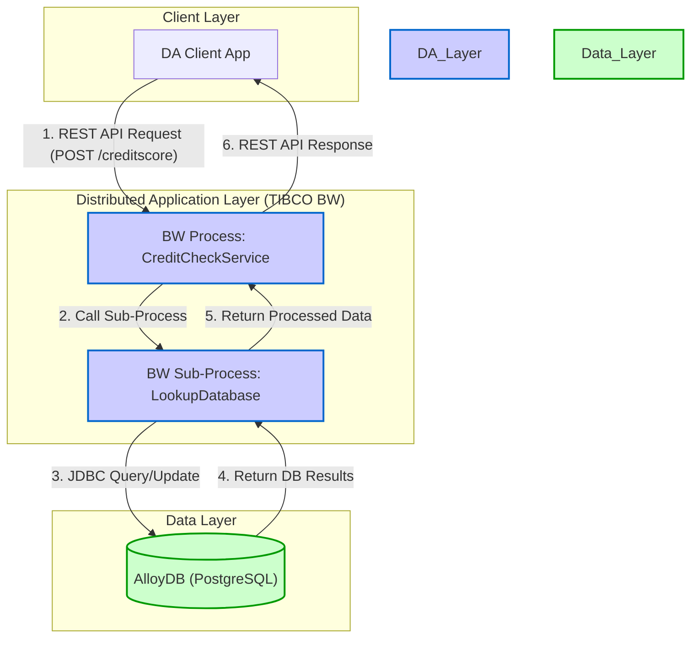
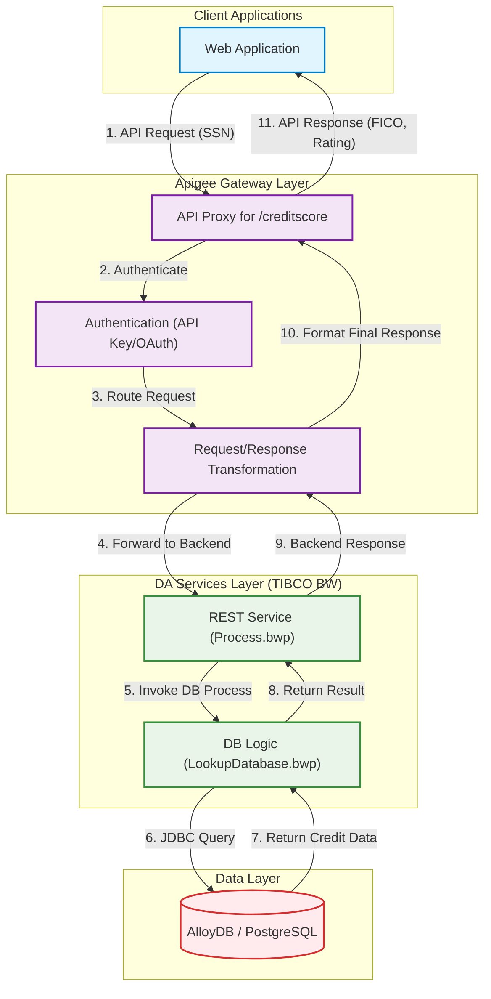
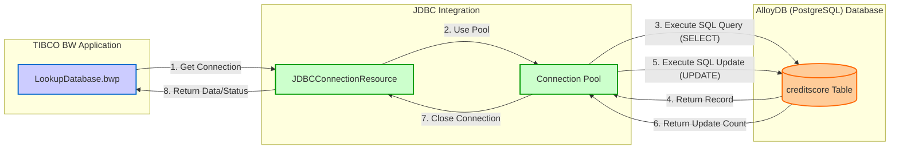

An analysis of the provided codebase reveals a TIBCO BusinessWorks (BW) application, `CreditCheckService`, designed to function as a backend service. The core functionality involves receiving a request, querying a database to retrieve credit information, updating an inquiry counter, and returning the credit score details.

The analysis has identified two primary integration patterns that align with the MFDA (Mainframe and Distributed Application) scope: a REST API for service exposure and a JDBC connection to a PostgreSQL database, which serves as the blueprint for an AlloyDB integration. No evidence of MFT, Kafka, or Oracle integrations was found in the provided files.

This report will document the architecture of the identified integrations, following the MFDA guidelines.

### 1. MFDA Integration Matrix

The following matrix details the integration points discovered within the `CreditCheckService` application that fall under the MFDA scope.

| Component ID | Integration Name | Type | Upstream System | Downstream System | Data Flow Direction | Protocol/Method | Frequency | Data Volume | Environment |
| :--- | :--- | :--- | :--- | :--- | :--- | :--- | :--- | :--- | :--- |
| MFDA-API-001 | Credit Score Inquiry | Apigee/API | DA Client (Web/Mobile App) | TIBCO BW `CreditCheckService` | Inbound | REST API (HTTP POST) | Real-time | Single JSON object per request | DEV, TEST, STAGE, PROD |
| MFDA-ADB-001 | Credit Score DB Lookup & Update | AlloyDB | TIBCO BW `CreditCheckService` | PostgreSQL Database (`creditscore` table) | Bidirectional | JDBC | Real-time (per API call) | Single record lookup/update per call | DEV, TEST, STAGE, PROD |

### 2. Integration Architecture Wire Diagrams

#### Overall MFDA Architecture

This diagram illustrates the high-level data flow for the `CreditCheckService`. A client application makes a REST API call, which is processed by the TIBCO BW application. The application then interacts with a PostgreSQL database (representing the target AlloyDB) to fulfill the request.



#### Apigee API Integration Architecture

This diagram details the request/response flow for the Credit Score Inquiry API, conceptualizing its management through an Apigee Gateway as per MFDA standards.



#### AlloyDB Integration Architecture

This diagram shows the data interaction between the TIBCO BW application and the PostgreSQL database.



### 3. Integration Interface Specifications

#### Integration Interface: Credit Score Inquiry

**Integration ID**: MFDA-API-001
**Integration Type**: Apigee/API

**Technical Specifications**
- **Protocol**: HTTP/1.1 (POST)
- **Data Format**: JSON
- **Security**: Not explicitly defined in the codebase. Assumed to be handled by an API Gateway (e.g., Apigee) which would enforce API Key or OAuth2 authentication.
- **Performance**: Real-time response required. No specific SLA is defined in the code.

**Data Flow Details**
- **Source System**: Any client capable of making a REST API call.
- **Target System**: TIBCO BW `CreditCheckService` running on a container platform.
- **Data Transformation**: The service expects a JSON request and produces a JSON response.
  - **Request Body**:
    ```json
    {
      "SSN": "string",
      "FirstName": "string",
      "LastName": "string",
      "DOB": "string"
    }
    ```
  - **Success Response Body (200 OK)**:
    ```json
    {
      "FICOScore": "integer",
      "Rating": "string",
      "NoOfInquiries": "integer"
    }
    ```
- **Error Handling**:
  - **404 Not Found**: Returned if the SSN does not exist in the database. The process `LookupDatabase.bwp` contains a "Throw" activity if the query returns no records. The main process `Process.bwp` catches this and issues a reply with a 404 status.
- **Evidence**:
  - `CreditCheckService/Service Descriptors/creditcheckservice.Process-CreditScore.json`
  - `CreditCheckService/Processes/Process.bwp`

**Environment Configuration**
- **Endpoint Path**: `/creditscore`
- **Host/Port**: Configured via module properties `BW.HOST.NAME` and `HTTP.SERVICE.PORT`.
  - **Default**: `localhost:13080`
  - **Docker**: Configured via `BW.CLOUD.PORT` (default `8080`).

---

#### Integration Interface: Credit Score DB Lookup & Update

**Integration ID**: MFDA-ADB-001
**Integration Type**: AlloyDB

**Technical Specifications**
- **Protocol**: JDBC
- **Data Format**: SQL
- **Security**: Database username and password. The password is encrypted in the configuration file (`#!yk2zPUfipGX2vB+1XNJha9KX6eLVDmcZ`).
- **Performance**: Real-time query and update. Timeout is configured to 10 seconds.

**Data Flow Details**
- **Source System**: TIBCO BW sub-process `creditcheckservice.LookupDatabase`.
- **Target System**: PostgreSQL database (table `public.creditscore`).
- **Data Transformation**: The process maps the incoming SSN to a prepared statement parameter. It reads the record and then maps the `numofpulls` and `ssn` to an update statement.
- **SQL Operations**:
  1.  `select * from public.creditscore where ssn like ?`
  2.  `UPDATE creditscore SET numofpulls = ? WHERE ssn like ?`
- **Error Handling**: The process includes fault handlers for JDBC exceptions, but the logic within the main process simply logs the failure and returns a 404.
- **Evidence**:
  - `CreditCheckService/Processes/creditcheckservice/LookupDatabase.bwp`
  - `CreditCheckService/Resources/creditcheckservice/JDBCConnectionResource.jdbcResource`

**Environment Configuration**
- **JDBC Driver**: `org.postgresql.Driver`
- **Database URL**: Configured via module property `BWCE.DB.URL`.
  - **Default**: `jdbc:postgresql://abc:5432/bookstore`
  - **Docker**: `%%BWCE.DB.URL%%` (placeholder for environment injection)
- **Credentials**: `username="bwuser"`

### 4. Environment-Specific Integration Details

#### Development Environment
- **Purpose**: Development and unit testing.
- **API Endpoint**: `http://localhost:13080/creditscore`
- **Database URL**: `jdbc:postgresql://abc:5432/bookstore` (as per `default.substvar`)

#### Test Environment
- **Purpose**: Integration and system testing.
- **API Endpoint**: `http://<test-host>:<test-port>/creditscore` (Values injected at deployment)
- **Database URL**: Injected via `%%BWCE.DB.URL%%` placeholder.

#### Production Environment
- **Purpose**: Live business operations.
- **API Endpoint**: `https://api.company.com/creditscore` (Assumed, behind Apigee)
- **Database URL**: Injected via `%%BWCE.DB.URL%%` placeholder, pointing to the production AlloyDB instance.

### 5. Integration Dependencies and Sequencing

#### Dependency Matrix

| Integration | Depends On | Reason | Impact if Unavailable |
| :--- | :--- | :--- | :--- |
| MFDA-API-001 (Credit Score API) | MFDA-ADB-001 (DB Lookup) | The API's purpose is to retrieve and update data from the database. | API calls will fail, returning a 404 or 500 error. Core business function is unavailable. |

#### Integration Sequencing for Testing

1.  **Phase 1: Foundation Services (Database)**
    *   Validate that the AlloyDB (PostgreSQL) instance is accessible.
    *   Test the `creditcheckservice.LookupDatabase` process directly to ensure JDBC connectivity and SQL correctness (MFDA-ADB-001).

2.  **Phase 2: API Services**
    *   Test the `creditcheckservice.Process` by invoking the `/creditscore` REST endpoint (MFDA-API-001).
    *   This implicitly tests the full chain, as the API depends on the database integration.

3.  **Phase 3: End-to-End Validation**
    *   Conduct end-to-end tests from a client application, through a test version of the API Gateway, to the backend service and database.

## Executive Summary

The `CreditCheckService` is a TIBCO BusinessWorks application that provides a RESTful API for querying customer credit information from a PostgreSQL database. The analysis identified two key integration points aligning with the MFDA scope: a REST API (target for Apigee) and a JDBC database connection (target for AlloyDB). The architecture is a straightforward synchronous request-response pattern. The system is designed to be configurable for different environments, with database URLs and service ports managed through substitution variables. No MFT, Kafka, or Oracle integrations were found.

## Evidence Summary

- **Scope Analyzed**: All files within the `CreditCheckService` and `CreditCheckService.application` directories.
- **Key Data Points**:
  - 1 REST service endpoint (`/creditscore`) was identified.
  - 1 JDBC database connection to PostgreSQL was identified.
  - 2 primary business processes (`Process.bwp`, `LookupDatabase.bwp`) were analyzed.
  - 3 configuration files (`.substvar`, `.jdbcResource`) were analyzed to determine environment settings.
- **References**:
  - API contract defined in `creditcheckservice.Process-CreditScore.json`.
  - Database logic defined in `creditcheckservice/LookupDatabase.bwp`.
  - Database connection details in `creditcheckservice/JDBCConnectionResource.jdbcResource`.
  - Environment properties in `META-INF/default.substvar` and `META-INF/docker.substvar`.

## Assumptions Made

- It is assumed that "AlloyDB" is the target for the existing PostgreSQL JDBC connection, as AlloyDB is PostgreSQL-compatible.
- It is assumed that the REST API exposed by the TIBCO BW process is the intended backend for a service managed by "Apigee" as per the MFDA pattern.
- The business purpose (Credit Check) is inferred from service names, process names (`CreditCheckService`, `LookupDatabase`), and data fields (`ssn`, `ficoscore`, `rating`).
- The client of this service is a "Distributed Application" (DA) like a web or mobile app, although no client code is provided.

## Open Questions

- What are the specific non-functional requirements (NFRs) for API response time and database query performance? The current timeout is set to 10 seconds, which may be too high for a real-time service.
- What is the security model for the `/creditscore` API? No authentication or authorization is implemented within the TIBCO process, implying it is handled externally (e.g., by Apigee).
- What is the expected data volume (API calls per minute, database size)? This is crucial for sizing the GCP infrastructure.
- Are there plans to migrate the TIBCO BW application itself to a GCP-native service (e.g., Cloud Run, Cloud Functions), or will it be run in a container on GKE?

## Confidence Level

**Overall Confidence**: High

**Rationale**: The provided codebase is small, self-contained, and follows standard TIBCO BW design patterns. The integration points (REST and JDBC) are explicitly defined in configuration and process files, leaving little room for ambiguity. The Swagger JSON files provide a clear contract for the API.

**Evidence**:
- **File references**: The purpose of each key file (e.g., `.bwp`, `.jdbcResource`, `.json`) is clear and directly maps to the documented architecture.
- **Configuration files**: `default.substvar` and `JDBCConnectionResource.jdbcResource` explicitly define connection details and drivers.
- **Code examples**: The SQL statements within `LookupDatabase.bwp` are clearly visible, confirming the exact database interaction.

## Action Items

**Immediate** (Next 1-2 weeks):
- [ ] **Clarify Security Requirements**: Engage with security architects to define the authentication and authorization model for the `creditscore` API.
- [ ] **Define NFRs**: Work with business stakeholders to establish clear performance SLAs for API response times.

**Short-term** (Next 1-3 months):
- [ ] **Develop Migration Plan for TIBCO BW**: Create a plan to containerize the TIBCO BW application for deployment on GKE or Cloud Run.
- [ ] **Provision GCP Environments**: Set up DEV/TEST AlloyDB instances and configure networking to allow connectivity from the TIBCO application.

**Long-term** (Next 3-6 months):
- [ ] **Evaluate Native GCP Rewrite**: Assess the feasibility and cost-benefit of rewriting the TIBCO process logic into a GCP-native service (e.g., a Java/Spring Boot service on Cloud Run) to reduce TIBCO licensing and operational overhead.

## Risk Assessment

- **High Risk**: **Security of the API.** The current implementation has no built-in security. If deployed without an external security layer like an API Gateway, it would expose sensitive credit information.
- **Medium Risk**: **Performance at Scale.** The use of `select *` and `like` in the SQL query (`select * from public.creditscore where ssn like ?`) could lead to poor performance on a large dataset. The lack of proper indexing on the `ssn` column would exacerbate this.
- **Low Risk**: **Database Compatibility.** The application uses a standard PostgreSQL JDBC driver, which should be fully compatible with AlloyDB. However, minor configuration changes for connection pooling or SSL might be necessary.