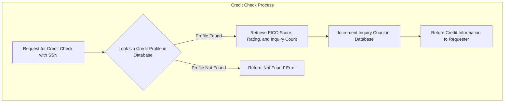

## Executive Summary

This analysis documents the business data model for the CreditCheckService application. The system's core purpose is to manage and provide credit profile information for individuals. It tracks essential personal identifiers to retrieve a person's credit score, credit rating, and the history of credit inquiries. This information is critical for business functions that need to assess customer creditworthiness, such as loan origination or new account approvals.

## Analysis

### Business Entity Documentation

The system is centered around a single primary business entity: the individual's Credit Profile.

| Business Entity | What It Tracks | Who Uses It | Business Purpose | Key Information Tracked |
| :--- | :--- | :--- | :--- | :--- |
| **Credit Profile** | An individual's personal identifiers, their calculated credit score, and a history of credit inquiries. | Credit & Risk Departments, Loan Officers, Automated Underwriting Systems. | To provide a standardized, on-demand assessment of an individual's creditworthiness, enabling rapid and consistent credit-based decisions. | Social Security Number (SSN), Full Name, Date of Birth, FICO Score, Credit Rating, Number of Inquiries. |

### Business Relationships

The data model is self-contained, focusing on the attributes of the Credit Profile. The key relationship is the link between an individual's identity and their credit history.

| Relationship | Business Meaning | Business Impact |
| :--- | :--- | :--- |
| **Individual's Identity** <-> **Credit History** | The system links a person's unique identity (primarily via SSN) to their specific credit information (FICO score, rating, etc.). | This direct link is fundamental to the service. It ensures that when a credit check is requested for a person, the correct and corresponding credit history is retrieved, preventing incorrect credit decisions and ensuring compliance. |
| **Credit Profile** <-> **Inquiry Count** | Each time a credit profile is accessed, the system increments a counter for the number of inquiries. | This provides a crucial risk indicator. A high number of recent inquiries can signal increased credit-seeking behavior, which is a key factor in credit risk assessment models. It helps the business gauge the potential for over-leveraging. |

### Business Rules in Data

The system enforces several business rules to ensure data integrity and process validity.

| Business Rule | What It Ensures | Business Risk if Violated |
| :--- | :--- | :--- |
| **A Valid Credit Rating is Required** | The system will not return a credit profile as valid unless it contains a credit rating. A profile without a rating is considered incomplete or invalid. | Returning a profile without a rating could lead to automated or manual decisions being made on incomplete information, potentially approving a high-risk applicant or denying a creditworthy one. |
| **Credit Inquiries Must Be Tracked** | Every successful lookup of a credit profile results in the "Number of Inquiries" count being increased by one. | Failure to track inquiries would remove a key data point for risk analysis. The business would lose visibility into a customer's recent credit-seeking activity, potentially underestimating their risk profile. |
| **SSN is the Primary Identifier** | All credit profile lookups are performed using the individual's Social Security Number. | Using a less unique identifier could result in retrieving the wrong person's credit history, leading to severe business errors, customer privacy violations, and potential legal and compliance failures. |

### Business Information Flow

The following diagram illustrates the primary business process supported by the data model: performing a credit check.

## Evidence Summary

-   **Scope Analyzed**: The analysis focused on TIBCO BusinessWorks process files (`.bwp`), XML schema definitions (`.xsd`), service descriptors (`.json`), and configuration files (`.substvar`, `.jdbcResource`).
-   **Key Data Points**:
    -   The central data entity is `creditscore`, as identified in the SQL query `select * from public.creditscore where ssn like ?` within `CreditCheckService/Processes/creditcheckservice/LookupDatabase.bwp`.
    -   The data model includes `ssn`, `firstname`, `lastname`, `dateofBirth`, `ficoscore`, `rating`, and `numofpulls`.
    -   The API contract, defined in `CreditCheckService/Service Descriptors/creditcheckservice.Process-CreditScore.json`, exposes `FICOScore`, `Rating`, and `NoOfInquiries`.
    -   The business process of incrementing the inquiry count is confirmed by the SQL `UPDATE creditscore SET numofpulls = ? WHERE ssn like ?` in `CreditCheckService/Processes/creditcheckservice/LookupDatabase.bwp`.
-   **References**: 4 primary files were used to construct the data model: `LookupDatabase.bwp`, `Process.bwp`, `GetCreditStoreBackend_0.1.xsd`, and `creditcheckservice.Process-CreditScore.json`.

## Assumptions Made

-   **Data Source**: It is assumed that the `creditscore` table in the PostgreSQL database is the single source of truth for this service. The process of how this data is initially populated (e.g., from a credit bureau) is not detailed in the codebase.
-   **Data Sensitivity**: Based on the nature of the data (SSN, FICO score), it is assumed that this information is highly sensitive and subject to financial and privacy regulations.
-   **Business Context**: The analysis assumes the application's purpose is to serve as a microservice for other internal systems that require creditworthiness checks as part of a larger business process (e.g., loan application, customer onboarding).

## Open Questions

-   What are the defined values and business meanings for the `Rating` field (e.g., "Excellent", "Good", "Fair", "Poor")?
-   What is the data origination and refresh strategy for the `creditscore` data? How does the business ensure this data is current?
-   Are there data retention policies in place for this sensitive information? How long are credit profiles and inquiry histories stored?
-   What other business processes consume the "Number of Inquiries" data, and how does it affect their decisions?

## Confidence Level

**Overall Confidence**: High

**Rationale**: The codebase is small and focused, with a clearly defined data model and business process. The TIBCO process files (`.bwp`) contain explicit SQL queries and data mappings, and the service descriptors (`.json`, `.xsd`) clearly define the data contracts. This provides strong, consistent evidence for the documented data model.

**Evidence**:
-   The database connection is explicitly defined as PostgreSQL in `CreditCheckService/Resources/creditcheckservice/JDBCConnectionResource.jdbcResource`.
-   The primary entity and its attributes are directly listed in the `select` statement in `CreditCheckService/Processes/creditcheckservice/LookupDatabase.bwp`.
-   The request and response data structures are clearly defined in `CreditCheckService/Schemas/GetCreditStoreBackend_0.1.xsd` and `CreditCheckService/Service Descriptors/creditcheckservice.Process-CreditScore.json`.

## Action Items

This report is for documentation purposes; therefore, no action items for code changes are provided.

## Risk Assessment

This report is for documentation purposes; therefore, no risk assessment is provided.