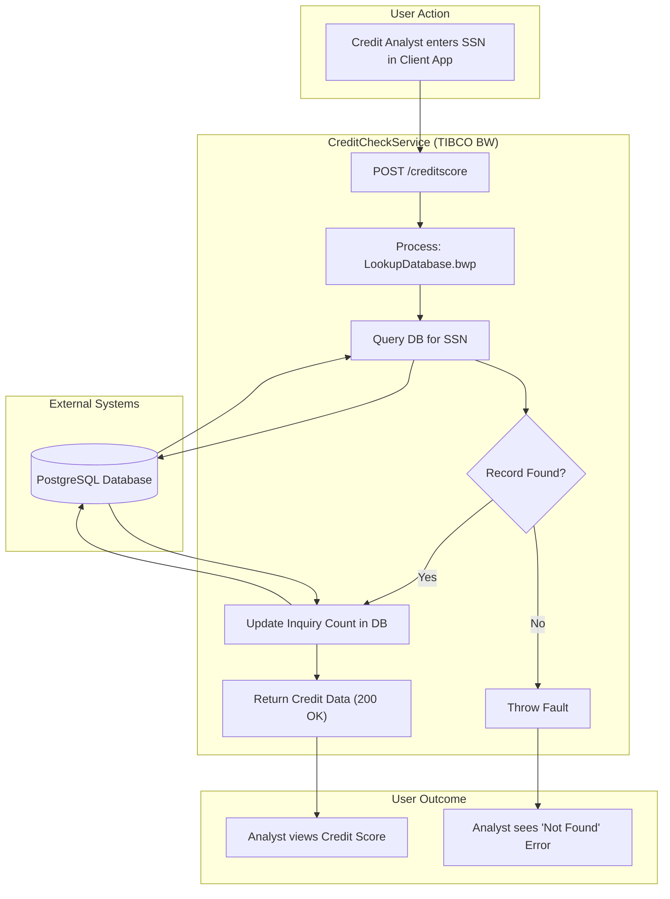

## Executive Summary
This analysis identifies the user personas and journeys for the `CreditCheckService` application. The system is a TIBCO BusinessWorks (BW) backend service designed to provide credit score information. The primary "user" is a client application, triggered by an inferred human user, likely a **Credit Analyst** or **Loan Officer**. The core user journey is a synchronous credit inquiry process: a request is made with a Social Security Number (SSN), the service looks up the credit data in a PostgreSQL database, increments an inquiry counter, and returns the credit score and rating. The process is linear and lacks complex branching or multiple user roles.

## Analysis
### Finding 1: Inferred User Persona - The Credit Analyst

Based on the application's function of retrieving credit scores, we can infer the primary human user persona. While the direct consumer is an API client, that client is operated on behalf of a business user responsible for evaluating creditworthiness.

**Evidence**:
-   The service is named `CreditCheckService`.
-   The main API endpoint is `/creditscore` (`CreditCheckService/META-INF/module.bwm`).
-   The input is an `SSN` and the output includes `FICOScore`, `Rating`, and `NoOfInquiries` (`CreditCheckService/Service Descriptors/creditcheckservice.Process-CreditScore.json`).
-   The database table is named `creditscore` and the process `LookupDatabase.bwp` queries it.

| Attribute | Description |
| :--- | :--- |
| **Role Name** | Credit Analyst / Loan Officer |
| **Primary Responsibilities** | - Evaluating the creditworthiness of new and existing applicants. - Making decisions on loan applications or credit line extensions. - Ensuring compliance with credit policies. |
| **Success Metrics/KPIs** | - Time to decision for credit applications. - Accuracy of credit assessments. - Loan default rates for approved applications. |
| **Pain Points** | - Slow or unresponsive systems for retrieving credit data. - Inaccurate or out-of-date credit information. - Lack of context when a credit record is not found. |
| **Decision Authority** | - Approve or deny credit applications up to a certain threshold. - Recommend decisions for larger credit amounts. |
| **Business Impact if System Fails** | - Complete halt of loan origination and customer onboarding processes. - Delays lead to customer dissatisfaction and potential loss of business. - Inability to assess risk, potentially leading to poor financial decisions. |
| **Escalation Path** | Senior Underwriter, Credit Risk Manager. |

### Finding 2: Core User Journey - The Credit Inquiry Process

The codebase defines a single, primary user journey: performing a credit check for a given individual. The journey is initiated by the Credit Analyst (via a client system) and is entirely synchronous.

**Evidence**:
-   The main process `CreditCheckService/Processes/creditcheckservice/Process.bwp` orchestrates the journey. It receives a request, calls the `LookupDatabase` subprocess, and returns a response or fault.
-   The subprocess `CreditCheckService/Processes/creditcheckservice/LookupDatabase.bwp` contains the core steps:
    1.  `QueryRecords`: Executes `select * from public.creditscore where ssn like ?`.
    2.  A conditional check: `string-length($QueryRecords/Record[1]/rating)>0`.
    3.  `UpdatePulls`: If a record is found, it executes `UPDATE creditscore SET numofpulls = ? WHERE ssn like ?` to increment the inquiry count.
    4.  The main process returns the fetched data or a 404 error if no record is found.

**Journey Name**: Applicant Credit Inquiry

**Participants**:
-   Credit Analyst (initiator)
-   Client Application (e.g., Loan Origination System)
-   CreditCheckService

**Steps**:
1.  **Initiate Inquiry**: The Credit Analyst enters an applicant's SSN into a client application to begin a credit check.
    -   **User Goal**: To retrieve the applicant's current credit score and history.
    -   **System Support**: The client application provides the interface for data entry.
    -   **Decision Points**: N/A.
    -   **Success Criteria**: The SSN is accepted by the system.
2.  **Request Sent**: The client application sends a POST request to the `/creditscore` endpoint with the SSN.
    -   **User Goal**: Securely transmit the inquiry to the backend service.
    -   **System Support**: The `CreditCheckService` listens for and accepts the request.
    -   **Decision Points**: N/A.
    -   **Success Criteria**: The service acknowledges the request.
3.  **Data Retrieval**: The `CreditCheckService` queries the PostgreSQL database for the matching SSN.
    -   **User Goal**: Find the correct credit profile.
    -   **System Support**: The `LookupDatabase.bwp` process executes the SQL query.
    -   **Decision Points**: Does a record exist for the given SSN?
    -   **Success Criteria**: A single, matching record is found.
4.  **Update Inquiry Count**: The service increments the `numofpulls` counter for the retrieved record.
    -   **User Goal**: To maintain an audit trail of credit inquiries.
    -   **System Support**: The `LookupDatabase.bwp` process executes an `UPDATE` SQL statement.
    -   **Decision Points**: N/A.
    -   **Success Criteria**: The database update completes successfully.
5.  **Receive Information**: The service returns the `FICOScore`, `Rating`, and `NoOfInquiries` to the client application, which displays it to the analyst.
    -   **User Goal**: To view the applicant's credit details.
    -   **System Support**: The system formats the data as JSON and returns a 200 OK response.
    -   **Success Criteria**: The analyst sees the correct credit information on their screen.
6.  **Make Decision**: The Credit Analyst uses the information to make a business decision (e.g., approve, deny, or escalate the application).
    -   **User Goal**: To complete the credit assessment.
    -   **System Support**: N/A (This step occurs outside the service).
    -   **Decision Points**: Is the credit score sufficient for approval?
    -   **Success Criteria**: A final decision is logged for the applicant.

**Value Chain**: This journey automates and standardizes the credit checking process, enabling faster loan processing, consistent risk assessment, and an improved experience for the end applicant.

**Pain Points**:
-   If no record is found for an SSN, the service returns a generic 404 error. The analyst does not know if this is due to a data entry error or if the applicant has no credit history.
-   The process is entirely synchronous. If the database is slow, the analyst is left waiting, impacting their productivity.

### Finding 3: Business Flow Diagram

The following diagram illustrates the Credit Inquiry journey.

## Evidence Summary
-   **Scope Analyzed**: The analysis covered all TIBCO BusinessWorks project files (`.bwp`, `.bwm`), service descriptors (`.json`), schema definitions (`.xsd`), and configuration files (`.substvar`, `.jdbcResource`).
-   **Key Data Points**:
    -   1 primary business process (`Process.bwp`).
    -   1 core subprocess (`LookupDatabase.bwp`).
    -   1 primary REST endpoint (`/creditscore`).
    -   1 database integration (PostgreSQL via JDBC).
-   **References**:
    -   `CreditCheckService/Processes/creditcheckservice/Process.bwp`: Defines the main service flow and error handling.
    -   `CreditCheckService/Processes/creditcheckservice/LookupDatabase.bwp`: Contains the core business logic for database lookup and update.
    -   `CreditCheckService/Resources/creditcheckservice/JDBCConnectionResource.jdbcResource`: Configures the PostgreSQL database connection, including the driver `org.postgresql.Driver` and a redacted password.
    -   `CreditCheckService/Service Descriptors/creditcheckservice.Process-CreditScore.json`: Defines the API contract for the `/creditscore` endpoint.

## Assumptions Made
-   It is assumed that a human user, such as a "Credit Analyst" or "Loan Officer," is the ultimate initiator of the credit check request, using a separate client application. The codebase only contains the backend service and has no UI or direct user interaction.
-   It is assumed that the `public.creditscore` table exists in the configured PostgreSQL database with columns matching the query (`ssn`, `ficoscore`, `rating`, `numofpulls`, etc.).
-   The business process for creating or updating records in the `creditscore` table is outside the scope of this application. This service only reads and performs a minor update (incrementing `numofpulls`).

## Open Questions
-   What is the business process for handling a "Not Found" (404) result? Should the system differentiate between an invalid SSN format, a valid SSN with no record, or a system error?
-   What client applications consume this service? Understanding the clients would provide more context on user journeys.
-   Is there a business requirement for an audit trail beyond incrementing the `numofpulls` field? The current logging is minimal.
-   What are the performance expectations (e.g., response time SLAs) for a credit check?

## Confidence Level
**Overall Confidence**: High

**Rationale**: The codebase is small, self-contained, and follows a clear, linear process. The TIBCO process files (`.bwp`) provide a visual and logical representation of the workflow, making the user journey easy to trace. The business purpose is explicitly stated by the service and data naming conventions. The only area of inference is the human persona, but this is a standard and logical deduction based on the service's function.

**Evidence**:
-   The direct, non-branching flow in `Process.bwp` and `LookupDatabase.bwp` makes the journey unambiguous.
-   The SQL statements (`select * from public.creditscore...` and `UPDATE creditscore...`) are explicit and confirm the data interaction.
-   The service descriptor `creditcheckservice.Process-CreditScore.json` clearly defines the API contract, confirming the inputs (`SSN`) and outputs (`FICOScore`, `Rating`).

## Action Items
**Immediate** (Next 1-2 weeks):
-   [ ] **Clarify "Not Found" Logic**: Meet with business stakeholders to define the desired behavior when an SSN is not found and update the service to return more descriptive error messages.

**Short-term** (Next 1-3 months):
-   [ ] **Improve Logging**: Enhance the process to log key details of each request (e.g., a request ID, timestamp) for better audit and troubleshooting capabilities.

**Long-term** (Next 6+ months):
-   [ ] **Explore Asynchronous Processing**: For integrations with slower downstream systems, consider an asynchronous pattern to improve the responsiveness of the client application.

## Risk Assessment
-   **Low Risk**: The simplicity of the current workflow limits the risk of process failure. The primary risk lies in the quality and availability of the data in the PostgreSQL database, which is an external dependency.
-   **Medium Risk**: The lack of detailed error handling could lead to user frustration and operational overhead. For example, if the `UPDATE` call fails after the `SELECT` succeeds, the state is inconsistent, but the process doesn't appear to handle this scenario. This could lead to inaccurate inquiry counts.