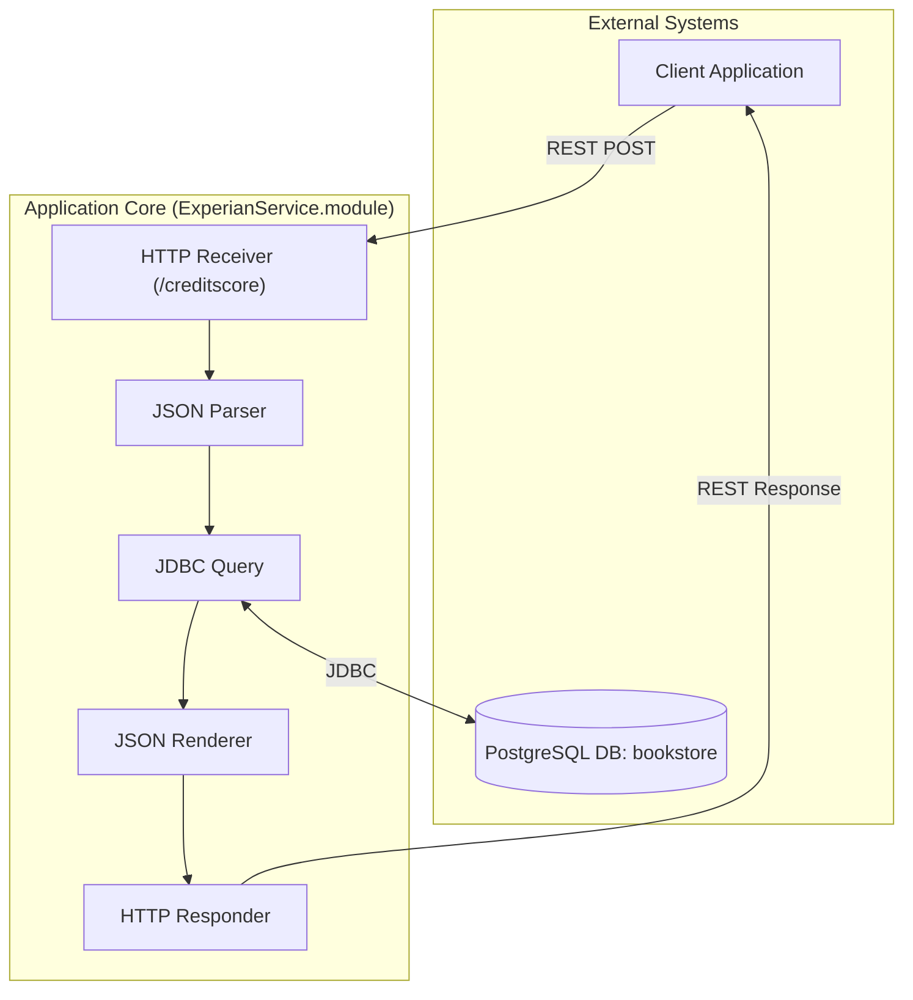

## Executive Summary
This report provides a logical dependency and integration diagram for the `ExperianService` application. The analysis reveals a simple, single-process TIBCO BusinessWorks application designed as a RESTful service. The service accepts a POST request with user details, queries a PostgreSQL database to retrieve credit score information, and returns a JSON response. The two primary integration points are the incoming REST API endpoint and an outgoing JDBC connection to a PostgreSQL database.

## Analysis

### System Overview
The `ExperianService` is a TIBCO BusinessWorks (BW) application that functions as a microservice. Its sole purpose is to expose a REST API endpoint (`/creditscore`) that takes a JSON payload containing a Social Security Number (SSN) and other personal details. It then uses this SSN to query a `creditscore` table in a PostgreSQL database named `bookstore`. The retrieved data is formatted into a JSON response and sent back to the client. The architecture is a straightforward request-response pattern with a direct database dependency.

### Dependency Diagram

### Integration Points

| Component | Integration Type | Target System | Protocol/Method | Purpose | Evidence |
|---|---|---|---|---|---|
| HTTP Receiver | API (Inbound) | ExperianService.module | REST (POST) | Exposes the `/creditscore` endpoint to receive credit score requests from client applications. | `ExperianService.module/Processes/experianservice/module/Process.bwp`   `ExperianService.module/Service Descriptors/experianservice.module.Process-Creditscore.json` |
| JDBC Query | DB (Outbound) | PostgreSQL (`bookstore`) | JDBC | Queries the `public.creditscore` table using an SSN to retrieve a user's credit information. | `ExperianService.module/Processes/experianservice/module/Process.bwp`   `ExperianService.module/Resources/experianservice/module/JDBCConnectionResource.jdbcResource` |

## Evidence Summary
- **Scope Analyzed**: The analysis covered all files within the `ExperianService` and `ExperianService.module` projects.
- **Key Data Points**:
    - 1 TIBCO BusinessWorks process was analyzed.
    - 1 inbound REST API integration was identified.
    - 1 outbound JDBC database integration was identified.
- **References**:
    - The TIBCO process `Process.bwp` defines the entire workflow.
    - The JDBC resource `JDBCConnectionResource.jdbcResource` confirms the use of a PostgreSQL database.
    - The HTTP resource `Creditscore.httpConnResource` defines the listening port for the service.
    - The Swagger file `Process-Creditscore.json` documents the REST API contract.

## Assumptions Made
- It is assumed that the `localhost` configuration for the database and HTTP listener is for development purposes and would be overridden by environment variables in a deployed environment.
- The `bookstore` database is assumed to be the correct and intended data source, despite the service being named `ExperianService`.
- The client application is capable of making standard RESTful POST requests with a JSON body.

## Open Questions
- What is the identity of the client application(s) that consume this service?
- What are the configuration details (host, port, credentials) for the PostgreSQL database in test and production environments?
- What is the complete schema for the `public.creditscore` table, including constraints and indexes? The query only reveals a subset of columns.
- Are there any network intermediaries like API gateways or load balancers in front of this service in a production environment?

## Confidence Level
**Overall Confidence**: High

**Rationale**: The project is small, self-contained, and follows standard TIBCO BW design patterns. The integration points are explicitly defined in shared resource files, leaving little room for ambiguity.

**Evidence**:
- **File references**: The database connection is explicitly defined in `ExperianService.module/Resources/experianservice/module/JDBCConnectionResource.jdbcResource`, specifying the driver (`org.postgresql.Driver`) and URL (`jdbc:postgresql://localhost:5432/bookstore`).
- **Configuration files**: The REST endpoint contract is clearly documented in the Swagger file `ExperianService.module/Service Descriptors/experianservice.module.Process-Creditscore.json`.
- **Code examples**: The workflow is defined visually and in XML within `ExperianService.module/Processes/experianservice/module/Process.bwp`, showing a clear sequence from `HTTPReceiver` to `JDBCQuery` to `SendHTTPResponse`.

## Action Items
**Immediate**:
- [ ] **Verify Database Configuration**: Confirm the production connection details for the `bookstore` PostgreSQL database to prepare for deployment configuration.

**Short-term**:
- [ ] **Document Client Consumers**: Identify and document all client applications that depend on this service to understand the full impact of any changes.
- [ ] **Establish Monitoring**: Implement logging and monitoring for the REST endpoint and JDBC connection to track performance and errors.

**Long-term**:
- [ ] **Decouple from Localhost**: Refactor configuration to use environment-specific variables for database and service endpoints, removing hardcoded `localhost` values.

## Risk Assessment
- **High Risk**: There are no high-risk items identified from a dependency perspective, as the architecture is very simple.
- **Medium Risk**: The primary risk is the dependency on the single PostgreSQL database. If the `bookstore` database is unavailable, the entire service will fail as there are no fallback mechanisms or caches implemented.
- **Low Risk**: The hardcoded `localhost` values pose a low risk, assuming they are correctly overridden by a CI/CD pipeline during deployment. However, this is an anti-pattern that could lead to configuration errors.