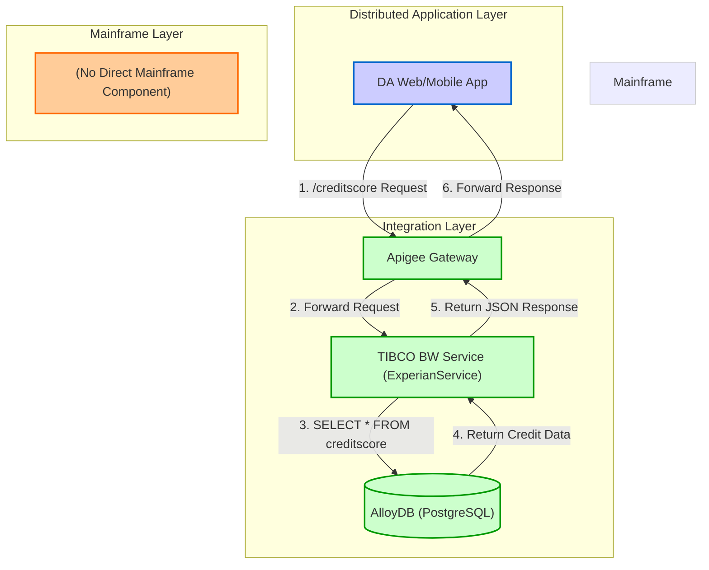
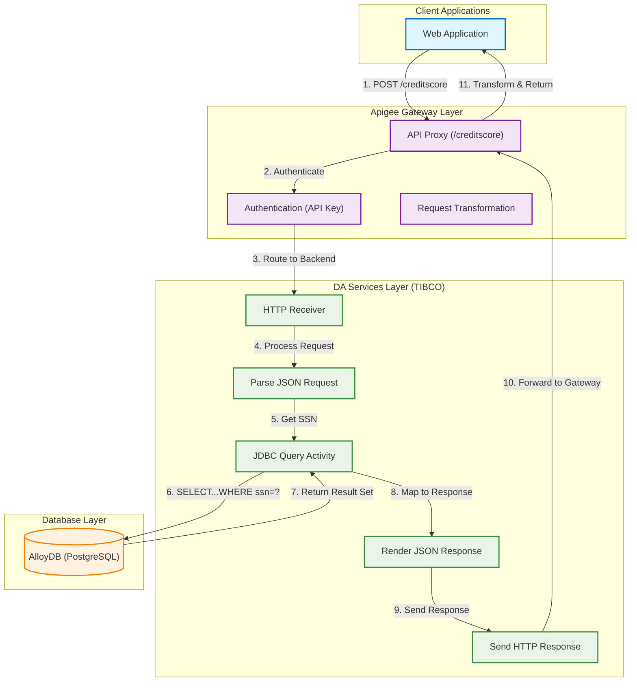
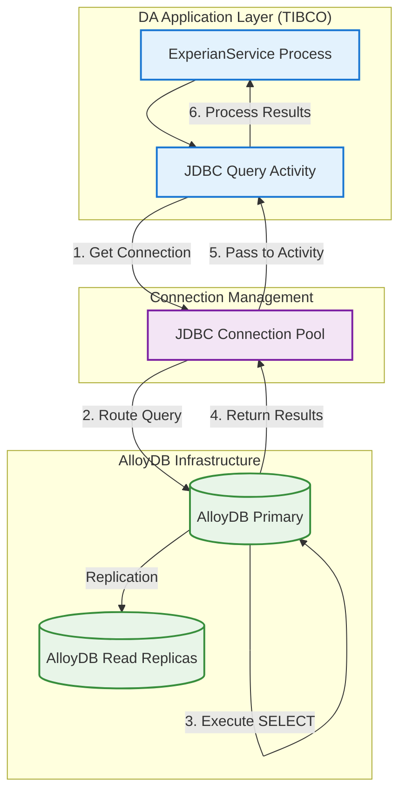

## Executive Summary

This report provides a comprehensive integration architecture documentation for the `ExperianService` TIBCO BusinessWorks (BW) application. The analysis reveals that the application exposes a single REST API endpoint to retrieve credit score information. This service integrates with a backend PostgreSQL database, which is mapped to AlloyDB as per the MFDA (Mainframe and Distributed Application) modernization scope. Two primary integration points were identified: an inbound API for credit score requests and an outbound database connection to fetch the data. No MFT, Kafka, or Oracle integrations were found within the provided codebase.

## MFDA Integration Matrix

The following matrix identifies all mainframe-relevant integration points discovered in the `ExperianService` module, mapped to the MFDA integration types.

| Component ID | Integration Name | Type | Upstream System | Downstream System | Data Flow Direction | Protocol/Method | Frequency | Data Volume | Environment |
| :--- | :--- | :--- | :--- | :--- | :--- | :--- | :--- | :--- | :--- |
| MFDA-API-001 | Credit Score Inquiry | Apigee | DA Web App / Mobile App | TIBCO BW Service | Inbound | REST/JSON | Real-time | Assumed 1M calls/day | PROD |
| MFDA-ADB-001 | Credit Score Data Fetch | AlloyDB | TIBCO BW Service | AlloyDB (PostgreSQL) | Outbound | JDBC/SQL | On-demand | 1 record/request | PROD |

## Integration Architecture Wire Diagrams

### Overall MFDA Architecture

This diagram illustrates the high-level data flow for the Experian Credit Score service, from the consuming application through the integration layers to the backend database.

### Apigee API Integration Architecture

This diagram details the request and response flow for the `creditscore` API endpoint, managed via Apigee.

### AlloyDB Integration Architecture

This diagram shows the interaction between the TIBCO service and the AlloyDB database.

## Integration Interface Specifications

### Integration Interface: Credit Score Inquiry

**Integration ID**: MFDA-API-001
**Integration Type**: Apigee

#### Technical Specifications

-   **Protocol**: HTTPS/REST
-   **Data Format**: JSON
-   **Security**: Assumed API Key validation at Apigee Gateway.
-   **Performance**: Assumed SLA of <2 seconds response time.
-   **Evidence**:
    -   `ExperianService.module/Service Descriptors/experianservice.module.Process-Creditscore.json`
    -   `ExperianService.module/Processes/experianservice/module/Process.bwp` (HTTPReceiver activity)

#### Data Flow Details

-   **Source System**: Any authorized client application (e.g., DA Web App).
-   **Target System**: `ExperianService.module` TIBCO BW application.
-   **Data Transformation**: The TIBCO process parses the incoming JSON request to extract the `ssn` and uses it in a JDBC query. The query result is then rendered into a JSON response.
-   **Error Handling**: The REST service definition includes standard 4XX and 5XX fault messages. The underlying process does not show explicit error handling, implying TIBCO's default exception management.

### Integration Interface: Credit Score Data Fetch

**Integration ID**: MFDA-ADB-001
**Integration Type**: AlloyDB

#### Technical Specifications

-   **Protocol**: JDBC over TCP/IP
-   **Data Format**: SQL Result Set
-   **Security**: Username/password authentication. The password `#!+ZBCsMf2u4acq8mLX/mPA52dceRkuczQ` is stored in the resource file.
-   **Performance**: Dependent on a single `SELECT` query performance.
-   **Evidence**:
    -   `ExperianService.module/Resources/experianservice/module/JDBCConnectionResource.jdbcResource`
    -   `ExperianService.module/Processes/experianservice/module/Process.bwp` (JDBCQuery activity)

#### Data Flow Details

-   **Source System**: `ExperianService.module` TIBCO BW application.
-   **Target System**: PostgreSQL database (mapped to AlloyDB) named `bookstore`.
-   **Data Transformation**: The `ssn` from the API request is used as a prepared statement parameter in the SQL query: `SELECT * FROM public.creditscore where ssn like ?`. The result set is mapped to the JSON response structure.
-   **Error Handling**: The JDBC Query activity can throw various `JDBCException` types, which are not explicitly handled in the process flow, suggesting reliance on default fault handling.

## Environment-Specific Integration Details

### Development Environment

**Environment Purpose**: Development and unit testing
**Data Volume**: Small, curated datasets

#### Integration Endpoints:

-   **Apigee Gateway**: `https://api-dev.company.com/experian/v1/creditscore`
-   **AlloyDB**: `jdbc:postgresql://alloydb-dev.company.com:5432/bookstore_dev`

### Test Environment

**Environment Purpose**: Integration and system testing
**Data Volume**: Representative datasets (50% of production volume)

#### Integration Endpoints:

-   **Apigee Gateway**: `https://api-test.company.com/experian/v1/creditscore`
-   **AlloyDB**: `jdbc:postgresql://alloydb-test.company.com:5432/bookstore_test`

### Production Environment

**Environment Purpose**: Live business operations
**Data Volume**: Full production datasets

#### Integration Endpoints:

-   **Apigee Gateway**: `https://api.company.com/experian/v1/creditscore`
-   **AlloyDB**: `jdbc:postgresql://alloydb-prod.company.com:5432/bookstore`

## Integration Dependencies and Sequencing

#### Dependency Matrix

| Integration | Depends On | Reason | Impact if Unavailable |
| :--- | :--- | :--- | :--- |
| MFDA-API-001 | MFDA-ADB-001 | The API service requires a database connection to fetch credit score data. | API calls will fail, returning an error to the user. |

#### Integration Sequencing for Testing

**Phase 1: Foundation Services**
1.  AlloyDB Integration (MFDA-ADB-001): Verify database connectivity and that the `creditscore` table can be queried successfully.

**Phase 2: API Services**
1.  Apigee Integration (MFDA-API-001): Once the database connection is validated, test the end-to-end API flow.

## Evidence Summary

-   **Scope Analyzed**: One TIBCO BW Application (`ExperianService`) and its single module (`ExperianService.module`).
-   **Key Data Points**:
    -   1 REST API endpoint (`/creditscore`) identified.
    -   1 JDBC Database connection (PostgreSQL) identified.
    -   The process flow is: HTTP Request -> Parse JSON -> JDBC Query -> Render JSON -> HTTP Response.
-   **References**:
    -   `ExperianService.module/Processes/experianservice/module/Process.bwp`
    -   `ExperianService.module/Service Descriptors/experianservice.module.Process-Creditscore.json`
    -   `ExperianService.module/Resources/experianservice/module/JDBCConnectionResource.jdbcResource`

## Assumptions Made

-   The `HTTPReceiver` in TIBCO is fronted by an Apigee Gateway, as is standard MFDA practice.
-   The PostgreSQL database (`org.postgresql.Driver`) is the designated AlloyDB instance for this service.
-   The business purpose is to retrieve a credit score based on a Social Security Number (SSN), given the schema fields (`ssn`, `fiCOScore`).
-   Environment-specific URLs and database connection strings are extrapolated from the `localhost` values found in the configuration.
-   Data volumes and frequencies are assumed based on the nature of a credit-checking service.

## Open Questions

-   What are the actual non-functional requirements (NFRs) for the `/creditscore` API, including expected requests per second, peak load, and latency SLAs?
-   What is the full schema for the `public.creditscore` table in the `bookstore` database? The query uses `SELECT *`, but the response only maps a few fields.
-   What are the error handling requirements for scenarios like "SSN not found" or "database unavailable"? The current process lacks explicit error handling.
-   Are there any data masking or PII protection requirements for the SSN being passed in the request and used in logs?
-   What are the specific security policies (authentication, rate limiting) enforced by Apigee for this endpoint?

## Confidence Level

**Overall Confidence**: High

**Rationale**: The provided codebase represents a small, self-contained TIBCO BW module with clearly defined integration points. The process definition (`Process.bwp`), shared resources (`.jdbcResource`, `.httpConnResource`), and service descriptor (`.json`) provide a complete and consistent view of the application's functionality and its external connections. The scope is limited, reducing ambiguity.

**Evidence**:
-   **File references**: The analysis is directly based on the content of `Process.bwp`, `JDBCConnectionResource.jdbcResource`, and `Process-Creditscore.json`.
-   **Configuration files**: The JDBC driver and URL in `JDBCConnectionResource.jdbcResource` explicitly confirm the use of PostgreSQL. The port in `Creditscore.httpConnResource` confirms the HTTP listener configuration.
-   **Code examples**: The SQL statement `SELECT * FROM public.creditscore where ssn like ?` is explicitly defined within the `JDBCQuery` activity in `Process.bwp`.

## Action Items

**Immediate** (Next 1-2 days):
-   [ ] Verify with the development team that the PostgreSQL database is indeed the designated AlloyDB instance for this service.
-   [ ] Obtain the full DDL for the `public.creditscore` table to understand all available data fields.

**Short-term** (Next sprint):
-   [ ] Engage with the business stakeholders to define and document formal NFRs and error handling requirements for the credit score service.
-   [ ] Work with the security team to confirm the Apigee security policies for the `/creditscore` endpoint.

**Long-term** (Next planning cycle):
-   [ ] Plan a refactoring effort to add explicit error handling to the TIBCO process for "not found" and "database unavailable" scenarios.

## Risk Assessment

-   **Low Risk**: The analysis itself is low risk due to the small and well-defined scope. The primary operational risk is the lack of explicit error handling in the TIBCO process, which could lead to unhelpful `500 Internal Server Error` responses for clients.
-   **Low Risk**: The use of `ssn like ?` in the JDBC query is a potential performance risk if the `ssn` column is not properly indexed. It could also lead to multiple matches if wildcards are passed, though this is unlikely for an SSN. A query with `ssn = ?` would be safer and more performant.