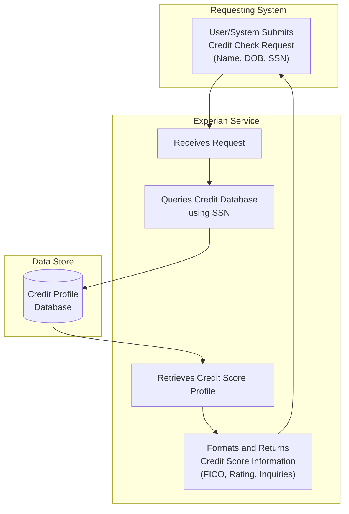

## Executive Summary

This analysis documents the business data model for the `ExperianService` application. The system's core function is to provide credit score information. It accepts personal identifiers for an individual and retrieves a corresponding credit profile from a backend database. The primary business information tracked includes personal identifiers for credit inquiries (Name, DOB, SSN) and the resulting credit profile data (FICO Score, Credit Rating, Number of Inquiries). This data model is central to any business process requiring automated credit risk assessment, such as loan origination or customer onboarding.

## Analysis

The codebase reveals a straightforward data model designed to support a credit inquiry service. The system captures identifying information about an individual, uses it to look up a stored credit profile, and returns a summary of that profile.

### Business Entity Catalog

The system manages two primary business entities: the information required to make a credit inquiry and the credit profile information that is stored and returned.

| Business Entity | What It Tracks | Who Uses It | Business Purpose | Key Information |
| :--- | :--- | :--- | :--- | :--- |
| **Credit Inquiry Subject** | Personal identifiers for an individual. | Any external system or user initiating a credit check (e.g., loan officers, automated underwriting systems). | To uniquely and accurately identify an individual for whom a credit report is being requested. | First Name, Last Name, Date of Birth, Social Security Number (SSN). |
| **Credit Score Profile** | A summary of an individual's credit history and standing. | The internal credit check service; the data is the source of truth for credit assessments. | To maintain a repository of credit information that supports real-time lending decisions and risk management. | FICO Score, Credit Rating, Number of recent credit inquiries. |

### Business Relationships

The data model is centered on the relationship between an inquiry and the stored credit profile.

| Relationship | Business Meaning | Business Impact |
| :--- | :--- | :--- |
| **Credit Inquiry Subject** <-> **Credit Score Profile** | This connection links an incoming request for a credit check (using an SSN) to a stored credit profile to retrieve and return the relevant credit information. | This relationship is the core function of the service. It enables the business to provide instant credit assessments, which is critical for automated loan approvals, customer onboarding, and managing financial risk. Without this link, the service is non-functional. |

### Business Rules in Data

The system enforces specific rules on the data it processes, which reflect underlying business policies for data quality and integrity.

| Business Rule | What It Ensures | Business Risk if Violated |
| :--- | :--- | :--- |
| **Complete Identification Required for Inquiry** | A credit check cannot be performed without the individual's full name, date of birth, and Social Security Number. | Providing incorrect credit information for the wrong person, leading to bad lending decisions, legal liability (FCRA violations), and customer privacy breaches. |
| **Partial Credit Profiles are Permitted** | The system can return a credit profile even if some information (like a FICO score or rating) is missing. | If all fields were mandatory, any request for a person with a limited credit history would fail. This would block valid business processes, such as a loan application for someone new to credit, leading to lost business opportunities. |

### Information Flow

The business process supported by this data model is a simple credit check workflow.

## Evidence Summary

-   **Scope Analyzed**: The analysis covered TIBCO BusinessWorks process files (`.bwp`), resource configurations (`.jdbcResource`, `.httpConnResource`), and data schemas (`.xsd`, `.json`).
-   **Key Data Points**:
    -   **Input Data Entity (`Credit Inquiry Subject`)**: Defined in `ExperianService.module/Schemas/ExperianRequestSchema.xsd` and `ExperianService.module/Service Descriptors/experianservice.module.Process-Creditscore.json`. It requires `firstName`, `lastName`, `dob`, and `ssn`.
    -   **Output Data Entity (`Credit Score Profile` subset)**: Defined in `ExperianService.module/Schemas/ExperianResponseSchemaResource.xsd`. It provides optional `fiCOScore`, `rating`, and `noOfInquiries`.
    -   **Backend Data Store**: A PostgreSQL database named `bookstore` is configured in `ExperianService.module/Resources/experianservice/module/JDBCConnectionResource.jdbcResource`.
    -   **Core Data Retrieval**: The SQL query `SELECT * FROM public.creditscore where ssn like ?` in `ExperianService.module/Processes/experianservice/module/Process.bwp` confirms that the `creditscore` table is the source of truth and is queried by SSN.

## Assumptions Made

-   It is assumed that the `ExperianService` name implies the data originates from or is formatted according to Experian standards, although the code only shows a generic database lookup.
-   The database named `bookstore` is assumed to be a placeholder or legacy name, as the data model (`creditscore` table) clearly relates to financial services, not book sales.
-   The data within the `public.creditscore` table is assumed to be managed and populated by a separate, out-of-scope process. This service is purely for retrieval.

## Open Questions

-   What is the business process for populating and updating the `creditscore` table in the `bookstore` database? Understanding the data's origin is crucial for assessing its reliability.
-   Who are the primary consumers of this service? Knowing whether it's for internal underwriting, external partners, or direct customer use would clarify its business criticality.
-   What are the business definitions and ranges for the `rating` field (e.g., "Good", "Excellent")?
-   Are there data retention policies governing how long credit profiles are stored?

## Confidence Level

**Overall Confidence**: High

**Rationale**: The provided files clearly define a self-contained, single-purpose service. The input schemas, output schemas, and the database query within the TIBCO process file (`Process.bwp`) align perfectly, providing a complete and unambiguous view of the data model as implemented in this specific module. The business purpose is evident from the data field names (`ssn`, `ficoscore`, `rating`).

**Evidence**:
-   The data entities and their fields are explicitly defined in `ExperianRequestSchema.xsd` and `ExperianResponseSchemaResource.xsd`.
-   The relationship between the entities is confirmed by the TIBCO process in `Process.bwp`, which takes the request data, uses the `ssn` in a `JDBCQuery` activity, and maps the query result to the response structure.
-   The business rules (e.g., required input fields) are enforced by the schema definitions referenced in the process.

## Action Items

**Immediate**:
-   [ ] **Clarify Data Source**: Business stakeholders should clarify the origin and refresh-rate of the data in the `creditscore` table to confirm its reliability for lending decisions.

**Short-term**:
-   [ ] **Document `rating` Field Semantics**: The business owner (e.g., Credit Risk department) should provide a clear definition for the values contained in the `rating` field.

**Long-term**:
-   [ ] **Develop Data Governance Plan**: Establish a formal data governance plan for the credit profile information, including ownership, quality standards, and retention policies.

## Risk Assessment

-   **High Risk**: The service's value is entirely dependent on the accuracy and timeliness of the backend `creditscore` table. If this data is stale or incorrect, it could lead to significant financial losses from bad lending decisions.
-   **Medium Risk**: The service returns personally identifiable information (PII). A security breach of this service or its underlying database would have severe regulatory and reputational consequences.
-   **Low Risk**: The data model itself is simple. There is low risk of ambiguity or misinterpretation of the data fields, as they represent common credit-reporting concepts.