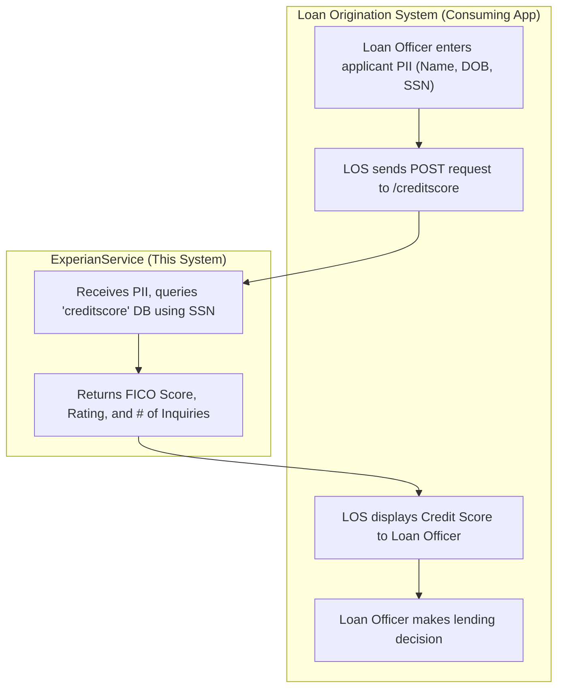

## Executive Summary

Based on the codebase, this system is a backend microservice named `ExperianService`. Its sole function is to provide credit score information (FICO score, rating, and number of inquiries) based on a person's identifying information (SSN, name, DOB). The primary users of this service are not individuals but other applications, such as a Loan Origination System. The ultimate business user is a role like a Loan Officer or Underwriter who relies on this data to assess credit risk and make lending decisions.

## Analysis
### User Persona: Loan Officer / Underwriter

**Evidence**: The service is named `ExperianService` and its primary operation, exposed via a `/creditscore` REST endpoint, takes a Social Security Number (SSN) and other personal data as input (`ExperianService.module/Service Descriptors/experianservice.module.Process-Creditscore.json`, `ExperianService.module/Schemas/ExperianRequestSchema.xsd`). It then queries a `creditscore` table (`ExperianService.module/Processes/experianservice/module/Process.bwp`) and returns a FICO score, rating, and number of inquiries (`ExperianService.module/Schemas/ExperianResponseSchemaResource.xsd`). This entire workflow is characteristic of a credit check process within a financial institution.

**Impact**: This persona is central to the institution's revenue-generating and risk management functions. Their ability to make fast, accurate lending decisions is directly dependent on the availability and reliability of the credit data provided by this service.

**Recommendation**: The user experience for this persona is indirect but critical. All future development on this service must prioritize speed, accuracy, and availability to ensure the Loan Officer's workflow is not impeded.

| Attribute | Description |
|-----------|-------------|
| **Role Name** | Loan Officer / Underwriter |
| **Primary Responsibilities** | - Evaluate creditworthiness of loan applicants. - Analyze credit reports to make lending decisions. - Ensure compliance with lending policies and regulations. |
| **Success Metrics/KPIs** | - Time-to-decision for loan applications. - Loan approval rate. - Default rate of approved loans. - Volume of loans processed per day/week. |
| **Pain Points** | - Slow system response when pulling credit reports, delaying customer decisions. - Inaccurate or outdated credit information leading to bad lending decisions. - System downtime, which completely halts the ability to process applications. |
| **Decision Authority** | Approve or deny loan applications up to a pre-defined financial limit. |
| **Business Impact if System Fails** | Complete stoppage of loan origination and other credit-based application processing. This directly halts revenue generation and severely impacts customer satisfaction. |
| **Escalation Path** | Senior Underwriter, Lending Department Manager. |

### User Journey: Loan Applicant Credit Assessment

**Evidence**: The TIBCO process `ExperianService.module/Processes/experianservice/module/Process.bwp` defines a clear, linear journey:
1.  Receive HTTP request with applicant PII.
2.  Parse the JSON input.
3.  Use the SSN to query the `creditscore` database.
4.  Render the database result into a JSON response.
5.  Send the HTTP response.
This sequence maps directly to a backend credit check initiated by a user-facing system.

**Impact**: This journey is the core value proposition of the service. Its efficiency directly impacts the productivity of the Loan Officer and the experience of the end customer (the loan applicant). Any failure or delay in this journey has immediate business consequences.

**Recommendation**: This journey should be the primary focus of all monitoring and performance testing. SLAs should be defined for each step to ensure the end-to-end process meets business expectations.

**Journey Name**: Loan Applicant Credit Assessment

**Participants**: Loan Officer, Loan Applicant (indirectly), Loan Origination System (consuming application)

**Steps**:
1.  **Initiate Credit Check**: The Loan Officer enters the applicant's personal details (First Name, Last Name, DOB, SSN) into their primary software (e.g., a Loan Origination System).
    -   **User Goal**: To retrieve the applicant's credit score to proceed with a loan evaluation.
    -   **System Support**: The consuming application sends the applicant's data to the `ExperianService` `/creditscore` endpoint.
    -   **Decision Points**: N/A at this step.
    -   **Success Criteria**: The request is successfully sent to the service.

2.  **Retrieve Credit Data**: The `ExperianService` receives the request, validates it, and queries its internal `creditscore` database using the provided SSN.
    -   **User Goal**: (System Goal) To find the matching credit profile in the database.
    -   **System Support**: The TIBCO process executes a JDBC query against the PostgreSQL database.
    -   **Decision Points**: Does a record exist for the given SSN?
    -   **Success Criteria**: A corresponding record is found or a "not found" condition is determined.

3.  **Review Credit Score**: The service returns the applicant's FICO score, credit rating, and number of recent inquiries to the Loan Officer's application.
    -   **User Goal**: To view and understand the applicant's creditworthiness.
    -   **System Support**: The `ExperianService` formats the data into a JSON response and sends it back to the calling system, which then displays it to the Loan Officer.
    -   **Decision Points**: Is the credit score sufficient for the requested loan product? Are there any red flags in the credit report (e.g., too many inquiries)?
    -   **Success Criteria**: The credit score is displayed clearly and accurately on the Loan Officer's screen.

4.  **Make Lending Decision**: The Loan Officer uses the credit score as a key factor to approve, deny, or modify the loan application.
    -   **User Goal**: To make a final, informed, and compliant lending decision.
    -   **System Support**: The service has completed its journey; this step occurs in the consuming application.
    -   **Decision Points**: Approve, Deny, Request more information.
    -   **Success Criteria**: A final decision is logged in the Loan Origination System.

**Value Chain**: This journey enables the business to make rapid, data-driven risk assessments, which is fundamental to any lending operation. It accelerates revenue generation (by approving loans faster) and mitigates financial loss (by identifying high-risk applicants).

**Pain Points**:
-   A slow response from the `ExperianService` creates a poor experience for both the Loan Officer and the waiting applicant.
-   If the service is down, the entire loan origination process is blocked.
-   Inaccurate data returned by the service could lead to significant financial losses from bad loans or lost opportunities from incorrectly denied good applicants.

**Optimization Opportunities**:
-   Enhance the response to include reason codes or contributing factors for the score.
-   Implement caching for recently pulled scores to improve performance for repeat lookups (if business rules permit).

### Business Flow Diagram

## Evidence Summary
- **Scope Analyzed**: The analysis covered the entire `ExperianService` TIBCO project, including the process definition, resource configurations, and data schemas.
- **Key Data Points**:
    - **Input**: `firstName`, `lastName`, `dob`, `ssn` (`ExperianRequestSchema.xsd`)
    - **Output**: `fiCOScore`, `rating`, `noOfInquiries` (`ExperianResponseSchemaResource.xsd`)
    - **Core Operation**: `SELECT * FROM public.creditscore where ssn like ?` (`Process.bwp`)
- **References**: 20 files were analyzed, with the primary logic contained in `ExperianService.module/Processes/experianservice/module/Process.bwp` and the service contract defined in `ExperianService.module/Service Descriptors/experianservice.module.Process-Creditscore.json`.

## Assumptions Made
- It is assumed that this `ExperianService` is consumed by a user-facing application, such as a Loan Origination System (LOS), and is not accessed directly by end-users.
- The "Loan Officer" persona is representative of a business user who needs to assess credit risk. This role could also be an "Underwriter," "Customer Service Agent," or an automated decisioning engine.
- The business operates in the financial services or lending industry, where credit checks are a standard part of the application process.
- The `creditscore` database is assumed to be populated and maintained by a separate, external process. This service is purely for data retrieval.

## Open Questions
- What is the data source for the `public.creditscore` table? How frequently is it updated?
- What are the specific performance and availability Service Level Agreements (SLAs) for this service?
- Are there other business processes or user roles that consume this credit score data?
- What are the error handling expectations? What should the Loan Officer see if a record is not found or the database is unavailable?

## Confidence Level
**Overall Confidence**: High

**Rationale**: The purpose of the service is exceptionally clear due to the descriptive naming of files (`ExperianService`, `creditscore`), the REST endpoint (`/creditscore`), and the explicit data schemas for requests and responses (SSN in, FICO score out). The TIBCO process flow is simple and directly confirms the business logic.

**Evidence**:
- **File references**: `ExperianService.module/Processes/experianservice/module/Process.bwp` clearly shows the sequence of receiving a request, querying a database, and sending a response.
- **Configuration files**: `ExperianService.module/Resources/experianservice/module/JDBCConnectionResource.jdbcResource` specifies the exact database and table being queried.
- **Code examples**: The SQL query `SELECT * FROM public.creditscore where ssn like ?` is explicitly defined within the JDBCQuery activity in `Process.bwp`.

## Action Items
**Immediate** (This Sprint):
- [ ] Validate the "Loan Officer" persona and "Credit Assessment" journey with business stakeholders to confirm accuracy.

**Short-term** (Next 1-2 Sprints):
- [ ] Formally document the API contract based on `experianservice.module.Process-Creditscore.json` for developers of consuming applications.
- [ ] Define and document the expected error responses for scenarios like "SSN not found" or "database unavailable."

**Long-term** (Next Quarter):
- [ ] Initiate a discovery process to map the end-to-end data lineage, including the source and update frequency of the `creditscore` table.

## Risk Assessment
- **High Risk**: Service unavailability. If this service is down, it creates a hard stop for critical, revenue-generating business processes like loan origination.
- **Medium Risk**: Data inaccuracy. If the data in the `creditscore` table is stale or incorrect, it could lead to poor lending decisions, resulting in financial losses or missed opportunities.
- **Low Risk**: Performance degradation. Slow response times would frustrate the Loan Officer and delay decisions but would not stop the process entirely unless timeouts are exceeded.