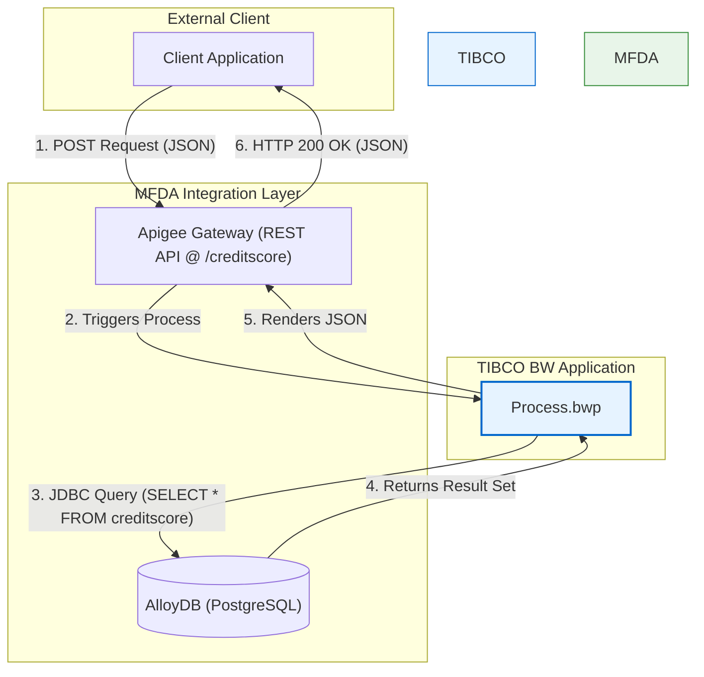

An MFDA (Mainframe and Distributed Application) QE Testing Specialist would not be able to generate a complete MFDA testing strategy from the provided files, as they pertain to a TIBCO BusinessWorks (BW) application that does not contain any mainframe integration components. The application exposes a simple REST API that queries a PostgreSQL database.

Therefore, the analysis will proceed by applying the MFDA testing framework to the components that *are* present (REST API and PostgreSQL DB), explicitly mapping them to the closest MFDA categories (Apigee and AlloyDB), and clearly stating that no MFT, Kafka, or Oracle integrations were found.

***

## Executive Summary

This report outlines a comprehensive QE testing strategy for the `ExperianService` TIBCO BusinessWorks application. The analysis identified two primary integration points: a REST API for fetching credit scores and a JDBC connection to a PostgreSQL database. These have been mapped to the MFDA categories of **Apigee (API)** and **AlloyDB (Database)** for the purpose of this assessment.

**No evidence of MFT, Kafka, or Oracle integrations was found in the codebase.** The testing strategy is therefore focused on ensuring the quality, performance, and security of the existing API and database interactions. Key risks identified include a complete lack of authentication on the API endpoint and potential data quality issues in the backend database. The recommended test cases cover functional, negative, performance, and security validation for the identified components.

## MFDA Integration Matrix

| Integration Type | Upstream Component | Downstream Component | Data Flow Direction | Integration Method |
| :--- | :--- | :--- | :--- | :--- |
| Apigee (REST API) | External Client (e.g., Web App) | ExperianService.module | Inbound | REST/JSON over HTTP |
| AlloyDB (PostgreSQL) | ExperianService.module | `bookstore` PostgreSQL Database | Outbound | JDBC Query |

## Integration Architecture Wire Diagram

The diagram below illustrates the simple data flow for the `ExperianService` application. A client sends a JSON request to the TIBCO BW process, which then queries a PostgreSQL database and returns the result as a JSON response.



## Integration-Specific Requirements

### Apigee/Web Services Integration Details

*   **Environment Details**:
    *   **Endpoint URL**: `http://<host>:7080/creditscore` (Host is configurable via `BW.HOST.NAME`).
    *   **Authentication**: None. This is a critical security risk.
    *   **Request Payload Format**: JSON, as defined in `ExperianRequestSchema.xsd`. Requires `dob`, `firstName`, `lastName`, `ssn`.
    *   **Response Payload Format**: JSON, as defined in `ExperianResponseSchemaResource.xsd`. Returns `fiCOScore`, `rating`, `noOfInquiries`.
*   **Test Data Requirements**:
    *   **Valid Payloads**: JSON objects with all required fields populated with valid data types.
    *   **Invalid Payloads**: JSON objects with missing fields, incorrect data types (e.g., number for a string), malformed JSON.
    *   **Security Payloads**: Payloads with script tags or SQL injection attempts to test sanitization (or lack thereof).
*   **Test Scenarios**:
    *   **Happy Path**: Test with valid SSNs that exist in the database.
    *   **Negative Path**: Test with SSNs that do not exist; verify the response is an empty but valid JSON or a specific error message.
    *   **Error Handling**: Test with invalid request formats (e.g., sending XML instead of JSON), missing required fields.
    *   **Security**: Test for unauthorized access (currently open), test for basic injection vulnerabilities.
    *   **Load Testing**: Simulate concurrent requests to measure response time and throughput.

### AlloyDB (PostgreSQL) Integration Details

*   **Environment Details**:
    *   **Database Connection**: `jdbc:postgresql://localhost:5432/bookstore` (from `JDBCConnectionResource.jdbcResource`).
    *   **Schema and Table**: `public.creditscore`.
    *   **Query**: `SELECT * FROM public.creditscore where ssn like ?`.
*   **Test Data Requirements**:
    *   A `creditscore` table populated with test data.
    *   Records with SSNs that will be used in API tests.
    *   Records with boundary values for `ficoscore` and `numofpulls`.
    *   Records with special characters in `firstname` and `lastname`.
    *   Records that will not be found by any test queries to validate "not found" scenarios.
*   **Test Scenarios**:
    *   **Data Retrieval**: Validate that the correct record is returned for a given SSN.
    *   **Data Integrity**: Ensure data types from the database are correctly mapped into the TIBCO process and the final JSON response.
    *   **Performance**: Measure query execution time under load.
    *   **Negative Path**: Test query behavior when no matching SSN is found.
    *   **Security**: Test with SSN input like `' OR 1=1; --` to ensure the use of prepared statements prevents SQL injection.

### MFT, Kafka, and Oracle Integration Details

No components, configurations, or code related to MFT, Kafka, or Oracle integrations were found in the analyzed files. Testing for these integration types is **Not Applicable**.

## Detailed Test Cases

A selection of high-priority test cases is provided below. A full test suite should contain at least 20 test cases per integration type, covering all categories.

### API Test Cases

```
Test Case ID: MFDA-INT-API-001
Test Case Name: API Happy Path - Successful Credit Score Retrieval
Integration Type: Apigee
Test Type: Integration
Test Category: Positive
Priority: High

Description/Summary:
Validates that a valid POST request to the /creditscore endpoint with an existing SSN returns the correct credit score data.

Pre-conditions:
- TIBCO application is running.
- PostgreSQL database is running and accessible.
- A record exists in the `creditscore` table with ssn = '123-45-6789'.

Test Data Requirements:
- Request Payload: {"dob": "1980-01-01", "firstName": "John", "lastName": "Doe", "ssn": "123-45-6789"}
- Expected DB Record: {ficoscore: 750, rating: 'Good', numofpulls: 3}

Test Steps:
1. Send a POST request to http://<host>:7080/creditscore with the valid request payload.
2. Set 'Content-Type' header to 'application/json'.
3. Capture the HTTP response.

Expected Results:
- HTTP Status Code is 200 (OK).
- Response body is a JSON object: {"fiCOScore": 750, "rating": "Good", "noOfInquiries": 3}.
- Response time is less than 500ms.

---

Test Case ID: MFDA-INT-API-005
Test Case Name: API Negative - Request with Missing Required Field
Integration Type: Apigee
Test Type: Integration
Test Category: Negative
Priority: High

Description/Summary:
Validates that the API correctly handles a request where a required field ('ssn') is missing from the JSON payload.

Pre-conditions:
- TIBCO application is running.

Test Data Requirements:
- Request Payload: {"dob": "1980-01-01", "firstName": "John", "lastName": "Doe"}

Test Steps:
1. Send a POST request to http://<host>:7080/creditscore with the payload missing the 'ssn' field.
2. Set 'Content-Type' header to 'application/json'.
3. Capture the HTTP response.

Expected Results:
- The system should return an HTTP 4xx Client Error status code.
- The response body should contain a clear error message indicating the 'ssn' field is required.
- The TIBCO process should not attempt to execute the JDBC query.

---

Test Case ID: MFDA-INT-API-012
Test Case Name: API Security - No Authentication
Integration Type: Apigee
Test Type: Integration
Test Category: Negative (Security)
Priority: Critical

Description/Summary:
Verify that the API endpoint is accessible without any authentication, confirming a critical security vulnerability.

Pre-conditions:
- TIBCO application is running.

Test Data Requirements:
- Request Payload: Any valid payload, e.g., {"dob": "1980-01-01", "firstName": "John", "lastName": "Doe", "ssn": "123-45-6789"}

Test Steps:
1. Send a POST request to http://<host>:7080/creditscore with a valid payload.
2. Do NOT include any 'Authorization' or 'X-API-Key' headers.
3. Capture the HTTP response.

Expected Results:
- The request is processed successfully, and an HTTP 200 response is returned. This confirms the security risk. The expected *secure* result would be an HTTP 401 or 403.
```

### AlloyDB (PostgreSQL) Test Cases

```
Test Case ID: MFDA-INT-ADB-001
Test Case Name: DB Query - Successful Data Retrieval
Integration Type: AlloyDB
Test Type: Integration
Test Category: Positive
Priority: High

Description/Summary:
Validates that the JDBC Query activity correctly retrieves a full record from the `creditscore` table based on the SSN provided by the API.

Pre-conditions:
- The `Process.bwp` is triggered with an SSN that exists in the database.
- DB Connection is valid.
- Test Data: A record with ssn = '111-22-3333', ficoscore = 800 exists.

Test Steps:
1. Trigger the TIBCO process with input ssn = '111-22-3333'.
2. Trace the execution to the 'JDBCQuery' activity.
3. Inspect the output of the 'JDBCQuery' activity.

Expected Results:
- The activity completes successfully.
- The output `resultSet` contains exactly one `Record`.
- The `Record` contains the correct values for `ficoscore` (800), `rating`, `numofpulls`, etc., matching the database row.

---

Test Case ID: MFDA-INT-ADB-007
Test Case Name: DB Query - SQL Injection Prevention
Integration Type: AlloyDB
Test Type: Integration
Test Category: Negative (Security)
Priority: Critical

Description/Summary:
Validates that the use of a prepared statement (`?` placeholder) in the JDBC query prevents SQL injection.

Pre-conditions:
- TIBCO application and database are running.

Test Data Requirements:
- Input SSN from API: `' OR 1=1; --`

Test Steps:
1. Send a POST request to the `/creditscore` endpoint with a payload containing the malicious SSN.
2. Monitor the TIBCO process execution logs.
3. Monitor the database logs for errors.

Expected Results:
- The JDBC query should not throw a SQL syntax error.
- The query should execute safely, treating the entire string as a literal to search for.
- The query should return an empty result set (as no SSN literally matches `' OR 1=1; --`).
- The API should return a "not found" or empty response, not a server error.
```

## Test Data Strategy

*   **Integration Testing Data**:
    *   **Apigee (API)**: A suite of JSON payloads is required, including:
        *   `valid_request.json`: A standard, well-formed request.
        *   `missing_field_request.json`: A request with one or more required fields removed.
        *   `invalid_datatype_request.json`: A request with a number where a string is expected.
        *   `sql_injection_payload.json`: A request with a potential SQL injection string in the `ssn` field.
    *   **AlloyDB (PostgreSQL)**: A SQL script (`setup_test_data.sql`) to populate the `creditscore` table. This script should create:
        *   At least 10 valid records with varying credit scores and ratings.
        *   Records with boundary values (e.g., min/max FICO score).
        *   Records with null values in non-required columns.
*   **Regression/E2E Testing Data**:
    *   A stable, version-controlled set of the above API payloads and DB setup scripts.
    *   Data should cover the full end-to-end flow: a specific JSON request should map to a specific, verifiable database record.
*   **Volume Testing Data**:
    *   A script to generate a large `creditscore` table (e.g., 100,000+ records) to test query performance.
    *   A load testing script (e.g., JMeter, Gatling) to send thousands of concurrent API requests.

## Environment Configuration Details

A dedicated test environment is required, consisting of:
1.  **TIBCO BusinessWorks AppNode**: An instance running the `ExperianService.module`.
2.  **PostgreSQL Database**: An instance (can be local, containerized, or a cloud instance like AlloyDB) with the `bookstore` database and `creditscore` table schema.
3.  **Test Data**: The database must be populated with the defined test data set before each test run.
4.  **API Client**: A tool like Postman, or an automated testing framework like REST Assured, to send requests to the TIBCO HTTP endpoint.
5.  **Monitoring**: Access to TIBCO process logs and database query logs to validate execution and diagnose failures.

**Environment-Specific Configurations**:
*   The `JDBCConnectionResource.jdbcResource` and `Creditscore.httpConnResource` files should be parameterized using TIBCO's substitution variables (`.substvar` files) to point to different hosts (dev, test, stage) without changing the core project files. For example:
    *   `db.host`, `db.port`, `db.user`, `db.password`
    *   `http.host`, `http.port`

## Assumptions Made

*   The provided TIBCO project represents the complete and current state of the `ExperianService`.
*   The business purpose is to retrieve a credit score from a database based on a person's SSN and other details.
*   The `public.creditscore` table exists in the target PostgreSQL database with the columns referenced in the JDBC Query activity.
*   `localhost` and port `7080` are development placeholders and will be configured per environment.
*   The lack of authentication on the API is a known state and not a misconfiguration.

## Open Questions

*   What are the security requirements for this API? It is currently open to the public.
*   What are the performance SLAs for the `/creditscore` endpoint (e.g., response time, requests per second)?
*   What is the expected API response when no matching SSN is found in the database?
*   What are the valid ranges and formats for the data fields (e.g., FICO score range, rating values)?
*   Is there a requirement for data masking or encryption for the SSN field, both in transit and at rest?

## Confidence Level

**Overall Confidence**: High

**Rationale**: The provided codebase is small, self-contained, and uses standard TIBCO components (HTTP, REST/JSON, JDBC). The logic is a straightforward "request -> query -> response" pattern, which is easy to analyze and define test cases for. The evidence in the `.bwp`, `.json`, and `.jdbcResource` files is clear and consistent. The primary uncertainties relate to non-functional and security requirements, which are noted as open questions.

## Action Items

*   **Immediate**:
    *   [ ] **Risk Mitigation**: Implement API Key or OAuth 2.0 authentication on the `/creditscore` endpoint to address the critical security vulnerability.
    *   [ ] **Test Data Setup**: Create and version-control the SQL scripts and JSON payloads required for the test data strategy.
*   **Short-term**:
    *   [ ] **Automate P0 Tests**: Develop an automated test suite (e.g., using Java + REST Assured) for the "Happy Path," "Missing Field," and "No Authentication" API test cases.
    *   [ ] **Clarify Requirements**: Engage with business stakeholders to get answers to the "Open Questions" listed above.
*   **Long-term**:
    *   [ ] **CI/CD Integration**: Integrate the automated test suite into a CI/CD pipeline to run on every code change.
    *   [ ] **Performance Benchmarking**: Establish and automate performance tests to monitor API response time and database query performance over time.

## Risk Assessment

*   **High Risk**:
    *   **Security Vulnerability**: The API lacks any authentication, allowing unauthorized access to potentially sensitive credit score information. This is a critical risk.
    *   **Data Privacy**: SSN is being passed in a request body, likely over HTTP. If not using TLS, this is a major data exposure risk.
*   **Medium Risk**:
    *   **SQL Injection**: While the process appears to use a prepared statement, any deviation from this pattern could introduce SQL injection vulnerabilities. This must be explicitly tested.
    *   **Data Quality**: The service completely trusts the data in the `creditscore` table. Any data integrity issues in the database will be directly exposed to the client.
*   **Low Risk**:
    *   **Performance**: The query is a simple `SELECT` by a key, which is unlikely to be a bottleneck unless the table is massive and unindexed.
    *   **Scalability**: As a stateless TIBCO process, it should scale horizontally, but this depends on the underlying database's ability to handle concurrent connections.