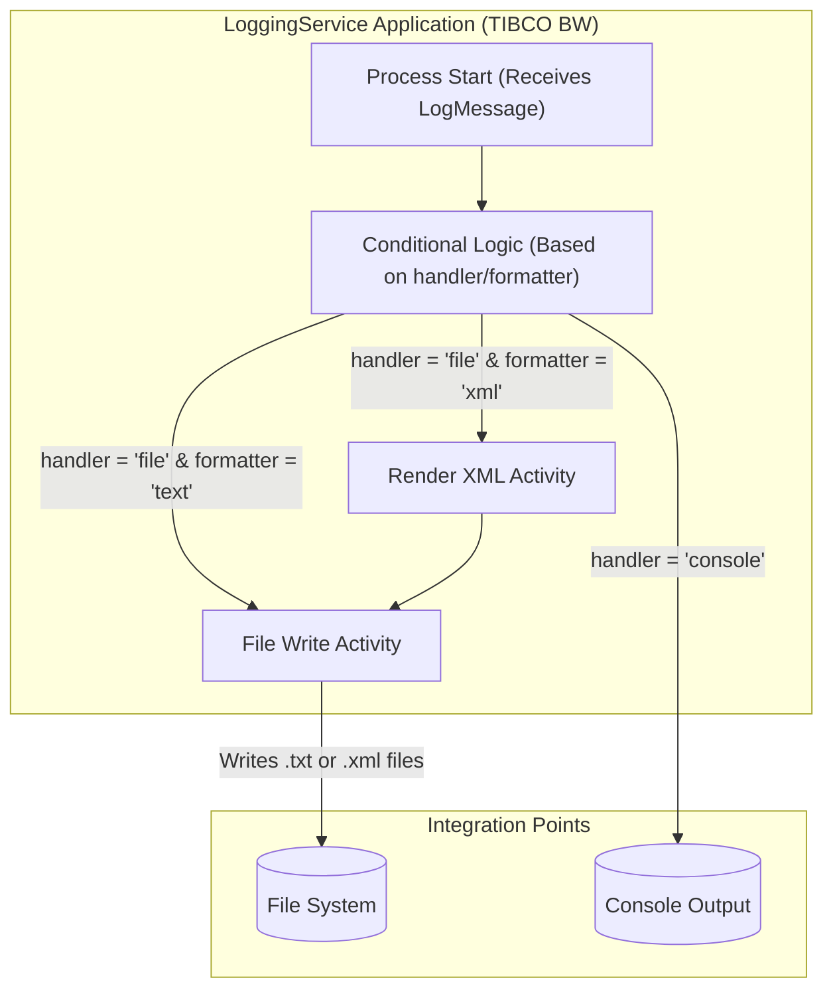

## Executive Summary
This analysis documents the logical dependencies and integration architecture of the `LoggingService` TIBCO BusinessWorks (BW) project. The system is a simple, callable logging process designed to receive a log message and route it to different outputs based on input parameters. The primary external integration is with the local **File System**, where it writes log files in either plain text or XML format. The process also logs to the **Console**, representing an operational output. A significant unknown is the invocation method, as no external service bindings (like REST or SOAP) are defined in the provided files.

## Logical Dependencies & Integration Diagram

### System Overview
The `LoggingService` is a TIBCO BW process that acts as a logging utility. It accepts a `LogMessage` containing the content, level, and desired output `handler` (e.g., "console", "file") and `formatter` (e.g., "text", "xml"). Based on these parameters, the process directs the output to either the standard console or writes a file to a configured directory on the file system.

### Dependency Diagram

### Integration Details Table

| Component | Integration Type | Target System | Protocol/Method | Purpose | Evidence |
|-----------|-----------------|---------------|-----------------|---------|----------|
| `LogProcess.bwp` | File | File System | File Write | To persist log messages as `.txt` or `.xml` files in a configurable directory. | `Processes/loggingservice/LogProcess.bwp` (Activities: `TextFile`, `XMLFile`), `META-INF/default.substvar` (Variable: `fileDir`) |
| `LogProcess.bwp` | Operational Log | Console Output | Standard Out | To write log messages directly to the console for real-time monitoring or debugging. | `Processes/loggingservice/LogProcess.bwp` (Activity: `consolelog`) |

### Undetermined Elements

**External System Details:**
*   **Production File System Path**: The `fileDir` variable in `META-INF/default.substvar` is set to a local user path (`/Users/santkumar/temp/`), which is clearly a development-time value. The actual file paths for TEST, STAGE, or PROD environments are not defined and would be set during deployment.

**Integration Contracts:**
*   The data contracts for the process input (`LogSchema.xsd`) and XML output (`XMLFormatter.xsd`) are well-defined. However, the contract for how this process is *invoked* is missing.

**Runtime Dependencies:**
*   **Invocation Method**: The most significant unknown is how the `LogProcess.bwp` is triggered. It is defined as a "callable" process, but there are no service bindings (e.g., SOAP Web Service, REST Resource) within the project. It is likely called by another TIBCO BW process, but that calling component is not included in the provided files.

**Operational Context:**
*   **Deployment Environment**: The `MANIFEST.MF` file specifies `TIBCO-BW-Edition: bwe,bwcf`, which suggests it can be deployed to TIBCO BusinessWorks Container Edition (`bwcf`). This implies it could run in a Docker container, but the exact orchestration (e.g., Kubernetes, Docker Compose) and operational environment are unknown.

## Evidence Summary
- **Scope Analyzed**: All 18 files of the TIBCO BusinessWorks project `LoggingService`.
- **Key Data Points**:
    - 1 core business process (`LogProcess.bwp`) identified.
    - 2 primary integration points discovered: File System and Console.
    - 3 data schemas (`LogSchema.xsd`, `LogResult.xsd`, `XMLFormatter.xsd`) define the data contracts.
- **References**: Analysis is based on the process flow defined in `Processes/loggingservice/LogProcess.bwp` and configuration in `META-INF/MANIFEST.MF` and `META-INF/default.substvar`.

## Assumptions Made
- It is assumed that the `LogProcess.bwp` is not a standalone service and is intended to be called as a utility sub-process by other, larger TIBCO applications.
- The `fileDir` variable is assumed to be overridden by environment-specific properties upon deployment.
- The "console" output is treated as an operational integration point for monitoring and debugging rather than a formal system-to-system integration.

## Open Questions
- How is the `LogProcess` invoked in production? Is it exposed via a REST/SOAP API, or is it called internally from another TIBCO process?
- What are the production, staging, and test environment values for the `fileDir` module property?
- What are the non-functional requirements for this logging service, such as throughput (logs/sec) and file rotation/archival policies?

## Confidence Level
**Overall Confidence**: High

**Rationale**: The provided codebase is small, self-contained, and uses standard TIBCO BusinessWorks components. The internal logic and direct dependencies are very clear from the process definition file (`LogProcess.bwp`). The confidence is not "Critical" only because the external invocation mechanism is completely missing, which is a key part of its overall architecture.

**Evidence**:
- **File System Integration**: Confirmed by the `bw.file.write` activities (`TextFile`, `XMLFile`) in `Processes/loggingservice/LogProcess.bwp` and the `fileDir` property in `META-INF/default.substvar`.
- **Conditional Logic**: Confirmed by the transition conditions in the `Start` event within `Processes/loggingservice/LogProcess.bwp`, which explicitly check `$Start/ns0:handler` and `$Start/ns0:formatter`.
- **Technology Stack**: Confirmed by the `Require-Capability` section in `META-INF/MANIFEST.MF`, which lists palettes for `bw.generalactivities`, `bw.file`, and `bw.xml`.

## Action Items
**Immediate**:
- [ ] **Clarify Invocation Method**: Engage with the development team to determine how the `LogProcess` is called in production to complete the end-to-end dependency map.

**Short-term**:
- [ ] **Document Environment Configurations**: Obtain the environment-specific values for the `fileDir` property to understand the production file storage locations.

**Long-term**:
- [ ] **Evaluate Modernization**: Assess if this custom logging process could be replaced by a standardized logging framework (e.g., Logstash, Fluentd) that writes to a centralized logging platform (e.g., Splunk, ELK Stack) instead of the local file system.

## Risk Assessment
- **High Risk**: None identified.
- **Medium Risk**: **Dependency on Local File System**. Writing logs to a local file system in a containerized (`bwcf`) environment can lead to data loss if the container is restarted or if storage is ephemeral. It also complicates log aggregation and analysis.
- **Low Risk**: **Missing Invocation Context**. While a gap in this analysis, the risk to the component itself is low as its function is clear. The risk lies with any calling applications, which are outside the scope of this codebase.