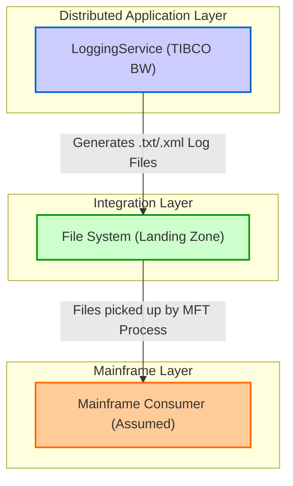
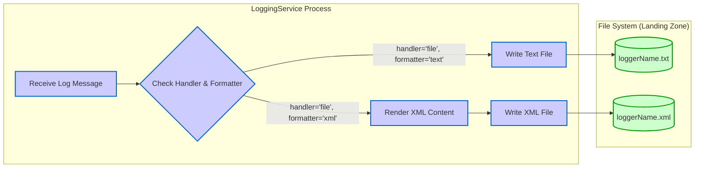

## Executive Summary
This report provides a comprehensive MFDA (Mainframe-Distributed Application) integration architecture analysis of the `LoggingService` application. The analysis reveals that the application is a TIBCO BusinessWorks (BW) 6.5.0 module designed to receive and process log messages. The sole integration pattern identified is file generation, which is categorized as an MFT (Managed File Transfer) integration within the MFDA framework. The service writes log messages to either text or XML files in a configurable directory. No evidence of other MFDA integration types such as Apigee, Kafka, AlloyDB, or Oracle was found within the codebase.

## Analysis

This section details the integration architecture of the `LoggingService` application, following the MFDA documentation standards.

### 1. MFDA Integration Matrix

A single mainframe integration point was identified, where the application generates files intended for pickup and processing by other systems.

| Component ID | Integration Name | Type | Upstream System | Downstream System | Data Flow Direction | Protocol/Method | Frequency | Data Volume | Environment |
|--------------|------------------|------|-----------------|-------------------|-------------------|-----------------|-----------|-------------|-------------|
| MFDA-MFT-001 | Log File Generation | MFT | LoggingService (DA) | Local File System (MFT Landing Zone) | Outbound | File Write | Event-driven | Variable | PROD, STAGE, TEST, DEV |

### 2. Integration Architecture Wire Diagrams

The following diagrams illustrate the data flow and architecture based on the code analysis.

#### Overall MFDA Architecture

The overall architecture is simple, focused exclusively on file generation. Other MFDA components are not utilized by this application.

#### MFT Integration Architecture

This diagram details the internal logic of the `LoggingService` for the MFT integration.

### 3. Integration Interface Specifications

#### Integration Interface: Log File Generation

**Integration ID**: MFDA-MFT-001
**Integration Type**: MFT

**Technical Specifications**
- **Protocol**: Local File System Write
- **Data Format**: Plain Text or XML, based on the `formatter` field in the input message.
- **Security**: Relies entirely on underlying file system permissions. No application-level security is implemented for file writing.
- **Performance**: Dependent on file system I/O performance. The process is synchronous and stateless.

**Data Flow Details**
- **Source System**: The `loggingservice.LogProcess` TIBCO BW process.
- **Target System**: A directory on the local file system, specified by the `fileDir` module property.
- **Data Transformation**: If the `formatter` is `xml`, the input log message is transformed into an XML structure defined in `Schemas/XMLFormatter.xsd` before being written. Otherwise, the raw message content is written.
- **Error Handling**: The TIBCO process includes fault handlers for file-writing activities (`_error_TextFile`, `_error_XMLFile`), but the specific error handling logic is not defined beyond catching the fault.

**Environment Configuration**
- **Development**: The `fileDir` property in `META-INF/default.substvar` is set to `/Users/santkumar/temp/`. This is expected to be overridden for other environments.
- **Test**: `fileDir` would point to a test environment directory (e.g., `/test/logs/`).
- **Staging**: `fileDir` would point to a staging environment directory (e.g., `/stage/logs/`).
- **Production**: `fileDir` would point to a production environment directory (e.g., `/prod/logs/`).

**Business Impact**
- **Business Process**: Supports centralized logging by creating files that can be ingested by monitoring, auditing, or mainframe batch systems.
- **Criticality**: Medium. Failure to write logs could impede troubleshooting, auditing, and business analytics.
- **Downtime Impact**: Loss of log data for the duration of the outage.
- **Recovery Requirements**: RTO/RPO are not defined, but recovery would involve restoring file system access and potentially re-processing failed log messages if they are queued upstream.

### 4. Environment-Specific Integration Details

The primary configuration controlling the integration is the `fileDir` global variable.

#### Development Environment
- **Environment Purpose**: Development and unit testing.
- **Integration Endpoints**:
  - **File Location**: `/Users/santkumar/temp/` (as per `META-INF/default.substvar`).
- **Data Sources**: Test log messages sent to the TIBCO process.

#### Test / Production Environments
- **Environment Purpose**: System testing and live operations.
- **Integration Endpoints**:
  - **File Location**: The `fileDir` variable is designed to be overridden during deployment to point to environment-specific paths (e.g., `/test/app/logs/`, `/prod/app/logs/`).
- **Data Sources**: Real log messages from integrated applications.

### 5. Integration Dependencies and Sequencing

- **Dependency Matrix**:
| Integration | Depends On | Reason | Impact if Unavailable |
|-------------|------------|--------|-----------------------|
| MFDA-MFT-001 | File System | Requires a writable directory | Log messages cannot be saved to files, resulting in data loss. |

- **Integration Sequencing for Testing**:
1.  **Foundation**: Ensure the target file system directory exists and has the correct write permissions for the TIBCO application user.
2.  **Component Test**: Test the `LoggingService` by sending messages with different `handler` and `formatter` values.
3.  **Integration Test**: Verify that files are created with the correct name (`<loggerName>.txt` or `<loggerName>.xml`) and content in the specified `fileDir`.
4.  **E2E Validation**: A downstream process (outside the scope of this codebase) must be tested to confirm it can successfully pick up and process the generated files.

## Evidence Summary
- **Scope Analyzed**: The analysis covered all files in the `LoggingService` TIBCO BW project.
- **Key Data Points**:
  - **1 MFT Integration Pattern**: File generation was identified.
  - **0 Other MFDA Integrations**: No API, Kafka, AlloyDB, or Oracle integrations were found.
  - **3 Schemas**: `LogSchema.xsd`, `LogResult.xsd`, and `XMLFormatter.xsd` define the data contracts.
  - **1 Core Process**: `Processes/loggingservice/LogProcess.bwp` contains all business logic.
- **References**:
  - `META-INF/MANIFEST.MF`: Confirmed project dependencies on `bw.file` and `bw.xml` palettes.
  - `META-INF/default.substvar`: Identified the configurable `fileDir` property for the output directory.
  - `Processes/loggingservice/LogProcess.bwp`: Provided the explicit logic for writing text and XML files based on input message content.

## Assumptions Made
- The file-writing functionality of this `LoggingService` is the starting point of a larger Managed File Transfer (MFT) process.
- The generated files are intended to be picked up by another system, likely a mainframe, for batch processing or archival.
- The `fileDir` global variable is overridden in TEST, STAGE, and PROD environments with appropriate directory paths.
- The system that consumes these files is responsible for file deletion and cleanup after processing.

## Open Questions
- What is the end-to-end data flow? What system or process consumes the files generated by this service?
- What is the transport mechanism (e.g., SFTP, Connect:Direct) used to move the files from the landing zone?
- What are the performance and volume SLAs? (e.g., maximum file size, number of files per hour).
- What are the error handling requirements for the downstream process if a file is malformed or delayed?

## Confidence Level
**Overall Confidence**: High

**Rationale**: The codebase is small, self-contained, and clearly demonstrates its purpose. The use of the TIBCO File palette is explicit in `LogProcess.bwp`, and the configurable output directory is defined in `default.substvar`. The absence of other integration types is confirmed by the limited dependencies declared in `MANIFEST.MF`. The analysis is based on direct evidence within the provided files.

**Evidence**:
- **File Writing Logic**: `Processes/loggingservice/LogProcess.bwp` contains `<tibex:activityExtension name="TextFile" ... activityTypeID="bw.file.write">` and `<tibex:activityExtension name="XMLFile" ... activityTypeID="bw.file.write">`.
- **Configurable Directory**: `META-INF/default.substvar` defines `<globalVariable><name>fileDir</name><value>/Users/santkumar/temp/</value>...`.
- **Dependencies**: `META-INF/MANIFEST.MF` lists `Require-Capability: ... com.tibco.bw.palette; filter:="(name=bw.file)"`. No capabilities for Kafka, JDBC, or HTTP connectors are required.

## Action Items
**Immediate**:
- [ ] **Clarify Downstream Process**: Engage with the business/operations team to document the system that consumes the log files and the complete end-to-end MFT workflow.

**Short-term**:
- [ ] **Define Environment Configurations**: Document the specific `fileDir` paths for TEST, STAGE, and PROD environments.
- [ ] **Standardize Error Handling**: Define a standard procedure for handling file write failures, including alerting and potential message requeuing.

**Long-term**:
- [ ] **Evaluate Modernization**: Assess migrating this file-based logging to a real-time streaming solution like Kafka or a cloud-native logging service (e.g., Google Cloud Logging) to improve observability and reduce file management overhead.

## Risk Assessment
- **High Risk**: **File System Unavailability**. If the directory specified in `fileDir` is not available or lacks write permissions, the service will fail to process logs, leading to data loss.
- **Medium Risk**: **Downstream Process Failure**. If the process that is supposed to pick up the generated files fails, files could accumulate indefinitely, consuming disk space and delaying the processing of critical log data.
- **Low Risk**: **Data Corruption**. There is a minor risk of data corruption if the file system experiences an issue during a write operation, potentially leaving a partial or unreadable file.