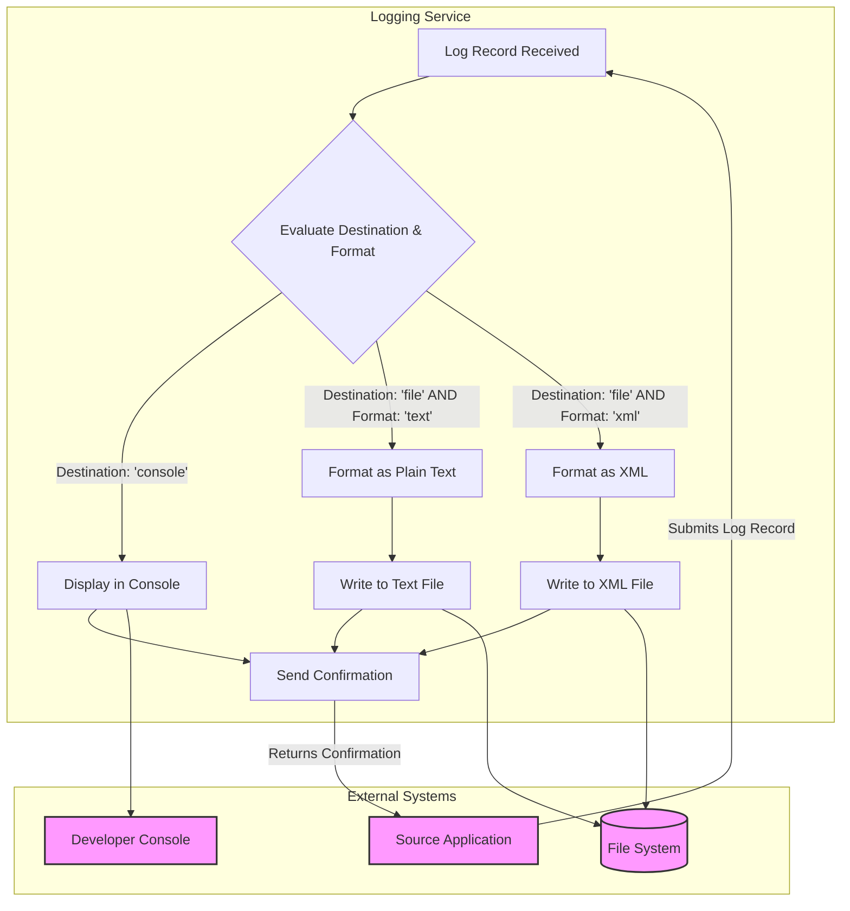

## Executive Summary

This analysis documents the business data model for a centralized logging service. The system's primary function is to capture, format, and store operational event data from various source applications. The core business information tracked is the "Log Record," which includes details like the event's severity, the message content, the source system, and the desired destination (e.g., console for immediate review or a file for auditing). The system enforces rules to route and format this information, creating either plain text or structured XML audit trails, which are crucial for operational monitoring, troubleshooting, and maintaining a historical record of system activities.

## Analysis

### Business Entity: Log Record

This is the central piece of information the system is designed to manage. It represents a single event or piece of information that a source application needs to record for operational or audit purposes.

| Business Entity | What It Tracks | Who Uses It | Business Purpose | Key Information |
| :--- | :--- | :--- | :--- | :--- |
| **Log Record** | A specific event, error, or status update from a source application. | Developers, System Administrators, Support Teams, Auditors | Provides a detailed audit trail for troubleshooting system issues, monitoring application health, and analyzing operational events over time. | Severity Level, Log Content, Source System, Error Code, Log Destination, Log Format |

### Business Entity: Confirmation Message

This entity represents the acknowledgment that the logging service has successfully processed a request.

| Business Entity | What It Tracks | Who Uses It | Business Purpose | Key Information |
| :--- | :--- | :--- | :--- | :--- |
| **Confirmation Message** | A simple success message. | Calling Applications | Confirms to the source system that the log record was received and processed, allowing the source system to continue its own operations. | A text message indicating completion (e.g., "Logging Done"). |

### Business Relationships

The data model is simple, with a direct process flow connecting the entities.

| Relationship | Business Meaning | Business Impact |
| :--- | :--- | :--- |
| **Log Record** -> **Confirmation Message** | A source application submits a **Log Record** to be processed, and upon successful storage or display, the system returns a **Confirmation Message**. | This flow ensures that applications have a reliable way to offload their operational logging responsibilities and receive acknowledgment, without needing to manage the complexities of file writing or console output themselves. |

### Business Rules in Data

The system contains several rules that govern how log records are processed. These rules are critical for ensuring that operational data is stored correctly for different business needs (e.g., real-time debugging vs. long-term audit).

| Business Rule | What It Ensures | Business Risk if Violated |
| :--- | :--- |
| **Route Logs to Specific Destinations** | Log records are sent to the correct place (e.g., a developer's console or a permanent file) based on the "Log Destination" specified in the record. | If violated, real-time alerts could be missed by developers, or permanent audit records could be lost, hindering troubleshooting and compliance checks. |
| **Format Logs for Intended Audience** | Log records are formatted as either simple text (for human readability) or structured XML (for machine processing) based on the "Log Format" specified. | If violated, logs intended for automated analysis tools might be unreadable, or audit trails might be difficult for support staff to interpret, increasing the time to resolve issues. |
| **Organize Log Files by Source** | Log files are named after the "Source System/Component" that generated the log record. | If violated, it would be extremely difficult to isolate issues for a specific application, as logs from all systems would be mixed together, significantly delaying problem diagnosis. |

### Business Information Flow

The system follows a clear, rule-based workflow for processing incoming log records. An application sends a "Log Record," and the system decides how to handle it based on its destination and format attributes.

## Evidence Summary

-   **Scope Analyzed**: The analysis covered all TIBCO BusinessWorks project files, including process definitions (`.bwp`), schema definitions (`.xsd`), and configuration files (`.substvar`, `.bwm`).
-   **Key Data Points**:
    -   **Log Record Entity**: Defined in `Schemas/LogSchema.xsd`, containing fields like `level`, `formatter`, `message`, `msgCode`, `loggerName`, and `handler`.
    -   **XML Format Entity**: Defined in `Schemas/XMLFormatter.xsd`, specifying the structure for XML-based logs.
    -   **Confirmation Entity**: Defined in `Schemas/LogResult.xsd`.
    -   **Business Rules & Workflow**: Implemented in `Processes/loggingservice/LogProcess.bwp`, which contains the conditional logic for routing and formatting logs.
-   **References**: 3 schema files and 1 process file were the primary sources for this data model analysis.

## Assumptions Made

-   It is assumed that this `LoggingService` is a shared, centralized utility intended to be called by other applications within the organization.
-   The `loggerName` field in a log record is assumed to correspond to the name of the application or component sending the log, which is then used for organizing files.
-   The `fileDir` global variable (`/Users/santkumar/temp/`) points to a temporary local directory for development, and in a production environment, this would be a managed, persistent network location.

## Open Questions

-   What are the defined business standards for the `level` field (e.g., "INFO", "WARN", "ERROR")? Understanding this is key to creating effective monitoring and alerting on the resulting logs.
-   What are all the possible values for the `handler` (destination) and `formatter` fields? This defines the full range of capabilities of the logging service.
-   What are the business requirements for log file retention and archiving?
-   Which downstream systems or teams consume the generated text and XML log files, and for what purpose (e.g., automated alerting, business intelligence, audit reviews)?

## Confidence Level

**Overall Confidence**: High

**Rationale**: The provided codebase is self-contained and clearly defines the data structures and the logic for processing them. The XSD schemas explicitly detail the fields of the business entities, and the TIBCO process file (`.bwp`) visually and logically lays out the business rules and workflow. The purpose of the service is unambiguous.

**Evidence**:
-   **Data Entities**: The structures for the "Log Record" and "Confirmation Message" are explicitly defined in `Schemas/LogSchema.xsd` and `Schemas/LogResult.xsd`.
-   **Business Rules**: The conditional transitions in `Processes/loggingservice/LogProcess.bwp` directly map to the business rules. For example, the link from the start event to the `consolelog` activity has the condition `matches($Start/ns0:handler, "console")`.
-   **Information Flow**: The sequence of activities in `Processes/loggingservice/LogProcess.bwp` (e.g., `Start` -> `RenderXml` -> `XMLFile` -> `End`) provides a clear, verifiable flow of information.

## Action Items

**Immediate**:
-   **[ ] Clarify Business Vocabulary**: Meet with business stakeholders or the development team to answer the "Open Questions" regarding the specific values for log levels, handlers, and formatters to create a complete data dictionary.

**Short-term**:
-   **[ ] Document Data Retention Policies**: Work with compliance and operations teams to formally document the business requirements for how long log files should be stored and when they can be archived or deleted.

**Long-term**:
-   **[ ] Model Downstream Consumption**: Analyze the systems that consume the output log files to model their data needs, ensuring the logging service provides all necessary information for alerting, reporting, and analytics.

## Risk Assessment

-   **Low Risk**: The data model itself is simple and poses little risk. However, the business processes that *rely* on this logging data may be high-risk.
-   **Medium Risk**: There is a medium operational risk if the logging service fails. A failure would create blind spots in system monitoring, potentially delaying the detection and resolution of critical production issues in the applications that use this service.
-   **Low Risk**: There is a low risk of data corruption, as the service primarily transforms and routes data. The main integrity risk would be if the file system it writes to is unreliable.