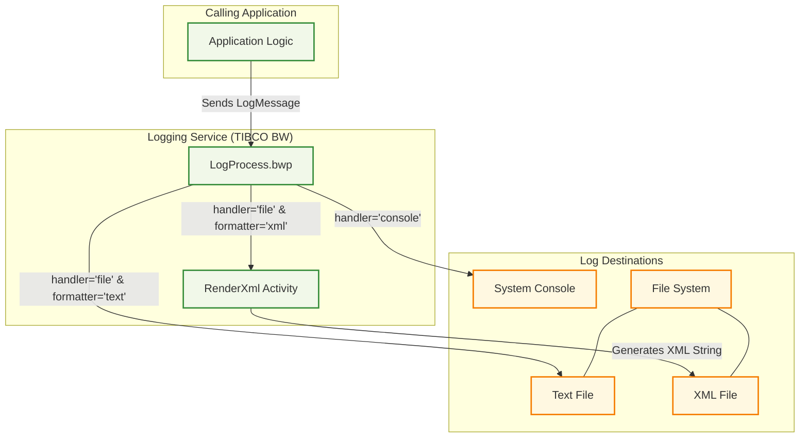
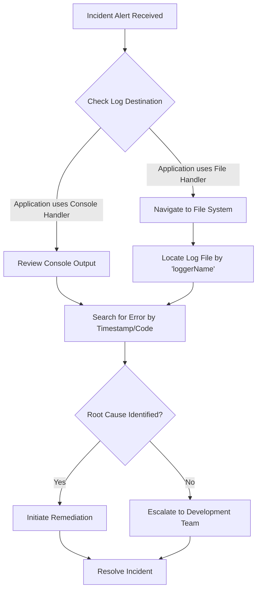

## Executive Summary

This analysis identifies the user personas and journeys for a backend TIBCO BusinessWorks application named `LoggingService`. The system's sole function is to act as a centralized logging utility. It receives log requests and, based on input parameters, writes them to either the system console or a file in text or XML format. The primary users are not end-users but rather technical roles: **Application Developers** who integrate this service into their applications, and **Operations/Support Engineers** who consume the generated logs to monitor and troubleshoot systems.

## Analysis

### User Persona Table

Based on the system's functionality, two primary user personas have been identified.

| Attribute | Description |
| :--- | :--- |
| **Role Name** | **Application Developer (Service Consumer)** |
| **Primary Responsibilities** | Integrating logging into their applications to record events, errors, and diagnostic information. |
| **Success Metrics/KPIs** | Low integration effort; reliable and performant log delivery; flexibility in log destination and format. |
| **Pain Points** | (Potential) Complex integration process; inflexible formatting options; unreliable logging (lost messages); performance overhead. |
| **Decision Authority** | Decides what information to log, the severity (`level`), the destination (`handler`), and the format (`formatter`). |
| **Business Impact if System Fails** | Inability to record application activity, leading to blind spots in monitoring, auditing, and debugging. |
| **Escalation Path** | DevOps or the team managing the `LoggingService`. |

| Attribute | Description |
| :--- | :--- |
| **Role Name** | **Operations/Support Engineer (Log Consumer)** |
| **Primary Responsibilities** | Monitoring application health, troubleshooting production incidents, and analyzing system behavior using logs. |
| **Success Metrics/KPIs** | Reduced Mean Time To Resolution (MTTR) for incidents; ability to quickly locate and understand relevant log entries. |
| **Pain Points** | (Potential) Unstructured or inconsistent log formats; missing context (timestamps, log levels); logs being difficult to locate or access. |
| **Decision Authority** | Determines the root cause of issues based on log data and initiates remediation procedures. |
| **Business Impact if System Fails** | Inability to diagnose production failures, leading to extended downtime and potential revenue loss. |
| **Escalation Path** | Application development teams, infrastructure teams. |

### User Journey Maps

#### Journey 1: Integrate Centralized Logging
- **Journey Name**: A developer records a critical application event.
- **Participants**: Application Developer
- **Steps**:
    1.  **Identify Logging Need**: The developer identifies a critical point in their application code (e.g., order submission) that requires logging.
        -   **User Goal**: To create a persistent, auditable record of the event.
        -   **System Support**: The `LoggingService` provides a standardized interface (`LogSchema.xsd`) for sending log data.
        -   **Decision Points**: The developer chooses the log `level` (e.g., "INFO"), `message`, and a unique `msgCode`.
        -   **Success Criteria**: The log request is successfully constructed.
    2.  **Configure Log Destination**: The developer decides where the log should be stored for this specific event.
        -   **User Goal**: To send the log to the most appropriate destination for analysis (e.g., a file for batch analysis, console for real-time debugging).
        -   **System Support**: The `LogMessage` input supports a `handler` ("console" or "file") and `formatter` ("text" or "xml") parameter.
        -   **Decision Points**: Choose `handler` and `formatter` based on the operational need.
        -   **Success Criteria**: The log request payload is complete.
    3.  **Invoke Logging Service**: The developer's application sends the `LogMessage` payload to the `LoggingService`.
        -   **User Goal**: To reliably offload the log message for processing.
        -   **System Support**: The `LogProcess.bwp` receives the request and routes it based on the `handler` and `formatter`.
        -   **Decision Points**: None.
        -   **Success Criteria**: The service returns a success response (`result`: "Logging Done"). The log appears in the correct destination (console or file system).
- **Value Chain**: This journey allows developers to implement standardized, enterprise-wide logging without building custom logic. It decouples applications from the logging infrastructure, improving maintainability and development speed.

#### Journey 2: Troubleshoot a Production Incident
- **Journey Name**: A support engineer investigates a failed transaction.
- **Participants**: Operations/Support Engineer
- **Steps**:
    1.  **Receive Incident Alert**: The engineer is notified of a failed transaction and is given a transaction ID or timestamp.
        -   **User Goal**: To find the logs associated with the failed transaction.
        -   **System Support**: The `LoggingService` writes logs to predictable locations (console or a file path configured via the `fileDir` variable). XML-formatted logs include a timestamp.
        -   **Decision Points**: Determine which log file/source to check based on the application that failed (`loggerName`).
        -   **Success Criteria**: The correct log file is located.
    2.  **Analyze Log Data**: The engineer searches the logs for entries matching the incident's context (timestamp, error codes).
        -   **User Goal**: To understand the sequence of events and identify the root cause.
        -   **System Support**: The logs contain the `level`, `message`, `msgCode`, and `timestamp` (for XML format), providing context for the failure.
        -   **Decision Points**: Based on the log message, decide if the issue is a data problem, a code bug, or an infrastructure failure.
        -   **Success Criteria**: A log entry is found that clearly explains the error.
    3.  **Initiate Remediation**: Based on the log analysis, the engineer escalates to the appropriate team or follows a runbook to resolve the issue.
        -   **User Goal**: To restore service functionality.
        -   **System Support**: The logs serve as evidence for the incident report and root cause analysis.
        -   **Decision Points**: None.
        -   **Success Criteria**: The issue is resolved, and the resolution is documented.
- **Value Chain**: This journey is critical for maintaining system uptime and reliability. The logs produced by the `LoggingService` are the primary source of truth for diagnosing and resolving production issues, directly impacting business continuity.

### Business Flow Diagrams

#### System Interaction Flow

This diagram shows how a calling application interacts with the `LoggingService` and the resulting outputs.

#### User Journey: Troubleshooting an Incident

This diagram illustrates the workflow for an Operations/Support Engineer.

## Evidence Summary

-   **Scope Analyzed**: The analysis covered all files in the TIBCO BusinessWorks project, including process definitions, schemas, and configuration.
-   **Key Data Points**:
    -   1 primary business process was identified: `Processes/loggingservice/LogProcess.bwp`.
    -   3 input parameters (`handler`, `formatter`, `loggerName`) control the core workflow logic.
    -   3 distinct output paths were found: Console, Text File, and XML File.
-   **References**:
    -   The user journey and personas are derived from the logic within `Processes/loggingservice/LogProcess.bwp`.
    -   The input data contract is defined in `Schemas/LogSchema.xsd`.
    -   The file output destination is configured in `META-INF/default.substvar` via the `fileDir` variable.

## Assumptions Made

-   **Centralized Service**: It is assumed this `LoggingService` is a shared, centralized utility intended for use by multiple applications across an enterprise.
-   **File Naming Convention**: The process uses the `loggerName` input parameter to construct the output filename (e.g., `[loggerName].txt`). It's assumed that consuming applications will provide a unique `loggerName` to avoid file contention.
-   **Deployment Context**: Assumed that the "console" handler writes to the standard output of the TIBCO process engine, which would be captured by system-level logging tools.

## Open Questions

-   **Invocation Method**: How is this "callable" process exposed to consumers? The files do not contain bindings for SOAP, REST, or JMS, which is a critical piece of information for the "Application Developer" persona.
-   **Performance SLAs**: What are the performance and throughput expectations for this service? The current design, especially with file I/O, may not be suitable for high-volume logging.
-   **Log Lifecycle Management**: The service only writes files. There is no built-in mechanism for log rotation, archival, or cleanup. How is the disk space on the target file system managed?
-   **File System Permissions**: What are the security and permission requirements for the directory specified by the `fileDir` variable?

## Confidence Level

**Overall Confidence**: High

**Rationale**: The provided codebase is small, self-contained, and has a very clear purpose. The business process logic is straightforward and explicitly defined in `LogProcess.bwp`. The input and output schemas are also clearly defined. The only significant ambiguity is the external invocation method, but the internal logic and user roles are unambiguous.

**Evidence**:
-   The conditional transitions in `LogProcess.bwp` (lines 280-300) clearly define the different paths based on `handler` and `formatter`, confirming the core journeys.
-   The input element `LogMessage` defined in `Schemas/LogSchema.xsd` confirms the data contract for the "Application Developer" persona.
-   The `fileDir` global variable in `META-INF/default.substvar` confirms the file-based destination for the "Operations/Support Engineer" persona.

## Action Items

**Immediate**:
-   [ ] Document the `LogMessage` data contract (from `LogSchema.xsd`) and share it with development teams to ensure standardized integration.

**Short-term**:
-   [ ] Investigate and document the service's deployment binding (e.g., REST, SOAP) to complete the integration guide for developers.
-   [ ] Define and test the file system permission requirements for the log directory to prevent runtime errors.

**Long-term**:
-   [ ] Design and implement a log rotation and archival strategy to prevent the file system from running out of space. This is a critical missing feature for a production-ready logging service.

## Risk Assessment

-   **High Risk**: **Loss of Logs due to File System Issues.** If the directory defined by `fileDir` becomes full, is unavailable, or has incorrect permissions, the "file" handler will fail. The current process does not appear to have robust error handling for this, potentially leading to silent loss of critical logs.
-   **Medium Risk**: **Performance Bottleneck.** The file-writing activities are synchronous. Under high load from multiple applications, this service could become a bottleneck, slowing down all consuming applications.
-   **Low Risk**: **Inconsistent Log Structure.** The service relies on consumers to correctly populate all fields. If developers are inconsistent, the resulting logs may be difficult for Operations Engineers to parse and analyze effectively.