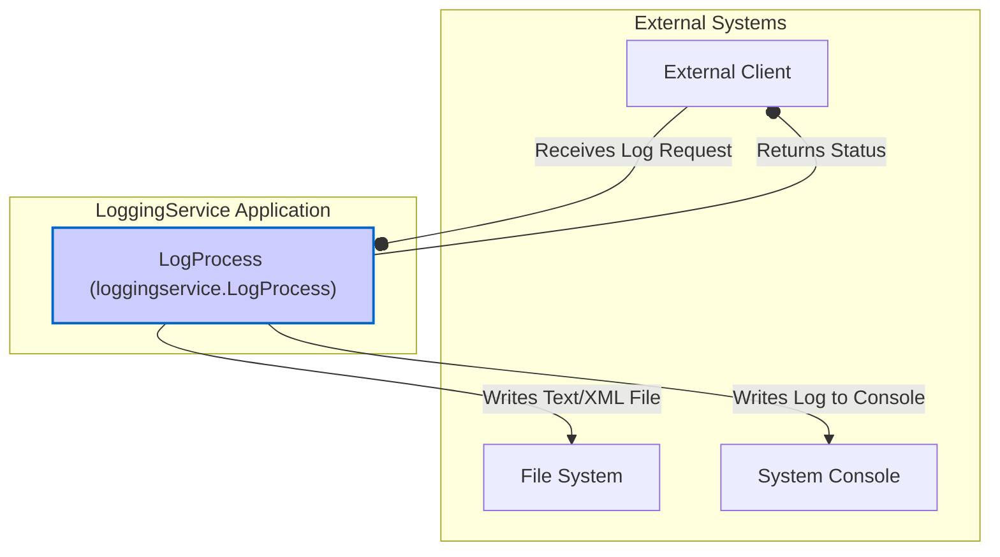

## Executive Summary

This report provides a logical dependency and integration analysis of the `LoggingService` TIBCO BusinessWorks (BW) application. The system is designed as a simple, callable logging utility. Its core function is to receive a log message and, based on specified handlers, write the output to either the system console or the local file system in text or XML format. The primary external dependencies are the calling client, the file system for log storage, and the system console for direct output. The exact client and protocol for invocation are not defined within the codebase.

## Logical Dependencies & Integration Diagram

### System Overview

The system consists of a single TIBCO BW process, `LogProcess`, which acts as a logging service. It is triggered by an external client and directs log output to one of two external systems: the File System or the System Console. The routing logic is determined by the content of the incoming `LogMessage`.

### Dependency Diagram

### Integration Details Table

| Component | Integration Type | Target System | Protocol/Method | Purpose | Evidence |
|-----------|------------------|---------------|-----------------|---------|----------|
| `LogProcess` | Inbound Request | `External Client` | TIBCO Process Invocation (e.g., SOAP/HTTP) | To receive log requests containing the message and routing instructions. | `Processes/loggingservice/LogProcess.bwp` (Defines a callable process with a `LogMessage` input) |
| `LogProcess` | Log Output | `System Console` | Standard Out | To log messages directly to the console when the input `handler` is 'console'. | `Processes/loggingservice/LogProcess.bwp` (Contains a `bw.generalactivities.log` activity named `consolelog`) |
| `LogProcess` | File Output | `File System` | File Write | To write log messages to text or XML files when the input `handler` is 'file'. | `Processes/loggingservice/LogProcess.bwp` (Contains `bw.file.write` activities); `META-INF/default.substvar` (Defines the `fileDir` variable for the output path) |

### Undetermined Elements

The following elements could not be fully determined from the provided codebase:

**External System Details:**
*   **Invoking Client Protocol**: The process is defined as "callable," but the specific binding (e.g., SOAP, REST) that exposes it to external clients is not configured within the project files. The `Service Descriptors` folder is empty.
*   **Production File System Path**: The `fileDir` variable in `META-INF/default.substvar` is set to a local development path (`/Users/santkumar/temp/`). The actual path in test or production environments is unknown as it would be configured during deployment.

**Integration Contracts:**
*   **Service Contract (WSDL/OpenAPI)**: While the input and output schemas (`LogSchema.xsd`, `LogResult.xsd`) are defined, the formal service contract (like a WSDL file) is not included, so the exact endpoint interface is not specified.

**Operational Context:**
*   **Deployment Architecture**: There is no information on how this service is deployed (e.g., on-premise, cloud, containerized).
*   **Infrastructure Dependencies**: Dependencies such as load balancers, proxies, or specific operating system requirements are not visible in the code.

## Evidence Summary
- **Scope Analyzed**: The analysis covered all TIBCO BusinessWorks project files, including process definitions (`.bwp`), schemas (`.xsd`), and configuration files (`.substvar`, `MANIFEST.MF`).
- **Key Data Points**:
    - 1 core process (`LogProcess.bwp`) was identified.
    - 3 external integration points were found: External Client (inbound), File System (outbound), and System Console (outbound).
    - 3 schemas define the data contracts for the service.
- **References**: The findings are based on the structure of `LogProcess.bwp`, the palettes declared in `MANIFEST.MF`, and the variables in `default.substvar`.

## Assumptions Made
- It is assumed that the "callable" nature of the `LogProcess` implies it is exposed as a service (like SOAP/HTTP) to be invoked by an external system.
- It is assumed that the file system specified by the `fileDir` variable is a standard, accessible file system on the machine where the TIBCO process engine is running.
- The `consolelog` activity is assumed to write to the standard output of the running TIBCO engine process.

## Open Questions
- What protocol (SOAP, REST, etc.) is used to invoke the `LogProcess` in production?
- What are the production, staging, and test environment values for the `fileDir` module property?
- Are there any specific performance or availability requirements for the file system this service writes to?
- How is the lifecycle of the generated log files managed (e.g., rotation, archival, deletion)?

## Confidence Level
**Overall Confidence**: High

**Rationale**: The provided codebase is small and self-contained, making the internal logic and direct dependencies clear. The `LogProcess.bwp` file explicitly shows the control flow and the activities used for external integration (file writing, console logging). The `MANIFEST.MF` and `.substvar` files provide clear evidence of the technologies used and configuration parameters. The only area of lower confidence relates to the operational context and the specific protocol of the invoking client, which are external to the codebase itself.

**Evidence**:
- **File System Dependency**: Confirmed by the `bw.file.write` activities in `Processes/loggingservice/LogProcess.bwp` and the `fileDir` property in `META-INF/default.substvar`.
- **Console Dependency**: Confirmed by the `bw.generalactivities.log` activity in `Processes/loggingservice/LogProcess.bwp`.
- **Process Logic**: The conditional transitions based on the `handler` and `formatter` fields are explicitly defined in the links within `Processes/loggingservice/LogProcess.bwp`.

## Action Items
**Immediate**:
- [ ] **Clarify Invocation Protocol**: Confirm with the development team how the `LogProcess` is exposed and invoked by clients to finalize the integration contract.

**Short-term**:
- [ ] **Document Environment Configurations**: Obtain the values for the `fileDir` property for all target environments (Test, Staging, Production).
- [ ] **Define File Management Strategy**: Document the operational procedures for managing the log files created by this service, including rotation and archival policies.

## Risk Assessment
- **High Risk**: None identified.
- **Medium Risk**: **Configuration Drift**. The file path is managed by a module property. An incorrect path in a production deployment could cause the service to fail silently or write logs to an unmonitored location.
- **Low Risk**: **Unspecified Client Contract**. Since the client invocation method isn't defined, there's a minor risk of integration mismatch if client and server expectations are not aligned during deployment.