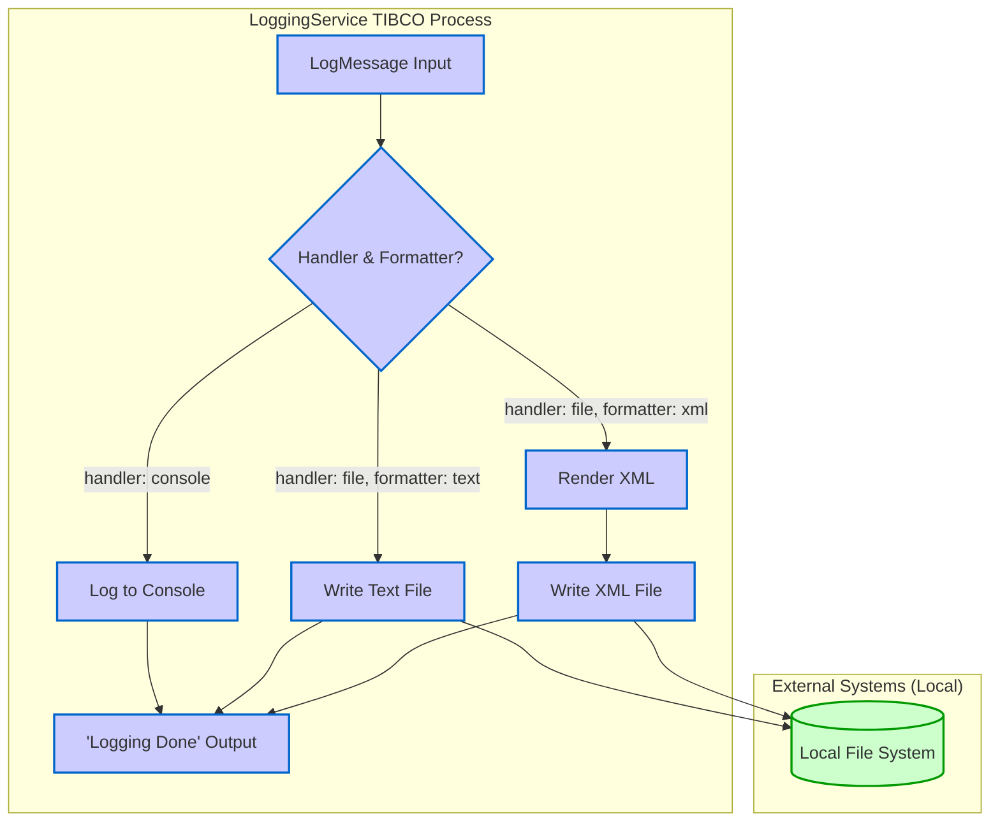

## Executive Summary

This report provides an MFDA (Mainframe and Distributed Application) integration architecture analysis of the `LoggingService` TIBCO BusinessWorks (BW) project. The analysis reveals that the project is a self-contained logging utility and **does not contain any of the specified MFDA integration patterns** (MFT, Apigee, Kafka, AlloyDB, Oracle). The core functionality involves a single process that receives a log message and, based on input parameters, writes it to the console or a local file in either text or XML format. The file operations identified are simple local file writes, not enterprise-scale Managed File Transfers (MFT).

## MFDA Integration Matrix

Based on the analysis of the provided codebase, no integrations matching the MFDA criteria were found. The following matrix reflects this finding.

| Component ID | Integration Name | Type | Upstream System | Downstream System | Data Flow Direction | Protocol/Method | Frequency | Data Volume | Environment |
| :--- | :--- | :--- | :--- | :--- | :--- | :--- | :--- | :--- | :--- |
| N/A | No MFDA Integrations Found | N/A | N/A | N/A | N/A | N/A | N/A | N/A | N/A |

## Integration Architecture Wire Diagrams

The provided codebase does not implement an MFDA architecture. Instead, it represents a simple, standalone logging service. The actual architecture is depicted below.

### Actual `LoggingService` Architecture

This diagram illustrates the internal logic of the `LoggingService` process, which is not an MFDA integration.

## Integration Interface Specifications

No MFDA-compliant integration interfaces were identified in the codebase. The project exposes a single callable TIBCO process, `loggingservice.LogProcess`, which is an internal component interface rather than an enterprise integration point.

### Integration Interface: `loggingservice.LogProcess` (Internal Process)

*   **Integration ID**: N/A
*   **Integration Type**: Not an MFDA Integration (Internal TIBCO Process Call)

#### Technical Specifications

*   **Protocol**: TIBCO Process Call
*   **Data Format**: XML based on `LogSchema.xsd`
*   **Security**: Not defined within the process; depends on the calling process's security context.
*   **Performance**: Not specified; depends on local file system I/O speed.

#### Data Flow Details

*   **Source System**: Any TIBCO process capable of calling this sub-process.
*   **Target System**: Local file system or console log.
*   **Data Transformation**: The process can format the input log message into an XML string before writing to a file.
*   **Error Handling**: The process definition includes fault paths for file and XML rendering errors, but no specific error handling logic is implemented.

## Environment-Specific Integration Details

The analysis did not find environment-specific configurations for MFDA integrations. The only environment-related variable is for a local file directory.

### `fileDir` Module Property

This property defines the base directory for file logging operations. It is not configured for different environments (DEV, TEST, PROD) within the provided files and defaults to a local user directory.

*   **File**: `META-INF/default.substvar`
*   **Property Name**: `fileDir`
*   **Default Value**: `/Users/santkumar/temp/`
*   **Purpose**: Specifies the output location for log files created by the `TextFile` and `XMLFile` activities in `LogProcess.bwp`. This points to a local file system path, not an MFT server or enterprise file share.

## Integration Dependencies and Sequencing

This section is not applicable as no MFDA integrations or dependencies between such components were found in the codebase. The `LoggingService` is a standalone utility with a dependency only on the local file system.

## Evidence Summary

*   **Scope Analyzed**: The analysis covered all files in the TIBCO BW project `LoggingService`, including process definitions (`.bwp`), schemas (`.xsd`), and configuration files (`.substvar`, `MANIFEST.MF`).
*   **Key Findings**:
    *   The project's primary component is `Processes/loggingservice/LogProcess.bwp`.
    *   This process acts as a logging utility, taking a `LogMessage` input and directing output to the console or a file.
    *   File writing is handled by the `bw.file.write` activity, which performs simple local file I/O.
    *   The output file path is constructed using the `fileDir` module property, which is configured with a local directory path (`/Users/santkumar/temp/`).
*   **Conclusion**: There is no evidence of Mainframe connectivity, Managed File Transfer (MFT) protocols (like SFTP), Apigee gateways, Kafka messaging, AlloyDB, or Oracle database integrations. The project does not meet the criteria for an MFDA integration component.

## Assumptions Made

*   The analysis is strictly limited to the files provided in the cache. The `LoggingService` may be part of a larger, unprovided ecosystem, but based on the available evidence, it functions as a standalone utility.
*   The term "MFT" in the MFDA context refers to enterprise-grade managed file transfer solutions, not simple local file write operations as implemented here.
*   The file path `/Users/santkumar/temp/` is a local development path and not a placeholder for a shared network or MFT location.

## Open Questions

*   Is this `LoggingService` project intended to be part of a larger MFDA solution? If so, the integration logic appears to be missing from the provided files.
*   What is the intended deployment environment for this service? The configuration suggests a local development setup, not an enterprise server environment.
*   Are there other repositories or modules that contain the actual MFT, API, or database integration logic that call this logging service?

## Confidence Level

**Overall Confidence**: High

**Rationale**: The provided codebase is small and self-contained. Analysis of the TIBCO process (`LogProcess.bwp`) and its configurations (`default.substvar`) definitively shows that the file operations are local writes. The `MANIFEST.MF` file confirms the dependencies are limited to standard TIBCO BW palettes (`bw.generalactivities`, `bw.file`, `bw.xml`) and do not include connectors for databases, messaging systems, or enterprise MFT solutions. The absence of any such connectors or related code provides high confidence that no MFDA integrations exist within this project.