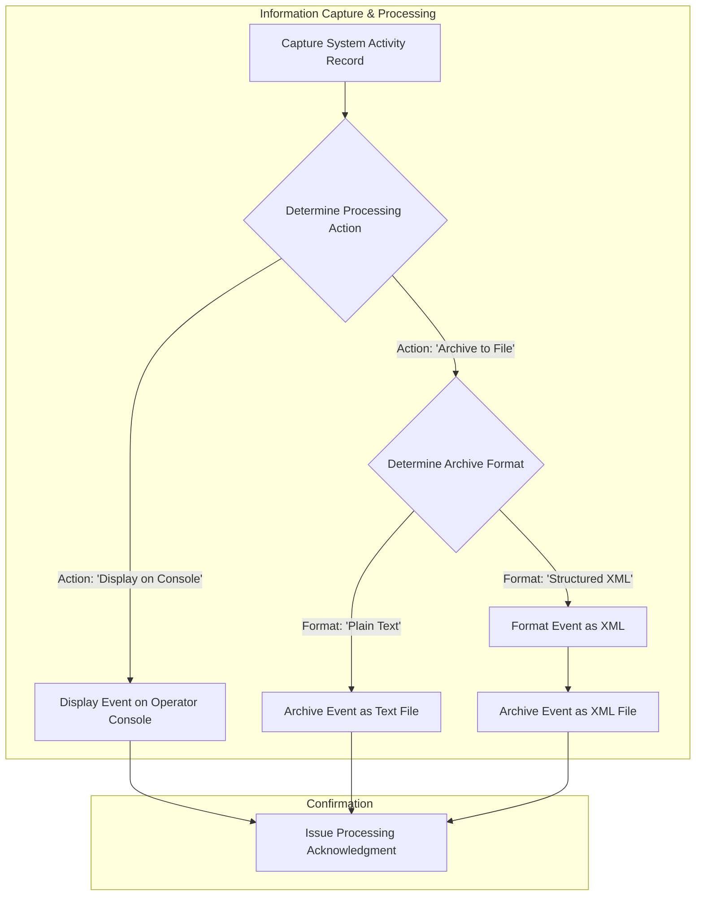

## Executive Summary

This analysis documents the business data model for the "LoggingService" application. The system is designed to capture, process, and store operational event records from various business applications. The core purpose of this data model is to provide a standardized way to track system activities for auditing, troubleshooting, and performance monitoring. The primary business entity is the "System Activity Record," which tracks key information like event severity, the source component, and a detailed description. The system enforces rules to route these records to different destinations (e.g., console for immediate review, files for long-term archival) based on predefined handlers, ensuring that information is managed according to its operational importance.

## Analysis

### Business Entity Catalog

The system is centered around capturing and managing information about operational events.

| Business Entity | What It Tracks | Who Uses It | Business Purpose | Key Information |
| :--- | :--- | :--- | :--- | :--- |
| **System Activity Record** | Detailed information about a single operational event or error occurring within a business application. | IT Operations, Developers, Security Auditors | To provide a verifiable audit trail of system behavior, enable rapid troubleshooting of operational issues, and monitor application health. | Severity Level, Event Description, Event Code, Source Application, Processing Action, Archive Format. |
| **Processing Acknowledgment** | A simple confirmation that a system activity record has been successfully processed and stored. | Automated Systems, Monitoring Tools | To confirm that the logging process has completed its task, allowing upstream systems to verify that their events have been captured. | A confirmation message (e.g., "Logging Done"). |

### Business Relationships

The data entities are connected through the central logging process.

| Relationship | Business Meaning | Business Impact |
| :--- | :--- | :--- |
| System Activity Record -> Processing Acknowledgment | Every activity record that is submitted to the service for processing results in a confirmation message. | This provides a closed-loop system, allowing the originating application to know its critical event information has been successfully captured and archived. Without this, events could be lost without any notification. |

### Business Rules in Data

The system's data model and processing logic enforce several key business rules.

| Business Rule | What It Ensures | Business Risk if Violated |
| :--- | :--- | :--- |
| **Mandatory Event Details** | Every system activity record must include a severity level, a descriptive message, and an event code. | Incomplete or useless records would be stored, making it impossible for support teams to diagnose issues or for auditors to understand what happened. This could lead to longer system downtimes and failed compliance checks. |
| **Flexible Sourcing** | The source application, processing action, and archive format are optional, allowing for flexible use by different systems. | Forcing every system to provide this information would create a barrier to adoption. However, this flexibility means some records may lack context, potentially slowing down root cause analysis if not governed properly. |
| **Handler-Based Routing** | Events are routed to different destinations (e.g., console or file) based on the specified "Processing Action". | Critical, real-time events might be missed if not displayed on a console, while less critical but detailed logs could overwhelm operators if not archived to files. Incorrect routing could lead to missed alerts or loss of important historical data. |
| **Formatter-Based Archiving** | Events destined for file archival can be stored as either plain text or structured XML, based on the "Archive Format". | Storing complex data as plain text could make it difficult to parse and analyze automatically. Storing simple messages as XML adds unnecessary overhead. This rule ensures data is stored in the most appropriate format for future use. |

### Business Information Flow

The system processes event data according to a defined workflow based on the information contained within the "System Activity Record".

## Evidence Summary

-   **Scope Analyzed**: The analysis covered all TIBCO BusinessWorks project files, including process definitions (`.bwp`), schema definitions (`.xsd`), and configuration files (`.substvar`, `MANIFEST.MF`).
-   **Key Data Points**:
    -   2 primary business entities were identified: "System Activity Record" and "Processing Acknowledgment".
    -   The "System Activity Record" entity tracks 6 key pieces of business information.
    -   4 core business rules governing data handling and routing were identified from the process logic and schema constraints.
-   **References**:
    -   `Schemas/LogSchema.xsd`: Defines the "System Activity Record" data structure.
    -   `Schemas/LogResult.xsd`: Defines the "Processing Acknowledgment" data structure.
    -   `Schemas/XMLFormatter.xsd`: Defines the structured XML format for archival.
    -   `Processes/loggingservice/LogProcess.bwp`: Contains the business logic for routing and processing based on the `handler` and `formatter` fields.
    -   `META-INF/default.substvar`: Defines the `fileDir` property, which represents the "Log Archive Location".

## Assumptions Made

-   It is assumed that "console", "file", "text", and "xml" are the primary values used for the `handler` and `formatter` fields, as these are the only paths explicitly defined in the `LogProcess.bwp` file.
-   The business purpose of logging (auditing, troubleshooting, monitoring) is inferred from the common use of such a service and the data it captures (e.g., severity level, message, source).
-   The "users" of this data (IT Operations, Developers, Auditors) are inferred based on the roles that typically consume system activity logs in a corporate environment.
-   The `fileDir` global variable in `default.substvar` is assumed to be the primary storage location for all file-based logging, representing the business's log archive.

## Open Questions

-   What are the specific business applications (`loggerName`) that are intended to use this logging service?
-   What are the business definitions and criteria for the different `level` values (e.g., INFO, WARN, ERROR)?
-   Are there governance policies dictating which applications should use which `handler` (console vs. file) or `formatter` (text vs. xml)?
-   What is the business's data retention policy for the archived log files?

## Confidence Level

**Overall Confidence**: High

**Rationale**: The provided codebase, though technical in nature, contains clear and explicit data definitions (`.xsd` files) and process logic (`.bwp` file) that directly map to a business data model. The schemas define the "what" (the information tracked), and the process defines the "how" (the rules for handling that information). The purpose of the service is unambiguous, making the translation to a business context straightforward.

**Evidence**:
-   The structure of the "System Activity Record" is explicitly defined in `Schemas/LogSchema.xsd`, including elements like `level`, `message`, `msgCode`, and `loggerName`.
-   The conditional logic for routing and formatting is clearly visible in the links and activities within `Processes/loggingservice/LogProcess.bwp`, which check the values of `$Start/ns0:handler` and `$Start/ns0:formatter`.
-   The existence of separate `TextFile` and `XMLFile` write activities in the process confirms the business rule for different archival formats.

## Action Items

**Immediate**:
-   [ ] **Clarify Business Terminology**: Engage with business stakeholders to validate the inferred business terms (e.g., "System Activity Record") and confirm the definitions for `level` and `msgCode`.

**Short-term**:
-   [ ] **Document Data Governance**: Create a governance document outlining which source applications (`loggerName`) should use which `handler` and `formatter` to ensure consistency and completeness of archived data.

**Long-term**:
-   [ ] **Define Data Retention Policy**: Work with IT Operations and Compliance to establish a formal data retention policy for the log archives stored in the location defined by the `fileDir` variable.

## Risk Assessment

-   **High Risk**: There is a risk of inconsistent or incomplete data if source applications do not provide the optional `loggerName`, `handler`, or `formatter` fields. This could hamper troubleshooting efforts.
-   **Medium Risk**: Without a defined data retention policy for the log archives, the storage location (`fileDir`) could grow indefinitely, leading to increased storage costs and potential performance issues.
-   **Low Risk**: The simplicity of the "Processing Acknowledgment" (a static string) means that the calling application does not get detailed feedback on where or how its event was stored, which could be a minor inconvenience in certain diagnostic scenarios.