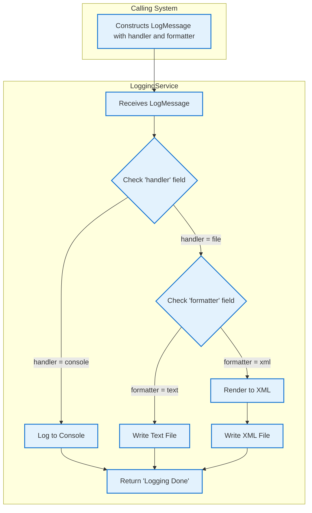

## Executive Summary
This analysis identifies the user personas and journeys for the `LoggingService` application. The codebase reveals a backend, technical service designed for other applications or developers, not for direct interaction with business end-users. The primary "user" is a **Calling System or Developer** whose goal is to record system events. The service supports three distinct journeys: logging to the console, logging to a plain text file, and logging to a structured XML file. The core business value lies in providing a standardized mechanism for auditing, debugging, and monitoring, though its current file-based implementation presents significant scalability and operational risks.

## Analysis
Based on the TIBCO BusinessWorks process and associated schemas, a single technical user persona has been identified. This system does not have traditional business user roles.

### User Persona Table

| Attribute | Description |
| :--- | :--- |
| **Role Name** | Calling System / Developer |
| **Primary Responsibilities** | - Submitting application events, errors, and diagnostic information to be recorded. - Specifying the desired log level, format (text/xml), and handler (console/file). - Providing a unique logger name to categorize messages. |
| **Success Metrics/KPIs** | - 100% of submitted log messages are successfully processed and stored. - Log processing latency is minimal and does not impact the performance of the calling application. - Logs are written in the correct format and to the specified destination. |
| **Pain Points** | - **(Inferred)** Lack of a centralized log aggregation system makes searching and correlation difficult. - **(Inferred)** File-based logging is not reliable in distributed or ephemeral environments; logs can be lost. - **(Inferred)** No built-in mechanism for log rotation, archival, or managing disk space. |
| **Decision Authority** | - Decides the content and severity (`level`) of the log message. - Chooses the output `handler` (console or file) and `formatter` (text or xml). |
| **Business Impact if System Fails** | - **Critical:** Loss of audit trails required for compliance. - **High:** Inability for support teams and developers to diagnose and resolve production issues. - **Medium:** Blind spots in application monitoring, preventing proactive issue detection. |
| **Escalation Path** | **(Inferred)** Logging failures would be reported to an Operations or DevOps team responsible for maintaining shared infrastructure services. |

### User Journey Maps

The system supports three primary technical journeys, determined by the input from the "Calling System / Developer" persona.

---
**Journey Name**: Log an Event to the Console

**Participants**: Calling System / Developer

**Steps**:
1.  **Construct Log Message**: The calling system creates a `LogMessage` payload.
    -   **User Goal**: To get immediate, real-time feedback on an application event, typically during development or debugging.
    -   **System Support**: The `LogSchema.xsd` defines the required input structure. The `handler` field must be set to `"console"`.
    -   **Decision Points**: The developer decides what `message`, `level`, and `msgCode` to include.
    -   **Success Criteria**: The `LogMessage` is valid according to the schema.
2.  **Invoke Logging Process**: The system calls the `loggingservice.LogProcess`.
    -   **User Goal**: To have the message recorded without needing to manage the output mechanism.
    -   **System Support**: The process receives the payload and its internal logic routes the request based on the `handler` field.
    -   **Decision Points**: The process's transition condition `matches($Start/ns0:handler, "console")` is met.
    -   **Success Criteria**: The process executes the `consolelog` activity.
3.  **Receive Confirmation**: The process completes and returns a success message.
    -   **User Goal**: To receive confirmation that the log request was accepted.
    -   **System Support**: The `End` activity returns a static string: "Logging Done".
    -   **Decision Points**: None.
    -   **Success Criteria**: The calling system receives the response without error.

**Value Chain**: Provides developers with a quick, simple way to view application events in real-time without persisting them to a file.

**Pain Points**: Console logs are ephemeral and are lost when the application or container restarts. They are not aggregated or searchable.

**Optimization Opportunities**: This journey is standard, but in a cloud environment, console output should be automatically streamed to a centralized logging platform like Google Cloud Logging.

---
**Journey Name**: Persist an Event to a Text File

**Participants**: Calling System / Developer

**Steps**:
1.  **Construct Log Message**: The calling system creates a `LogMessage` payload.
    -   **User Goal**: To persist a log event in a simple, human-readable format for later review.
    -   **System Support**: The `LogSchema.xsd` defines the input. The `handler` must be `"file"` and `formatter` must be `"text"`.
    -   **Decision Points**: The developer provides a `loggerName`, which is used to construct the filename (e.g., `mylogger.txt`).
    -   **Success Criteria**: The `LogMessage` is valid.
2.  **Invoke Logging Process**: The system calls the `loggingservice.LogProcess`.
    -   **User Goal**: To have the message written to a persistent file.
    -   **System Support**: The process logic (`matches($Start/ns0:handler, "file") and matches($Start/ns0:formatter, "text")`) routes the request to the `TextFile` (Write File) activity. The file is written to the directory specified by the `fileDir` module property.
    -   **Decision Points**: None.
    -   **Success Criteria**: The `TextFile` activity executes successfully.
3.  **Receive Confirmation**: The process completes and returns "Logging Done".
    -   **User Goal**: To get confirmation that the log was processed.
    -   **System Support**: The `End` activity sends the response.
    -   **Success Criteria**: The calling system receives the response.

**Value Chain**: Creates a persistent, human-readable audit trail on the local file system.

**Pain Points**: Relies on a local file system path, which is not scalable or reliable in a cloud or containerized environment. No log rotation, size management, or aggregation.

**Optimization Opportunities**: Replace the "Write File" activity with a component that sends the log to a durable storage solution like a GCS bucket or a log shipping agent.

---
**Journey Name**: Persist an Event to an XML File

**Participants**: Calling System / Developer

**Steps**:
1.  **Construct Log Message**: The calling system creates a `LogMessage` payload.
    -   **User Goal**: To persist a log event in a structured, machine-readable format.
    -   **System Support**: The `LogSchema.xsd` defines the input. The `handler` must be `"file"` and `formatter` must be `"xml"`.
    -   **Decision Points**: The developer provides a `loggerName` for the filename (e.g., `audit.xml`).
    -   **Success Criteria**: The `LogMessage` is valid.
2.  **Invoke Logging Process**: The system calls the `loggingservice.LogProcess`.
    -   **User Goal**: To have the message written to a structured, persistent file.
    -   **System Support**: The process logic routes the request to the `RenderXml` activity, which formats the data according to `XMLFormatter.xsd`, and then to the `XMLFile` (Write File) activity.
    -   **Decision Points**: None.
    -   **Success Criteria**: The `RenderXml` and `XMLFile` activities execute successfully.
3.  **Receive Confirmation**: The process completes and returns "Logging Done".
    -   **User Goal**: To get confirmation that the log was processed.
    -   **System Support**: The `End` activity sends the response.
    -   **Success Criteria**: The calling system receives the response.

**Value Chain**: Creates a structured, machine-readable log file that can be easily parsed by other systems for monitoring or analysis.

**Pain Points**: Same as the text file journey; it's tied to an unreliable local file system.

**Optimization Opportunities**: Replace the file output with a Kafka producer that sends the structured XML (or preferably JSON) to a topic for consumption by log aggregators or event-driven services.

### Business Flow Diagrams

This diagram illustrates the decision-making process within the `LogProcess` based on the user's (calling system's) input.

## Evidence Summary
- **Scope Analyzed**: The analysis focused on the TIBCO BusinessWorks process `Processes/loggingservice/LogProcess.bwp` and its associated schemas (`Schemas/LogSchema.xsd`, `Schemas/XMLFormatter.xsd`).
- **Key Data Points**:
    - **1** primary user persona identified (technical).
    - **3** distinct user journeys (log to console, log to text file, log to XML file).
    - **1** key external dependency: the local file system, configured via the `fileDir` property in `META-INF/default.substvar`.
- **References**: The logic for the journeys is explicitly defined by the links and transition conditions within `Processes/loggingservice/LogProcess.bwp`. The input data structure for the persona is defined in `Schemas/LogSchema.xsd`.

## Assumptions Made
- It is assumed that the "user" of this service is not a human but another automated system, application, or a developer integrating with it. The service has no user interface.
- It is assumed that the file-based logging mechanism, which writes to a local directory (`/Users/santkumar/temp/`), is a placeholder for development and that a more robust, centralized solution is required for production.
- It is assumed that the purpose of this service is to act as a shared, reusable logging utility for a suite of other applications.

## Open Questions
- What is the production strategy for managing the log files created by this service? The current configuration is not production-ready.
- What are the non-functional requirements for this service, such as expected message volume (logs/sec), latency, and reliability?
- How are failures within the logging process (e.g., disk full, file permissions error) handled and communicated back to the calling application? The process currently returns a generic success message regardless of file I/O outcomes.

## Confidence Level
**Overall Confidence**: High

**Rationale**: The codebase is small, self-contained, and follows a clear, declarative pattern in the TIBCO process definition. The purpose of the service is unambiguous. The schemas clearly define the inputs and expected data structures, making the "user's" intent easy to deduce.

**Evidence**:
- **File:** `Processes/loggingservice/LogProcess.bwp`. The visual and XML-based process definition clearly shows the conditional paths for "console", "file"+"text", and "file"+"xml".
- **File:** `Schemas/LogSchema.xsd`. The elements `<element name="handler" ...>` and `<element name="formatter" ...>` confirm these fields are the primary drivers of the user journey.
- **File:** `META-INF/default.substvar`. The `<globalVariable><name>fileDir</name>...</globalVariable>` tag confirms the dependency on a configurable, local file path.

## Action Items
**Immediate**:
- [ ] **Clarify Production Configuration**: Engage with the development/operations team to determine the intended production configuration for the `fileDir` property and the strategy for log aggregation and management.

**Short-term**:
- [ ] **Risk Assessment of File I/O**: Formally document the risks of using a local file system for logging in the target production environment (e.g., data loss on container restart, inability to scale, no central search).

**Long-term**:
- [ ] **Propose Modernization Roadmap**: Draft a proposal to migrate the file-writing logic to a cloud-native solution. Options include writing to a GCS bucket, publishing to a Pub/Sub topic, or direct integration with Google Cloud's operations suite (Cloud Logging).

## Risk Assessment
- **High Risk**: **Log Data Loss**. The current architecture writes to a local file system. In a containerized or cloud environment, instance restarts or scaling events would cause logs to be permanently lost, defeating the purpose of an audit and debug trail.
- **Medium Risk**: **Performance Bottleneck**. Under high load, file I/O can become a significant bottleneck, causing back-pressure on all applications that use this service for logging.
- **Low Risk**: **Internal Logic Failure**. The process logic itself is simple and unlikely to fail. The primary risks are operational and architectural, related to its dependency on the file system.