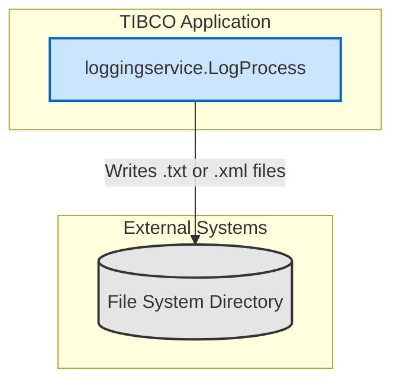

## Executive Summary
This report provides a comprehensive QE testing strategy for the MFDA (Mainframe and Distributed Application) integration points identified within the `LoggingService` TIBCO BusinessWorks project. The analysis reveals that the sole integration pattern matching the MFDA scope is **File Transfer (MFT)**, implemented via TIBCO's File palette. The service is designed to receive a log message and, based on input parameters, write it to the console or to a text/XML file in a configured directory.

No other MFDA-scoped integrations, such as Web Services (Apigee), Kafka, AlloyDB, or Oracle, were detected in the codebase. Therefore, this testing strategy focuses exclusively on ensuring the quality, reliability, and performance of the file generation and writing capabilities. The overall complexity is low, but risks related to file system dependencies, data formatting, and error handling require structured testing.

## MFDA Integration Matrix

| Integration Type | Upstream Component | Downstream Component | Data Flow Direction | Integration Method |
| :--- | :--- | :--- | :--- | :--- |
| MFT | `loggingservice.LogProcess` | File System | Outbound | File Write |

## Integration Architecture Wire Diagram

The diagram below illustrates the simple data flow where the TIBCO process writes log files to a designated directory on the file system.

## Detailed Test Cases by Integration Type

The following are representative test cases for the identified MFT integration. A full test suite would expand upon these patterns to cover all permutations of input data and environmental conditions.

---
**Test Case ID**: MFDA-INT-MFT-001
**Test Case Name**: Successful Text File Generation and Write
**Integration Type**: MFT
**Test Type**: Integration
**Test Category**: Positive
**Priority**: High
**Complexity**: Simple

**Description/Summary**:
This test validates that when the `LogProcess` is invoked with `handler='file'` and `formatter='text'`, it correctly creates and writes the message content to a text file in the configured directory.

**Pre-conditions**:
- The `fileDir` global variable is set to a valid, writable directory path (e.g., `/test/mft/output/`).
- The TIBCO application is running.

**Test Data Requirements**:
- **Input Payload (`LogMessage`)**:
  - `level`: "INFO"
  - `formatter`: "text"
  - `message`: "This is a test log message."
  - `msgCode`: "TC001"
  - `loggerName`: "TestLogger_Text"
  - `handler`: "file"
- **Expected Output**:
  - A file named `TestLogger_Text.txt` should be created in the `fileDir` directory.
  - The content of the file should be exactly: "This is a test log message."

**Test Steps**:
1.  **Setup**: Ensure the target directory specified by `fileDir` exists and has write permissions for the application user.
2.  **Execution**: Invoke the `loggingservice.LogProcess` with the specified input payload.
3.  **Verification**:
    - Check if the file `TestLogger_Text.txt` exists in the target directory.
    - Read the content of the file.
    - Assert that the file content matches the `message` from the input payload.

**Expected Results**:
- The process completes successfully.
- The file `TestLogger_Text.txt` is created with the correct content.
- The file's last modified timestamp is recent.

---
**Test Case ID**: MFDA-INT-MFT-002
**Test Case Name**: Successful XML File Generation and Write
**Integration Type**: MFT
**Test Type**: Integration
**Test Category**: Positive
**Priority**: High
**Complexity**: Medium

**Description/Summary**:
This test validates that when the `LogProcess` is invoked with `handler='file'` and `formatter='xml'`, it correctly renders an XML payload and writes it to an XML file.

**Pre-conditions**:
- The `fileDir` global variable is set to a valid, writable directory path.
- The TIBCO application is running.

**Test Data Requirements**:
- **Input Payload (`LogMessage`)**:
  - `level`: "ERROR"
  - `formatter`: "xml"
  - `message`: "An XML-formatted error occurred."
  - `msgCode`: "TC002"
  - `loggerName`: "TestLogger_Xml"
  - `handler`: "file"
- **Expected Output**:
  - A file named `TestLogger_Xml.xml` is created.
  - The file content is a well-formed XML document matching the `XMLFormatter.xsd` schema, containing the level, message, logger, and a current timestamp.

**Test Steps**:
1.  **Setup**: Ensure the target directory is clean and writable.
2.  **Execution**: Invoke the `loggingservice.LogProcess` with the XML-specific input payload.
3.  **Verification**:
    - Check for the existence of `TestLogger_Xml.xml`.
    - Read the file content.
    - Validate the content against the `XMLFormatter.xsd` schema.
    - Assert that the XML nodes for `level`, `message`, and `logger` contain the correct data from the input.

**Expected Results**:
- The process completes successfully.
- A valid XML file `TestLogger_Xml.xml` is created.
- The XML content is correctly structured and populated.

---
**Test Case ID**: MFDA-INT-MFT-003
**Test Case Name**: Negative - Handle Non-Existent Directory
**Integration Type**: MFT
**Test Type**: Integration
**Test Category**: Negative
**Priority**: High
**Complexity**: Medium

**Description/Summary**:
This test verifies the process's behavior when the `fileDir` path does not exist. The `Write File` activity is configured with `createMissingDirectories=true`, so the test should verify that the directory is created.

**Pre-conditions**:
- The `fileDir` global variable is set to a path that does not exist (e.g., `/test/mft/non_existent_dir/`).
- The parent directory (`/test/mft/`) must be writable.

**Test Data Requirements**:
- **Input Payload (`LogMessage`)**:
  - `handler`: "file"
  - `formatter`: "text"
  - `loggerName`: "DirCreationTest"
  - `message`: "Testing directory creation."

**Test Steps**:
1.  **Setup**: Configure `fileDir` to a non-existent path. Ensure the path is removed if it exists from previous runs.
2.  **Execution**: Invoke the `loggingservice.LogProcess`.
3.  **Verification**:
    - Check that the process completes without a `FileNotFoundException`.
    - Verify that the directory `/test/mft/non_existent_dir/` has been created.
    - Verify that the file `DirCreationTest.txt` exists inside the new directory with the correct content.

**Expected Results**:
- The process completes successfully.
- The specified directory path is created automatically.
- The log file is written successfully into the newly created directory.

---
**Test Case ID**: MFDA-E2E-MFT-001
**Test Case Name**: End-to-End - Console Handler Passthrough
**Integration Type**: MFT (related process)
**Test Type**: End-to-End
**Test Category**: Positive
**Priority**: Medium
**Complexity**: Simple

**Description/Summary**:
This test validates the end-to-end flow for the "console" handler, ensuring that no file is written and the process completes successfully by invoking the `Log` activity.

**Pre-conditions**:
- The TIBCO application and its logging infrastructure are running.

**Test Data Requirements**:
- **Input Payload (`LogMessage`)**:
  - `handler`: "console"
  - `message`: "This message should go to console logs."
  - `loggerName`: "ConsoleTest"

**Test Steps**:
1.  **Setup**: Note the current time to correlate logs. Ensure the `fileDir` directory is being monitored.
2.  **Execution**: Invoke the `loggingservice.LogProcess` with the console-specific payload.
3.  **Verification**:
    - Monitor the application's standard output/log files for the message "This message should go to console logs.".
    - Verify that NO file named `ConsoleTest.txt` or `ConsoleTest.xml` is created in the `fileDir` directory.

**Expected Results**:
- The process completes successfully.
- The log message appears in the configured TIBCO application logs.
- No files are written to the file system for this transaction.

## Integration-Specific Requirements (MFT)

### Environment Details
- **File Server**: The integration writes to a local file system path. In a real environment, this would likely be a mounted network share (NFS, CIFS) acting as a landing zone for a true MFT tool.
- **Input/Output Locations**: The output location is controlled by the `fileDir` global variable, defined in `META-INF/default.substvar`. The default value is `/Users/santkumar/temp/`. This must be overridden for each environment.
- **File Naming**: The file name is derived from the `loggerName` input parameter, with a `.txt` or `.xml` extension depending on the `formatter`.
- **Batch Jobs**: No batch jobs are directly triggered. File creation is synchronous with the process invocation. A separate file watcher service would be required to trigger downstream batch jobs.

### Test Data Requirements
- **Input Files**: Not applicable, as the process generates files.
- **Input Payloads**: Test data consists of `LogMessage` payloads (`Schemas/LogSchema.xsd`) with variations in the `handler`, `formatter`, `loggerName`, and `message` fields to cover all logical paths.
- **Error Scenarios**: Test data should include payloads that result in long file names, special characters in file names, and very large `message` content to test performance and file system limits.

### Test Scenarios
- **Success Scenarios**:
  - Write a text file successfully.
  - Write an XML file successfully.
  - Append to an existing file (Note: current configuration overwrites; this would be a test for a configuration change).
  - Create missing directories.
- **Error Conditions**:
  - `fileDir` points to a location with no write permissions.
  - `fileDir` is an invalid path.
  - Disk is full.
- **Performance Benchmarks**:
  - Measure the time taken to write a 100MB message to a file.
  - Measure the throughput of writing 10,000 small (1KB) log messages in a loop.

## Test Data Strategy

### Integration Testing Data
- **`LogMessage` Payloads**: A suite of payloads is required.
  - **MFT - Text**: `handler='file'`, `formatter='text'`, with varying `loggerName` and `message` lengths.
  - **MFT - XML**: `handler='file'`, `formatter='xml'`, with varying `loggerName` and `message` content.
  - **Negative**: Payloads with null or empty required fields (`message`, `level`).
  - **Edge Case**: Payloads with special characters, extremely long strings for `loggerName` and `message`.

### Regression/E2E Testing Data
- A standardized set of `LogMessage` payloads covering every branch in `LogProcess.bwp`:
  1.  Console handler.
  2.  File handler with text formatter.
  3.  File handler with XML formatter.
- This dataset should be run after every code change to ensure no regressions are introduced. Data should include a mix of simple and complex message content.

## Environment Configuration Details

### Lower Environment Setup
The primary configuration point is the `fileDir` global variable in `META-INF/default.substvar`. This file should be managed per environment.

- **Development Environment**:
  - **`fileDir`**: `/dev/log_output/`
  - **Setup**: Developers' local machines or a shared dev server. Permissions should be open.
- **Test Environment**:
  - **`fileDir`**: `/qa/log_output/`
  - **Setup**: A dedicated, controlled QA server. Directory should be cleaned before each test run. Permissions should be strictly managed to test permission-denied scenarios.
- **Staging Environment**:
  - **`fileDir`**: `/stage/log_output/`
  - **Setup**: A production-like server, potentially with a network file share mount to simulate production topology.

## Assumptions Made
- The TIBCO `bw.file.write` activity is considered an "MFT" integration as it's the only file transfer mechanism present and fits the category's intent.
- The local file system path defined by `fileDir` is a landing zone, and a separate, out-of-scope process (e.g., a true MFT tool, cron job) is responsible for picking up these files for mainframe transfer.
- The analysis is scoped strictly to the provided TIBCO project; no external calling applications or downstream file consumers were analyzed.
- "Mainframe" is the conceptual destination, but the code only interacts with a generic file system.

## Open Questions
- What is the expected behavior if the disk is full? The process will likely fault, but is there a business requirement for alerting?
- Are there any restrictions on file names or characters that can be used in the `loggerName` field, which becomes the file name?
- What are the performance SLAs for file generation and writing?
- Is there a requirement to append to existing log files, or is overwriting the intended behavior? (The current configuration for text files is `append=false` and for XML files is `append=false`).

## Confidence Level
**Overall Confidence**: High

**Rationale**:
- The project is small, self-contained, and uses standard TIBCO activities.
- The logic within `LogProcess.bwp` is straightforward and follows simple conditional paths based on input.
- The file schemas (`LogSchema.xsd`, `XMLFormatter.xsd`) are well-defined, making test data creation predictable.
- The single point of external configuration (`fileDir`) is clearly identified in `default.substvar`.

## Action Items
**Immediate**:
- [ ] Confirm with the development team if the file-writing capability is indeed part of a larger MFT workflow to validate the testing scope.
- [ ] Develop and automate the 8-10 core test cases outlined above to establish a baseline regression suite.

**Short-term**:
- [ ] Create a data generation utility to produce a wide variety of `LogMessage` payloads for edge case and negative testing.
- [ ] Set up a dedicated QE test environment with controlled directory permissions to execute both positive and negative test scenarios reliably.

**Long-term**:
- [ ] Integrate the automated test suite into a CI/CD pipeline to run on every code change.
- [ ] Develop performance tests to run on a schedule to monitor for performance degradation over time.

## Risk Assessment
- **High Risk**:
  - Incorrect file permissions in a target environment could cause the entire logging functionality to fail silently or with unhandled exceptions, leading to loss of critical log data.
- **Medium Risk**:
  - Data corruption if the XML rendering process fails or produces malformed XML.
  - Performance degradation when writing very large log messages, potentially blocking the calling thread.
- **Low Risk**:
  - Inconsistent file naming if the `loggerName` input is not sanitized, potentially creating files that are difficult for downstream systems to process.
  - Disk space exhaustion if there is no log rotation or cleanup strategy for the output directory.